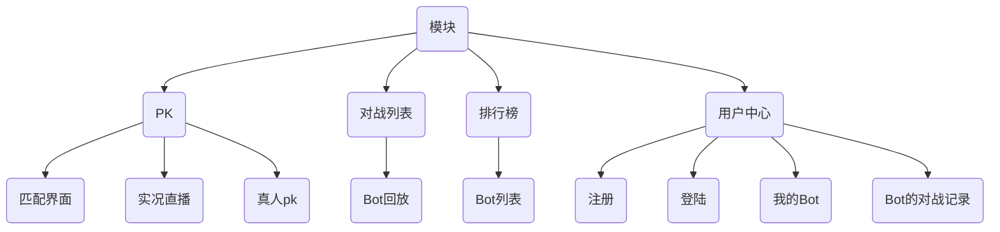

### Java知识

`String.format("%d", x)`跟`printf("%d", x)`，这俩作用差不多，一个是输出到`String`里面，一个是输出到标准输出里

----

**多态**：同一个类调用相同的函数就有不同的行为，多态需要三个条件

- 继承或者实现
- 方法的重写
- 基类引用指向派生类对象，即父类引用指向子类对象
  - 因为子类必然是父类类型，所以父类引用才能 指向子类对象

```java
public class Main {
    public static void main(String[] args) {
      	/*
      		1. 基类Point，有toString()方法
      		2. 子类ColorPoint，radixpoint继承Point重写了toString()方法
      		3. 父类引用指向子类对象
      		4. 多态的应用：
      			 不必每次都是用colorPoint.toString(), radixPoint.toString()
      			 写一个方法getString，里面传入的是父类对象，由于有3. 所以可以直接传入子类对象也能获取结果
      			 这种方式可以缩短代码量。
      			 不光是写方法可以这么用，因为可以用基类代替，因此在初始化的时候也很方便
      	*/
        Point point = new ColorPoint(2, 3, "red");
        Point point1 = new radixPoint(3, 5, 0.5);
        System.out.println(getString(point));
        System.out.println(getString(point1));
    }

    public static String getString(Point point) {
        return point.toString();
    }
}
```

----

- java.util.HashSet<K>：哈希表：有序
- java.util.TreeSet<K>：平衡树：无序


### 项目（King of bot）

**简介**

> 每名用户有多个bot，每次对战的时候只能派出一个bot去参战，防止一个bot被复制了好多份霸榜
>
> 可以跟其他用户PK，每个bot都有一个天梯分
>
> 也可以不派出bot，用户之间PK

**模块**

PK：匹配界面、实况直播、真人PK

对战列表：Bot回放

排行榜

用户中心：注册、登陆、查看我的Bot（增加、删除、修改）、Bot的对战记录



---

**前后端分离与不分离**：重点在于拼接地方是在哪

- 分离：
  1. 客户端进入网站的时候，服务端会先返回**静态资源**给客户端。
  2. 客户端再向服务器发送请求，服务器将**数据**返回给客户端
  3. 在客户端将静态资源和数据通过某种方式动态拼接起来
  4. 好处就是在实现不同的接口的时候比如`Web`端和`app`端的时候，因为数据是一样的，不需要写多个后端
- 不分离
  1. 客户进入网站向服务器发送url
  2. 服务端将在服务器生成的完整的页面发送给客户端

----

#### 前端

**第一节课**

1. 确定好前端的导航栏和内容区的布局，去`bootstrap`官网找一个合适的`navbar`布局给导航栏

   在从拷过来的代码中的`class`稍加修改

   

2. 因为navbar是不变的布局，所以放在`App.vue`里，因为该`navbar`使用了`bootstrap`，所以`App.vue`中要使用这个组件的话需要导入`bootstrap`的`css`文件，`js`文件没使用到先导进来也无妨。

   ```vue
   <template>
     <NavBar />
   
     <router-view></router-view>
   
   </template> 
   
   
   <script>
   import  NavBar  from "./components/NavBar.vue"
   import "bootstrap/dist/css/bootstrap.min.css"
   import "bootstrap/dist/js/bootstrap.bundle.min.js"
   export default {
   
     components: {
       NavBar,
     }
   }
   </script>
   
   <style>
   body {
     background-image: url("assets/background.png");
     background-size: cover;
   }
   </style>
   
   ```

3. 给导航栏每一个链接在`views`目录下创建相应的模块文件夹

   

4. 在`router`路径下创建这些组件的路由

   ```js
   import { createRouter, createWebHistory } from 'vue-router'
   import PkIndexView from "../views/pk/PkIndexView";
   import RankListIndexView from "../views/ranklist/RankListIndexView"
   import ReCordIndexView from '../views/record/ReCordIndexView';  // 写Record就报错，懵
   import NotFound from "../views/error/NotFound";
   import UserBotIndexView from "../views/user/bot/UserBotIndexView";
   
   const routes = [
     {
       name: "home",
       path: "/",
       redirect:"/pk/",
     },
     {
       name:"pk_index",
       path: "/pk/",
       component: PkIndexView
     },
     {
       name: "ranklist_index",
       path: "/ranklist/",
       component: RankListIndexView
     },
     {
       name: "record_index",
       path: "/record/",
       component: ReCordIndexView,
     },
     {
       name: "notFound",
       path: "/404/",
       component: NotFound,
     },
     {
       name: "user_bot_index",
       path: "/user/bot",
       component:UserBotIndexView,
     },
     {
       path:"/:catchAll(.*)", // 不能被以上路径识别的路径会在这里被捕捉
       redirect: "/404/",
   
     }
   
   ]
   
   const router = createRouter({
     history: createWebHistory(),
     routes
   })
   
   export default router
   
   ```

5. 为了使这些路由能够被应用上前端渲染，需要将`navbar`的`a`链接改成`router-link`。`name`为`routes`中定义的`name`

   ```vue
   <router-link class="navbar-brand" :to="{name: 'home'}" >King of bots</router-link>
   ```

6. 使界面美观，需要在页面中间添加`card`，也是去`bootstrap`找一个`card`

   

   

   因为这个`card`是所有的页面共用的，因此可以像`navbar`一样创建一个组件，给`card`添加一个`container`，`container`能够自适应屏幕。要填充的内容都会渲染在<slot></slot>里面

   

7. 在每个页面文件中导入`ContentField`这个组件

   

8. 实现导航栏进入某个链接的时候会高亮`active`

   `computed`：实时计算当前`route`内部是什么。如果需要在某个属性里面使用表达式的话可以在前面加一个`:`

   这里的`route`其实就是路由，跟上面是一个意思

   

   

   

   

   

9. 需要动的物体都是以60帧的方式移动，因此可以把这些基本功能抽象成一个基类。在这里用到了前端的`RequestAnimationFrame`

   1. 前面都很好理解，`this.timedelta`代表的是时间差，`last_timestamp`是上一帧执行的毫秒数，`timestamp`是执行时刻的毫秒数

   2. `has_celled_start`表示该对象是否是第一次执行

      每一帧都会执行`step`函数，如果该对象没有被调用，那就调用`start`并将`has_celled_start`设为`true`

      如果是被调用过的，那就执行`update`函数，并且计算出两帧之间的时间差

   ```js
   
   const AC_GAME_OBJECTS = [];
   
   export class AcGameObject {
       
       constructor() {
           AC_GAME_OBJECTS.push(this);
           this.has_celled_start = false;
           this.timedelta = 0;
   
       }
   
       start() {  // 开始时执行一次
   
       }
   
       update() {  // 在start之后每一帧执行一次
           
       }
   
       on_destroy() {  // 删除之前调用
   
       }
   
       destroy() { // 
           this.on_destroy();
           
           for (let i in AC_GAME_OBJECTS) {
               if (this == AC_GAME_OBJECTS[i]) {
                   AC_GAME_OBJECTS.splice(i);
                   break;
               } 
           }
       }
   }
   let last_timestamp;
   
   const step = (timestamp) => {
       for (let obj of AC_GAME_OBJECTS) {
           if (!obj.has_celled_start) {
               obj.has_celled_start = true;
               obj.start();
           } else {
               obj.timedelta = timestamp - last_timestamp;
               obj.update();
           }
       }
       last_timestamp = timestamp;
       requestAnimationFrame(step);
   
   } 
   
   requestAnimationFrame(step);
   ```

10. `ctx`：画布，`parent`：画布的父元素，用来动态修改画布的长宽

    地图会变化，游戏对象应该也是跟着成比例变，因此绝对距离就不重要

    地图是`13*13`的，因此每一个格子都可以看成一个单位，所以可以把格子存为绝对距离，坐标都存为相对距离，`this.L`是一个单位的长度

    ```js
    import { AcGameObject } from "./AcGameObjects";
    
    export class GameMap extends AcGameObject {
        constructor(ctx, parent) {
            super();
            this.ctx = ctx;
            this.parent = parent;
            this.L = 0;  // 地图的一个单位的大小
            this.cols = 13;
            this.rows = 13;  // cols rows 可以自行调整，但是获取地图大小的方式不变
    
        }
    
        start() {
    
        }
    
        update_size() {  // 更新地图，每一帧都要更新地图
            this.L = parseInt(Math.min(this.parent.clientWidth / this.cols, this.parent.clientHeight / this.rows));  // 这里是会计算出浮点数的，如果不取整，那么地图就会有断层
            this.ctx.canvas.width = this.L * this.cols;
            this.ctx.canvas.height = this.L * this.rows;
        
        }
    
        update() {  // 在基类有写在什么时候会执行update，所以upate的逻辑是不在基类写的
            this.update_size();
            this.render();
        }
    
        render() {  // 渲染出来，在cdn有写ctx如何画图
            this.ctx.fillStyle = "green";
            this.ctx.fillRect(0, 0, this.ctx.canvas.width, this.ctx.canvas.height);  
        }
    }
    ```

    **`pk`页面传过来的是`getContext("2d")`的内容了，设置宽度和高度还是需要加`.canvas.width和.canvas.height`**

11. 去掉`Pk`页面的`ContentField`组件，写一个游戏背景`PlayGround`。

    在游戏背景里面放一个地图`GameMap`组件，地图是`13*13`，因此需要边长尽可能的大，需要动态求

    将地图看成是一个是长方形，其实正方形是一个特殊的长方形，如何求变长的最大值

    $min(h / rows, w / cols)$  得到的最小地图的最小单位，然后宽度和高度再用**单位*列或者行数**

    

    

    在`PlayGround`组件写的背景里面不止有游戏界面，还有一些其他界面，所以将其他页面跟`ContentField`分开来写

    `onMounted`：组件挂载完之后需要执行哪些操作

    ```vue
    <template>
        <div ref="parent" class="gamemap">
            <canvas ref="canvas"></canvas>
        </div> 
    </template>
    
    <script>
    import { GameMap } from '../assets/scripts/GameMap';
    import { ref, onMounted} from 'vue';
    
    export default {
        setup() {
            let parent = ref("");  // 将parent 和 canvas指向空
            let canvas = ref("");
    
            onMounted(() => {
                new GameMap(canvas.value.getContext("2d"), parent.value);
            });
    
            return {
                parent,
                canvas,
            }
        }
    }
    </script>
    
    <style scoped>
    div.gamemap {
        width: 100%;
        height: 100%;
      /* 后面三项是将地图居中的*/ 
        display: flex;
        justify-content: center;
        align-items: center;
    
    }
    </style>
    ```

    

12. **画地图的格子**：相邻格子的颜色不一样，可以用横纵坐标之和来区分

    **怎么画：**在`GameMap`里，`render`函数是渲染，因此改一下逻辑即可

    **注意：**在`canvas`里，水平向右是横坐标，垂直向下是纵坐标，又是在对`rows, cols, width, height`的计算中是按常规来算的，所以在使用`fillRect`的时候坐标换一下就好

    ```js
    render() {  // 渲染出来
            const color_even = "#AAD751", color_odd = "#A2D149";
            for (let r = 0; r < this.rows; r ++) {
                for (let c = 0; c < this.cols; c++) {
                    if ((c + r) % 2 == 0) {
                        this.ctx.fillStyle = color_even;
                    } else {
                        this.ctx.fillStyle = color_odd;
                    }
                  	// x：c在变，y：r不变
                    this.ctx.fillRect(this.L * c, this.L * r, this.L, this.L);
                }
            }
        }
    ```

    

13. **画墙：**新建一个墙的组件`Wall.js`，每次只画一个墙，用`GameMap`来计算墙的位置的大小

    ```js
    import { AcGameObject } from "./AcGameObjects";
    
    export class Wall extends AcGameObject {
        constructor(r, c, gamemap) {
            super();
            
            this.r = r;
            this.c = c;
            this.gamemap = gamemap;
            this.color = "#B37226"
        }
    
        update() {
            this.render();
        }
        
        render() {
            const L = this.gamemap.L;
            const ctx = this.gamemap.ctx;
            ctx.fillStyle = this.color;
            ctx.fillRect(this.c * L, this.r * L, L, L);
        }
    }
    ```

    `GameMap`：创建一个建墙函数，下面的`this.walls`是数组成员变量，在构造函数写添加，只是为了保存有哪些墙是被建立的，去掉直接`new Wall`也可以创建出墙

    `g`在这里是一个布尔二维数组，这里的创建二维数组的方式可以学习。没有墙的地方为`false`，有墙的地方为`true`

    ```js
    	 create_wall() {
            const g = [];
            for (let r = 0; r < this.rows; r ++) {
                g[r] = [];
                for (let c = 0; c < this.cols; c++) {
                    g[r][c] = false;
                }
            }
    				// 这两个二维数组是为了创建外围的墙
            for (let r = 0; r < this.rows; r++) {
                g[r][0] = g[r][this.cols - 1] = true;
            }
            
            for (let c = 0; c < this.cols; c ++) {
                g[0][c] = g[this.rows - 1][c] = true;
            }
    
            for (let r = 0; r < this.rows; r ++) {
                for (let c = 0; c < this.cols; c ++) {
                    if (g[r][c]) {
                        this.walls.push(new Wall(r, c, this));
                    }
                }
            }
        }
    
        start() {   
            this.create_wall();
        }
    
    ```

    

14. **生成随机墙、保证左下与右上角不会生成墙和连通性**：对上面的代码加以补充，

    ```js
     	  // 判断连通性，用的Flood Fill算法
    		check_connectivity(g, sx, sy, tx, ty) {
            if (sx == tx && sy == ty) return true;
            g[sx][sy] =  true;
            let dx = [-1, 0, 1, 0], dy = [0, 1, 0, -1];
            for (let i = 0; i < 4; i++) {
                let x = sx + dx[i], y = sy + dy[i];
                if (!g[x][y] && this.check_connectivity(g, x, y, tx, ty)) {
                    return true;
                }
            }
            return false;
        }
    		create_wall() {
            const g = [];
            for (let r = 0; r < this.rows; r ++) {
                g[r] = [];
                for (let c = 0; c < this.cols; c++) {
                    g[r][c] = false;
                }
            }
            for (let r = 0; r < this.rows; r++) {
                g[r][0] = g[r][this.cols - 1] = true;
            }
            
            for (let c = 0; c < this.cols; c ++) {
                g[0][c] = g[this.rows - 1][c] = true;
            }
            
       		// this.walls_count是构造函数里写的一个成员变量，值自己定义，意思为墙的数量
            for (let i = 0; i < this.walls_count; i++) {
                for (let j = 0; j < 1000; j++) {
                  	/*
                  		1. 循环1000次是为了保证随机能够随机生成成功，不建议死循环，容易写不好把浏览器卡死
                  		2. 为了对称，需要g[r][c], g[c][r]同时判断
                  		3. 第二个if是为了将左下和右上的点排出
                  	*/
                    let r = parseInt(Math.random() * this.rows);
                    let c = parseInt(Math.random() * this.cols);
                    if (g[r][c] || g[c][r]) continue;
                    if (r == 1 && c == this.cols - 2 || r == this.rows - 2 && c == 1) continue;
                    g[r][c] = g[c][r] = true;
                    break; 
                }
            }
    				/*
    					小技巧：利用JSON之间的转换实现深拷贝，这是怕在搜索的过程中影响了原来了g
    					如果连同不了，那这个图就不生成了，需要重新刷新页面
    				*/
            const copy_g = JSON.parse(JSON.stringify(g));
            if (!this.check_connectivity(copy_g, 2, this.rows - 2, this.cols - 2, 2)) {
                 return false;
            }
    
    
            for (let r = 0; r < this.rows; r ++) {
                for (let c = 0; c < this.cols; c ++) {
                    if (g[r][c]) {  
                        this.walls.push(new Wall(r, c, this));
                    }
                }
            }
            return true;
        }
    
        start() {   
            // this.create_wall();
          
          	// 如果上面墙的数量多了，这里可以增加i的循环次数，不建议写死循环
          	// 如果生成成功，则不再执行
            for (let i = 0; i < 1000; i++) {
                if (this.create_wall()) {
                    break;
                }
            }
        }
    ```

------


----

### 注解

1. **Controller**：
   - `@Controller`
   - `@RestController`：该`controller`返回的是**数据**
   - `@RequsetMapping("path")`：在类外写就是父目录，在函数外写子目录，进入该路径执行这个函数，总路径是父+子


