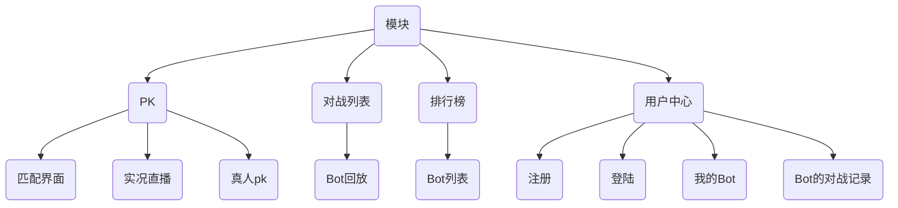

#### Java知识

`String.format("%d", x)`跟`printf("%d", x)`，这俩作用差不多，一个是输出到`String`里面，一个是输出到标准输出里

----

**多态**：同一个类调用相同的函数就有不同的行为，多态需要三个条件

- 继承或者实现
- 方法的重写
- 基类引用指向派生类对象，即父类引用指向子类对象
  - 因为子类必然是父类类型，所以父类引用才能 指向子类对象

```java
public class Main {
    public static void main(String[] args) {
      	/*
      		1. 基类Point，有toString()方法
      		2. 子类ColorPoint，radixpoint继承Point重写了toString()方法
      		3. 父类引用指向子类对象
      		4. 多态的应用：
      			 不必每次都是用colorPoint.toString(), radixPoint.toString()
      			 写一个方法getString，里面传入的是父类对象，由于有3. 所以可以直接传入子类对象也能获取结果
      			 这种方式可以缩短代码量。
      			 不光是写方法可以这么用，因为可以用基类代替，因此在初始化的时候也很方便
      	*/
        Point point = new ColorPoint(2, 3, "red");
        Point point1 = new radixPoint(3, 5, 0.5);
        System.out.println(getString(point));
        System.out.println(getString(point1));
    }

    public static String getString(Point point) {
        return point.toString();
    }
}
```

----

- java.util.HashSet<K>：哈希表：有序
- java.util.TreeSet<K>：平衡树：无序


#### 项目（King of bot）

**简介**

> 每名用户有多个bot，每次对战的时候只能派出一个bot去参战，防止一个bot被复制了好多份霸榜
>
> 可以跟其他用户PK，每个bot都有一个天梯分
>
> 也可以不派出bot，用户之间PK

**模块**

PK：匹配界面、实况直播、真人PK

对战列表：Bot回放

排行榜

用户中心：注册、登陆、查看我的Bot（增加、删除、修改）、Bot的对战记录



---

**前后端分离与不分离**：重点在于拼接地方是在哪

- 分离：
  1. 客户端进入网站的时候，服务端会先返回**静态资源**给客户端。
  2. 客户端再向服务器发送请求，服务器将**数据**返回给客户端
  3. 在客户端将静态资源和数据通过某种方式动态拼接起来
  4. 好处就是在实现不同的接口的时候比如`Web`端和`app`端的时候，因为数据是一样的，不需要写多个后端
- 不分离
  1. 客户进入网站向服务器发送url
  2. 服务端将在服务器生成的完整的页面发送给客户端

----

