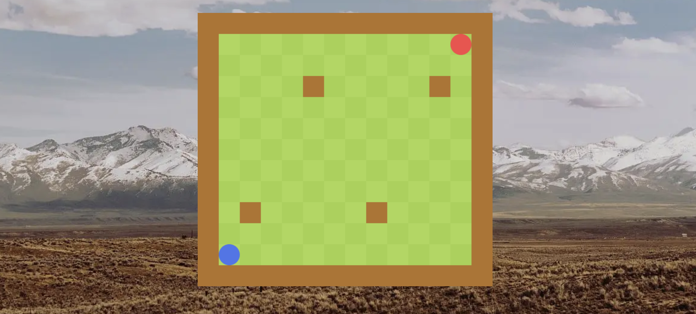
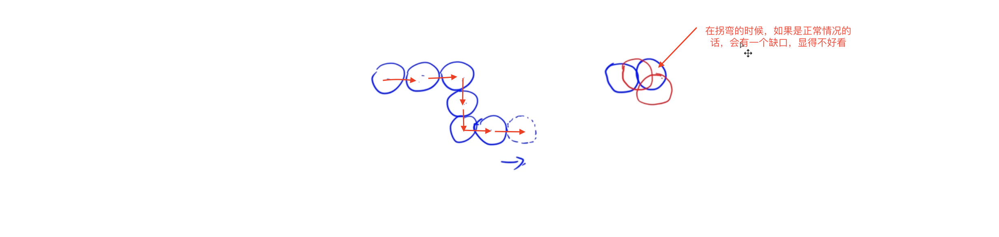

### Java知识

`String.format("%d", x)`跟`printf("%d", x)`，这俩作用差不多，一个是输出到`String`里面，一个是输出到标准输出里

----

**多态**：同一个类调用相同的函数就有不同的行为，多态需要三个条件

- 继承或者实现
- 方法的重写
- 基类引用指向派生类对象，即父类引用指向子类对象
  - 因为子类必然是父类类型，所以父类引用才能 指向子类对象

```java
public class Main {
    public static void main(String[] args) {
      	/*
      		1. 基类Point，有toString()方法
      		2. 子类ColorPoint，radixpoint继承Point重写了toString()方法
      		3. 父类引用指向子类对象
      		4. 多态的应用：
      			 不必每次都是用colorPoint.toString(), radixPoint.toString()
      			 写一个方法getString，里面传入的是父类对象，由于有3. 所以可以直接传入子类对象也能获取结果
      			 这种方式可以缩短代码量。
      			 不光是写方法可以这么用，因为可以用基类代替，因此在初始化的时候也很方便
      	*/
        Point point = new ColorPoint(2, 3, "red");
        Point point1 = new radixPoint(3, 5, 0.5);
        System.out.println(getString(point));
        System.out.println(getString(point1));
    }

    public static String getString(Point point) {
        return point.toString();
    }
}
```

----

- java.util.HashSet<K>：哈希表：有序
- java.util.TreeSet<K>：平衡树：无序


### 项目（King of bot）

**简介**

> 每名用户有多个bot，每次对战的时候只能派出一个bot去参战，防止一个bot被复制了好多份霸榜
>
> 可以跟其他用户PK，每个bot都有一个天梯分
>
> 也可以不派出bot，用户之间PK

**模块**

PK：匹配界面、实况直播、真人PK

对战列表：Bot回放

排行榜

用户中心：注册、登陆、查看我的Bot（增加、删除、修改）、Bot的对战记录


---

**前后端分离与不分离**：重点在于拼接地方是在哪

- 分离：
  1. 客户端进入网站的时候，服务端会先返回**静态资源**给客户端。
  2. 客户端再向服务器发送请求，服务器将**数据**返回给客户端
  3. 在客户端将静态资源和数据通过某种方式动态拼接起来
  4. 好处就是在实现不同的接口的时候比如`Web`端和`app`端的时候，因为数据是一样的，不需要写多个后端
- 不分离
  1. 客户进入网站向服务器发送url
  2. 服务端将在服务器生成的完整的页面发送给客户端

----

#### 前端

##### 第一节课

1. 确定好前端的导航栏和内容区的布局，去`bootstrap`官网找一个合适的`navbar`布局给导航栏

   在从拷过来的代码中的`class`稍加修改

   

2. 因为navbar是不变的布局，所以放在`App.vue`里，因为该`navbar`使用了`bootstrap`，所以`App.vue`中要使用这个组件的话需要导入`bootstrap`的`css`文件，`js`文件没使用到先导进来也无妨。

   ```vue
   <template>
     <NavBar />
   
     <router-view></router-view>
   
   </template> 
   
   
   <script>
   import  NavBar  from "./components/NavBar.vue"
   import "bootstrap/dist/css/bootstrap.min.css"
   import "bootstrap/dist/js/bootstrap.bundle.min.js"
   export default {
   
     components: {
       NavBar,
     }
   }
   </script>
   
   <style>
   body {
     background-image: url("assets/background.png");
     background-size: cover;
   }
   </style>
   
   ```

3. 给导航栏每一个链接在`views`目录下创建相应的模块文件夹

   

4. 在`router`路径下创建这些组件的路由

   ```js
   import { createRouter, createWebHistory } from 'vue-router'
   import PkIndexView from "../views/pk/PkIndexView";
   import RankListIndexView from "../views/ranklist/RankListIndexView"
   import ReCordIndexView from '../views/record/ReCordIndexView';  // 写Record就报错，懵
   import NotFound from "../views/error/NotFound";
   import UserBotIndexView from "../views/user/bot/UserBotIndexView";
   
   const routes = [
     {
       name: "home",
       path: "/",
       redirect:"/pk/",
     },
     {
       name:"pk_index",
       path: "/pk/",
       component: PkIndexView
     },
     {
       name: "ranklist_index",
       path: "/ranklist/",
       component: RankListIndexView
     },
     {
       name: "record_index",
       path: "/record/",
       component: ReCordIndexView,
     },
     {
       name: "notFound",
       path: "/404/",
       component: NotFound,
     },
     {
       name: "user_bot_index",
       path: "/user/bot",
       component:UserBotIndexView,
     },
     {
       path:"/:catchAll(.*)", // 不能被以上路径识别的路径会在这里被捕捉
       redirect: "/404/",
   
     }
   
   ]
   
   const router = createRouter({
     history: createWebHistory(),
     routes
   })
   
   export default router
   
   ```

5. 为了使这些路由能够被应用上前端渲染，需要将`navbar`的`a`链接改成`router-link`。`name`为`routes`中定义的`name`

   ```vue
   <router-link class="navbar-brand" :to="{name: 'home'}" >King of bots</router-link>
   ```

6. 使界面美观，需要在页面中间添加`card`，也是去`bootstrap`找一个`card`

   

   

   因为这个`card`是所有的页面共用的，因此可以像`navbar`一样创建一个组件，给`card`添加一个`container`，`container`能够自适应屏幕。要填充的内容都会渲染在<slot></slot>里面

   

7. 在每个页面文件中导入`ContentField`这个组件

   

8. 实现导航栏进入某个链接的时候会高亮`active`

   `computed`：实时计算当前`route`内部是什么。如果需要在某个属性里面使用表达式的话可以在前面加一个`:`

   这里的`route`其实就是路由，跟上面是一个意思

   

   

   

   

   

9. 需要动的物体都是以60帧的方式移动，因此可以把这些基本功能抽象成一个基类。在这里用到了前端的`RequestAnimationFrame`

   1. 前面都很好理解，`this.timedelta`代表的是时间差，`last_timestamp`是上一帧执行的毫秒数，`timestamp`是执行时刻的毫秒数

   2. `has_celled_start`表示该对象是否是第一次执行

      每一帧都会执行`step`函数，如果该对象没有被调用，那就调用`start`并将`has_celled_start`设为`true`

      如果是被调用过的，那就执行`update`函数，并且计算出两帧之间的时间差

   ```js
   
   const AC_GAME_OBJECTS = [];
   
   export class AcGameObject {
       
       constructor() {
           AC_GAME_OBJECTS.push(this);
           this.has_celled_start = false;
           this.timedelta = 0;
   
       }
   
       start() {  // 开始时执行一次
   
       }
   
       update() {  // 在start之后每一帧执行一次
           
       }
   
       on_destroy() {  // 删除之前调用
   
       }
   
       destroy() { // 
           this.on_destroy();
           
           for (let i in AC_GAME_OBJECTS) {
               if (this == AC_GAME_OBJECTS[i]) {
                   AC_GAME_OBJECTS.splice(i);
                   break;
               } 
           }
       }
   }
   let last_timestamp;
   
   const step = (timestamp) => {
       for (let obj of AC_GAME_OBJECTS) {
           if (!obj.has_celled_start) {
               obj.has_celled_start = true;
               obj.start();
           } else {
               obj.timedelta = timestamp - last_timestamp;
               obj.update();
           }
       }
       last_timestamp = timestamp;
       requestAnimationFrame(step);
   
   } 
   
   requestAnimationFrame(step);
   ```

10. `ctx`：画布，`parent`：画布的父元素，用来动态修改画布的长宽

    地图会变化，游戏对象应该也是跟着成比例变，因此绝对距离就不重要

    地图是`13*13`的，因此每一个格子都可以看成一个单位，所以可以把格子存为绝对距离，坐标都存为相对距离，`this.L`是一个单位的长度

    ```js
    import { AcGameObject } from "./AcGameObjects";
    
    export class GameMap extends AcGameObject {
        constructor(ctx, parent) {
            super();
            this.ctx = ctx;
            this.parent = parent;
            this.L = 0;  // 地图的一个单位的大小
            this.cols = 13;
            this.rows = 13;  // cols rows 可以自行调整，但是获取地图大小的方式不变
    
        }
    
        start() {
    
        }
    
        update_size() {  // 更新地图，每一帧都要更新地图
            this.L = parseInt(Math.min(this.parent.clientWidth / this.cols, this.parent.clientHeight / this.rows));  // 这里是会计算出浮点数的，如果不取整，那么地图就会有断层
            this.ctx.canvas.width = this.L * this.cols;
            this.ctx.canvas.height = this.L * this.rows;
        
        }
    
        update() {  // 在基类有写在什么时候会执行update，所以upate的逻辑是不在基类写的
            this.update_size();
            this.render();
        }
    
        render() {  // 渲染出来，在cdn有写ctx如何画图
            this.ctx.fillStyle = "green";
            this.ctx.fillRect(0, 0, this.ctx.canvas.width, this.ctx.canvas.height);  
        }
    }
    ```

    **`pk`页面传过来的是`getContext("2d")`的内容了，设置宽度和高度还是需要加`.canvas.width和.canvas.height`**

11. 去掉`Pk`页面的`ContentField`组件，写一个游戏背景`PlayGround`。

    在游戏背景里面放一个地图`GameMap`组件，地图是`13*13`，因此需要边长尽可能的大，需要动态求

    将地图看成是一个是长方形，其实正方形是一个特殊的长方形，如何求变长的最大值

    $min(h / rows, w / cols)$  得到的最小地图的最小单位，然后宽度和高度再用**单位*列或者行数**

    

    

    在`PlayGround`组件写的背景里面不止有游戏界面，还有一些其他界面，所以将其他页面跟`ContentField`分开来写

    `onMounted`：组件挂载完之后需要执行哪些操作

    ```vue
    <template>
        <div ref="parent" class="gamemap">
            <canvas ref="canvas"></canvas>
        </div> 
    </template>
    
    <script>
    import { GameMap } from '../assets/scripts/GameMap';
    import { ref, onMounted} from 'vue';
    
    export default {
        setup() {
            let parent = ref("");  // 将parent 和 canvas指向空
            let canvas = ref("");
    
            onMounted(() => {
                new GameMap(canvas.value.getContext("2d"), parent.value);
            });
    
            return {
                parent,
                canvas,
            }
        }
    }
    </script>
    
    <style scoped>
    div.gamemap {
        width: 100%;
        height: 100%;
      /* 后面三项是将地图居中的*/ 
        display: flex;
        justify-content: center;
        align-items: center;
    
    }
    </style>
    ```

    

12. **画地图的格子**：相邻格子的颜色不一样，可以用横纵坐标之和来区分

    **怎么画：**在`GameMap`里，`render`函数是渲染，因此改一下逻辑即可

    **注意：**在`canvas`里，水平向右是横坐标，垂直向下是纵坐标，又是在对`rows, cols, width, height`的计算中是按常规来算的，所以在使用`fillRect`的时候坐标换一下就好

    ```js
    render() {  // 渲染出来
            const color_even = "#AAD751", color_odd = "#A2D149";
            for (let r = 0; r < this.rows; r ++) {
                for (let c = 0; c < this.cols; c++) {
                    if ((c + r) % 2 == 0) {
                        this.ctx.fillStyle = color_even;
                    } else {
                        this.ctx.fillStyle = color_odd;
                    }
                  	// x：c在变，y：r不变
                    this.ctx.fillRect(this.L * c, this.L * r, this.L, this.L);
                }
            }
        }
    ```

    

13. **画墙：**新建一个墙的组件`Wall.js`，每次只画一个墙，用`GameMap`来计算墙的位置的大小

    ```js
    import { AcGameObject } from "./AcGameObjects";
    
    export class Wall extends AcGameObject {
        constructor(r, c, gamemap) {
            super();
            
            this.r = r;
            this.c = c;
            this.gamemap = gamemap;
            this.color = "#B37226"
        }
    
        update() {
            this.render();
        }
        
        render() {
            const L = this.gamemap.L;
            const ctx = this.gamemap.ctx;
            ctx.fillStyle = this.color;
            ctx.fillRect(this.c * L, this.r * L, L, L);
        }
    }
    ```

    `GameMap`：创建一个建墙函数，下面的`this.walls`是数组成员变量，在构造函数写添加，只是为了保存有哪些墙是被建立的，去掉直接`new Wall`也可以创建出墙

    `g`在这里是一个布尔二维数组，这里的创建二维数组的方式可以学习。没有墙的地方为`false`，有墙的地方为`true`

    ```js
    	 create_wall() {
            const g = [];
            for (let r = 0; r < this.rows; r ++) {
                g[r] = [];
                for (let c = 0; c < this.cols; c++) {
                    g[r][c] = false;
                }
            }
    				// 这两个二维数组是为了创建外围的墙
            for (let r = 0; r < this.rows; r++) {
                g[r][0] = g[r][this.cols - 1] = true;
            }
            
            for (let c = 0; c < this.cols; c ++) {
                g[0][c] = g[this.rows - 1][c] = true;
            }
    
            for (let r = 0; r < this.rows; r ++) {
                for (let c = 0; c < this.cols; c ++) {
                    if (g[r][c]) {
                        this.walls.push(new Wall(r, c, this));
                    }
                }
            }
        }
    
        start() {   
            this.create_wall();
        }
    
    ```

    

14. **生成随机墙、保证左下与右上角不会生成墙和连通性**：对上面的代码加以补充，

    ```js
     	  // 判断连通性，用的Flood Fill算法
    		check_connectivity(g, sx, sy, tx, ty) {
            if (sx == tx && sy == ty) return true;
            g[sx][sy] =  true;
            let dx = [-1, 0, 1, 0], dy = [0, 1, 0, -1];
            for (let i = 0; i < 4; i++) {
                let x = sx + dx[i], y = sy + dy[i];
                if (!g[x][y] && this.check_connectivity(g, x, y, tx, ty)) {
                    return true;
                }
            }
            return false;
        }
    		create_wall() {
            const g = [];
            for (let r = 0; r < this.rows; r ++) {
                g[r] = [];
                for (let c = 0; c < this.cols; c++) {
                    g[r][c] = false;
                }
            }
            for (let r = 0; r < this.rows; r++) {
                g[r][0] = g[r][this.cols - 1] = true;
            }
            
            for (let c = 0; c < this.cols; c ++) {
                g[0][c] = g[this.rows - 1][c] = true;
            }
            
       		// this.walls_count是构造函数里写的一个成员变量，值自己定义，意思为墙的数量
            for (let i = 0; i < this.walls_count; i++) {
                for (let j = 0; j < 1000; j++) {
                  	/*
                  		1. 循环1000次是为了保证随机能够随机生成成功，不建议死循环，容易写不好把浏览器卡死
                  		2. 为了对称，需要g[r][c], g[c][r]同时判断
                  		3. 第二个if是为了将左下和右上的点排出
                  	*/
                    let r = parseInt(Math.random() * this.rows);
                    let c = parseInt(Math.random() * this.cols);
                    if (g[r][c] || g[c][r]) continue;
                    if (r == 1 && c == this.cols - 2 || r == this.rows - 2 && c == 1) continue;
                    g[r][c] = g[c][r] = true;
                    break; 
                }
            }
    				/*
    					小技巧：利用JSON之间的转换实现深拷贝，这是怕在搜索的过程中影响了原来了g
    					如果连同不了，那这个图就不生成了，需要重新刷新页面
    				*/
            const copy_g = JSON.parse(JSON.stringify(g));
            if (!this.check_connectivity(copy_g,  this.rows - 2, 1, 1, this.cols - 2, )) {
                 return false;
            }
    
    
            for (let r = 0; r < this.rows; r ++) {
                for (let c = 0; c < this.cols; c ++) {
                    if (g[r][c]) {  
                        this.walls.push(new Wall(r, c, this));
                    }
                }
            }
            return true;
        }
    
        start() {   
            // this.create_wall();
          
          	// 如果上面墙的数量多了，这里可以增加i的循环次数，不建议写死循环
          	// 如果生成成功，则不再执行
            for (let i = 0; i < 1000; i++) {
                if (this.create_wall()) {
                    break;
                }
            }
        }
    ```

------

##### 第二节课

1. **避免两条蛇进入到同一个格子**
   
   - 一开始设定的是地图大小是1 3* 13，左下角的点为(11, 1)，右上为(1, 11)，当蛇走一步时，横纵之和会在奇偶之间穿插，如果地图设定为13 * 13，两条蛇就可能进入到同一个格子
   - 将地图更改为满足要求的长方形
   - 非正方形不满足轴对称，考虑换成中心对称
   
   
   
   - 更改画墙的逻辑
   
   ```js
       for (let j = 0; j < 1000; j++) {
         /*
          1. 循环1000次是为了保证随机能够随机生成成功，不建议死循环，容易写不好把浏览器卡死
          2. 为了对称，需要g[r][c], g[c][r]同时判断，后续改为中心对称 
          3. 第二个if是为了将左下和右上的点排出
         */
   
         let r = parseInt(Math.random() * this.rows);
         let c = parseInt(Math.random() * this.cols);
         // 修改了
         if (g[r][c] || g[this.rows - 1 - r][this.cols - 1 - c]) {
           continue;
         }
         if (r == 1 && c == this.cols - 2 || r == this.rows - 2 && c == 1) {
           continue;
         }
         // 修改了
         g[r][c] = g[this.rows - 1 - r][this.cols - 1 - c] = true;
         break; 
       }
   }
   ```
   
   ------
   
1. **画蛇头：**蛇的起点在左下和右下
   
   - 前10步每一步增长一个单位，往后每3步增长一个单位，
   - 蛇是由一堆圆组成的，一条蛇就是一堆圆组成的序列
   - 方便画蛇，定义一个格子`Cell.js`。在`canvas`里坐标系跟定义的是反的，所以先将坐标转换成`canavs`的坐标，因为是要画圆，存下圆心的坐标`(x + 0.5, y + 0.5)`。使用canvas画圆：`ctx.arc()`前两个参数是小圆的终点，第三个是圆的半径，后两个是圆弧的起始角度和终止角度
   
   ```js
   export class Cell {
       constructor(r, c) {
           this.r = r;
           this.c = c;
           this.x = c + 0.5;
           this.y = r + 0.5;
       }
   }
   ```
   
   - 将蛇定义为对象`Snake.js`，构造函数的两个参数都是从GameMap传过来的，定义了蛇的id，颜色，坐标。在第二点说到，蛇是由圆组成的序列，因此在每条蛇都有一个`this.Cells`来存放蛇的序列
   
   ```js
   import { AcGameObject } from "./AcGameObjects";
   import { Cell } from "./Cell";
   
   export class Snake extends AcGameObject{
       constructor(info, gamemap) {
           super();
           this.r = info.r;
           this.c = info.c;
           this.color = info.color;
           this.id = info.id;
           this.gamemap = gamemap;
   
           this.Cells = [
               new Cell(info.r, info.c),
           ]
   
       }
   
       start() {
   
       }
   
       update() { // 每一帧都会渲染
           this.render();
       }
   
       render() {
           const L = this.gamemap.L;
           const ctx = this.gamemap.ctx;
           ctx.fillStyle = this.color;
           for (const cell of this.Cells) {
               // 画圆
               ctx.beginPath();
               ctx.arc(L * cell.x, L * cell.y, L / 2, 0, Math.PI * 2);
               ctx.fill(); // 填充颜色
           }
       }
   
   
   }
   ```
   
   补充`GameMap.js`的构造函数
   
   ```js
   this.snakes = [
               new Snake({id: 0, color: "#4876EC", r: this.rows - 2, c: 1}, this),
               new Snake({id: 1, color: "#F94848", r: 1, c: this.cols - 2}, this),
   
           ]
   ```
   
   
   
   
   
   -----
   
1. **让蛇移动**
   
   - 在`Snake`类里写`move`函数，只是一个简答的移动，`timedelta`表示两帧之间的毫秒数，$s=v * t$
   
   ```js
   		update_move() {
          // this.speed 自己设定的成员变量。
      		 // 向右移动，可以随意自己改移动的方向
           this.Cells[0].x += this.speed * this.timedelta / 1000;
       }
       update() {
           this.update_move();
           this.render();
       }
   ```
   
   - 移动时有细节问题：创建一个新的头，其他位置都是不变的，让新的头部朝目的地移动，尾巴就朝着下一个位置动就好了，所以只有头和尾在动，其他地方是不变的，拐角就可以保持原样
   
   
   
   --------
   
   - 只有当两条蛇都接收到了下一步指令的时候才会让两条蛇分别朝对应的方向移动。每条蛇不能自己判断自己是否需要移动，应该有一个裁判，裁判放在公共的位置GameMap里
   
     ```js
     GameMap.js
     check_ready() {  // 判断两条蛇是否都准备好下一回合了
             for (const snake of this.snakes) {
                 if (snake.status !== "idle") return false;
                 if (snake.direction === -1) return false;
             }
             return true;
         }
     
     next_step() {  // 让两条蛇进入下一回合
             for (const snake of this.snakes) {
                 snake.next_step();
             }
         }
     
     update() {
             this.update_size();
             if (this.check_ready()) {
                 this.next_step();
             }
             this.render();
         }
     ```
   
   - 如果准备好下一步的时候，每条蛇都要跟新一下状态，表示进到下一回合。如果要知道走下一步是往哪走。有些回合蛇不会变长，有些会，要统计回合数
   
     ```js
     snake.js
     next_step() {  // 蛇的状变为走下一步
             const d = this.direction;
             this.next_cell = new Cell(this.cells[0].r + this.dr[d], this.cells[0].c + this.dc[d]);
             this.direction = -1;  // 清空状态
             this.status = "move";
             this.step ++;
             const k = this.cells.length;  // 求小球的数量
             // 每一位小球都向后移动一位
             for (let i = k; i > 0; i--) { 
                 // 第一个不用，就可以产生头部多了一个自己的复制
                 this.cells[i] = JSON.parse(JSON.stringify(this.cells[i - 1]));
             }
         }
     ```
   
   - 如何获取用户的操作：目前无法从后端获取操作，只能从前端获取。在canvas标签里添加tabindex="0"就可以获取用户的操作了 
   
     ```js
     GameMap.js
     add_listening_events() {
             this.ctx.canvas.focus();
     
             const [snake0, snake1] = this.snakes;
             this.ctx.canvas.addEventListener("keydown", e => {
                 if (e.key === 'w') snake0.set_direction(0);
                 else if (e.key === 'd') snake0.set_direction(1);
                 else if (e.key === 's') snake0.set_direction(2);
                 else if (e.key === 'a') snake0.set_direction(3);
                 else if (e.key === 'ArrowUp') snake1.set_direction(0);
                 else if (e.key === 'ArrowRight') snake1.set_direction(1);
                 else if (e.key === 'ArrowDown') snake1.set_direction(2);
                 else if (e.key === 'ArrowLeft') snake1.set_direction(3);
             });
         }
     ```
   
   - 头部抛出一个新的球，让新的球朝目的地移动
   
     
   
     ```js
     Snake.js
     update_move() {
             // this.cells[0].x += this.speed * this.timedelta / 1000;
             const dx = this.next_cell.x - this.cells[0].x;
             const dy = this.next_cell.y - this.cells[0].y;
             const distance = Math.sqrt(dx * dx + dy * dy);  // 走完一格的距离，所以可以用dx dy distance求角度
     
             // 判断是不是走到了终点，当两个点足够接近的时候就认为已经走在一块了
             if (distance < this.eps) {  // 移到了目标点，应该停下来
                 this.cells[0] = this.next_cell;  // 把目标点存下来作为新的头
                 this.next_cell = null;
                 this.status = "idle";
             } else {  // 不重合
                 const move_distance = this.speed * this.timedelta / 1000; // 实际走的距离
                 this.cells[0].x += move_distance * dx / distance;
                 this.cells[0].y += move_distance * dy / distance;
             }
         }
         update() {
             if (this.status === "move") {
                 this.update_move();
             }
             this.render();
         }
     ```
   
   - 成员变量
   
     ```js
     this.next_cell = null; // 下一步的目标
     this.direction = -1;  // -1表示没有指令，0、1、2、3表示上右下左
     this.status = "idle";  // idle表示静止，move表示正在移动，die表示死亡
     
     this.dr = [-1, 0, 1, 0];  // 4个方向行的偏移量
     this.dc = [0, 1, 0, -1];  // 4个方向列的偏移量
     
     
     this.step = 0;
     this.eps = 1e-2;  // 允许的误差
     ```
   
     ----
   
4. **蛇尾移动**

   - 先判断蛇的长度在当前回合是否增加

     ```js
     Snake.js
     check_tail_increasing() {  // 检测当前回合，蛇的长度是否增加
             if (this.step < 10) return true;
             if (this.step % 3 === 1) return true;
             return false;   
         } 
     ```

   - 蛇尾变长，那就蛇尾不动；如果蛇尾不变长，那么就要跟着蛇头一起动

     ```js
      update_move() {
        // this.cells[0].x += this.speed * this.timedelta / 1000;
        const dx = this.next_cell.x - this.cells[0].x;
        const dy = this.next_cell.y - this.cells[0].y;
        const distance = Math.sqrt(dx * dx + dy * dy);  // 走完一格的距离，所以可以用dx dy distance求角度
     
        // 判断是不是走到了终点，当两个点足够接近的时候就认为已经走在一块了
        if (distance < this.eps) {  // 移到了目标点，应该停下来
          this.cells[0] = this.next_cell;  // 把目标点存下来作为新的头
          this.next_cell = null;
          this.status = "idle";
     
          if (!this.check_tail_increasing()) {
            this.cells.pop();  // 长度不变，最后一个往前挪了，需要砍掉最后一个
          }
        } else {  // 不重合
          const move_distance = this.speed * this.timedelta / 1000; // 实际走的距离
          this.cells[0].x += move_distance * dx / distance;
          this.cells[0].y += move_distance * dy / distance;
     
          if (!this.check_tail_increasing()) {  // 蛇尾的长度不增加
            const k = this.cells.length;
            const tail = this.cells[k - 1], tail_target = this.cells[k - 2];
            const tail_dx = tail_target.x - tail.x ;
            const tail_dy = tail_target.y - tail.y ;
            tail.x += move_distance * tail_dx / distance;
            tail.y += move_distance * tail_dy / distance; // 因为头尾是一起动的，所以距离通用
     
     
     
          }
        }
      }	
     ```

     ---

5. **将蛇变得好看**

   - 在两个圆之间用长方形覆盖

     

   - 三种情况：

     - 两个圆重合
     - x轴重合：不确定两个哪个在上，y值取两个圆的最小值
     - y轴重合：不确定两个圆那个在左，取x的最小值
     - 为了更好看，不重合，把宽度画成80%，长度不变，因为长度是两个圆心之间的距离，同时也要将圆的大小画成80%

     

     ```js
     Snake.js下的render()
     for (let i = 1; i < this.cells.length; i++) {
       const a = this.cells[i - 1], b = this.cells[i];
       if (Math.abs(a.x - b.x) < this.eps && Math.abs(a.y - b.y) < this.eps) continue;
       if (Math.abs(a.x - b.x) < this.eps) {
         ctx.fillRect((a.x - 0.4) * L, Math.min(a.y, b.y) * L, L * 0.8, Math.abs(a.y - b.y) * L);
       } else {
         ctx.fillRect(Math.min(a.x, b.x) * L, (a.y - 0.4) * L, Math.abs(a.x - b.x) * L, L * 0.8);
       }
     }
     ```

     ----

6.  **检测目标格子是否非法**

   - GameMap作为裁判

     ```js
     check_valid(cell) {
       for (const wall of this.walls) {  // 判断墙
         if (cell.r === wall.r && cell.c === wall.c) {
           return false;
         }
       }
       for (const snake of this.snakes) {
         let k = snake.cells.length;
         if (!snake.check_tail_increasing()) {// 当蛇尾会前进的时候，蛇尾不要判断
           k--;
         }
         for (let i = 0; i < k; i ++) {  // 判断蛇的身体
           if (snake.cells[i].r === cell.r && snake.cells[i].c === cell.c) {
             return false;
           }
         }
       }
       return true;
     }
     ```

   - 在Sanke.js的next_step函数判断下一步的合法性

     ```js
     if (!this.gamemap.check_valid(this.next_cell)) { // 下一步操作非法，蛇死亡
       this.status = "die";
     }
     ```

   - render函数渲染死亡蛇的效果

     ```js
     if (this.status === "die") {
       this.color = "white";
     } 
     ```

     ---

7. **给蛇加眼睛**

   - 当蛇的方向不同的时候，**蛇的眼睛也在不同的**

     ```js
     this.eye_direction = 0;
     if (this.id === 1) this.eye_direction = 2; // 左下角蛇头朝上，右上角朝下
     
      next_step() {  // 蛇的状变为走下一步
        this.eye_direction = d;  // 改变眼睛的方向
     ```

   - 计算不同方向蛇的眼睛的偏移量，蛇的眼睛为黑色

     

     ```js
     //render()渲染眼睛
     for (let i = 0; i < 2; i ++) { // 遍历2次是画2个眼珠，偏移量为0.15，半径为0.05L
       ctx.fillStyle = "black";
       const eye_x = (this.cells[0].x + this.eye_dx[this.eye_direction][i] * 0.15) * L;
       const eye_y = (this.cells[0].y + this.eye_dy[this.eye_direction][i] * 0.15) * L;
       ctx.beginPath();
       ctx.arc(eye_x, eye_y, 0.05 * L, 0, Math.PI * 2);
       ctx.fill();
     }
     ```

     -----

#### 后端

-----

##### Mysql

1. 添加依赖：去maven仓库搜索相关以来，添加到pom.xml
   - mybatis-plus-generator：自动生成一些函数，比如mapper之类的
   - mybatis-plus-boot-starter：帮我们写了很多mysql
   - Project Lombok：简化代码
   - spring-boot-starter-security：权限判断模块
   
2. springboot访问数据库：如同终端和其他图形化页面一样，springboot连接mysql时也需要配置用户名和密码

3. springboot中常用模块

   - pojo层：`table -> class`。将数据库中的表对应成Java中的Class。

     - sql注入springboot已经帮我们实现了

   - mapper层：`class中的语句 -> sql`（也叫Dao层）：将pojo层的class中的操作，映射成sql语句。

   - service层：写具体的==业务==逻辑，组合使用mapper中的操作

   - controller层：==调度service==。负责请求转发，接受==（前端）==页面过来的参数，传给Service处理，接到返回值，再传给页面。

     ```mermaid
     graph LR
     A(pojo) --> B(mapper) 
     B --> C(service)
     C --> D(controller)
     
     ```

4. `MyBatis-Plus`

   - 条件构造器：`QueryWrapper`

     > 继承自 AbstractWrapper ,自身的内部属性 **entity 也用于生成 where 条件**
     > 及 LambdaQueryWrapper, 可以通过 new QueryWrapper().lambda() 方法获取

     **例子**

     ```java
     @GetMapping("/user/{userId}/")
     public User getUser(@PathVariable int userId) {
       QueryWrapper<User> queryWrapper = new QueryWrapper<>();
       queryWrapper.eq("id", 1);  // 可以在官网查，有很多操作，比如lt gt ge le
       													// 同时支持连贯操作: ge().le()，实现>= && <= 
       return userMapper.selectOne(queryWrapper);
     }
     ```

   - `Mapper`

     **例子**

     ```java
     @GetMapping("/user/add/{userId}/{username}/{rating}")  // 插入和删除一般是使用Post
     public String insertUser(@PathVariable int userId,
                              @PathVariable String username,
                              @PathVariable int rating) {
       User user = new User(userId, username, rating);
       userMapper.insert(user);
       return "add successfully";
     }
     ```

   ---

5. **用户认证**：权限判断

   - 加了spring-boot-starter-security依赖之后就帮我们实现了很多页面。没有登录时登陆页面的用户名是user，密码在项目运行里有写

     

     

   - **传统的用户登陆方式**

     1. 正常登陆：`Client --> SpringBoot(server) --> mysql`，然后结果返回`mysql --> SpringBoot(server) --> Client`
     2. 正常登陆完之后，`Springboot`生成一个随机字符串`sessionId`发送给`Client`，`Client`将`sessionId`存到`cookie`，一般这个`sessionId`会存在`mysql`或者`redis`里
     3. 用户再次请求时，`Client`会发送`cookie`，`springboot`会取`cookie`中的`sessionId`值，然后取跟`mysql`匹配，同时看看`sessionId`有没有过期，`mysql`中存的不只是`sessionId`，还有比如用户名之类的数据
     4. 如果`sessionId`过期了，那么`server`就会发送一个登陆页面给`Client`

     

   - 将spring-security对接数据库，不再限于只有一个user登陆

     1. 实现service.impl.UserDetailsServiceImpl类，实现UserDetailsService接口

     2. 重写接口的方法：通过username返回一个**UserDetails**，里面包含用户名和密码

        ```java
        @Override
        public UserDetails loadUserByUsername(String username) throws UsernameNotFoundException {
            QueryWrapper<User> queryWrapper = new QueryWrapper<User>();
            queryWrapper.eq("username", username);
            User user = userMapper.selectOne(queryWrapper);
            if (user == null) {
              throw new RuntimeException("用户不存在");
            }
            return new UserDetailsImpl(user);
          }
        ```
        
     3. 在service.utils下创建UserDetailsImpl实现UserDetails接口，同时有很多is...方法，根据自己的需要改为true还是false
     
        ```java
        @Data
        @NoArgsConstructor
        @AllArgsConstructor
        public class UserDetailsImpl implements UserDetails {
        
            private User user;
        
            @Override
            public Collection<? extends GrantedAuthority> getAuthorities() {
                return null;
            }
        
            @Override
            public String getPassword() {
                return user.getPassword();
            }
        
            @Override
            public String getUsername() {
                return user.getUsername();
            }
        
            @Override
            public boolean isAccountNonExpired() {
                return true;
            }
        
            @Override
            public boolean isAccountNonLocked() {
                return true;
            }
        
            @Override
            public boolean isCredentialsNonExpired() {
                return true;
            }
        
            @Override
            public boolean isEnabled() {
                return true;
            }
        }
        ```
     
     4. 这个时候去验证用户名密码，会报一个错：There is no PasswordEncoder mapped for the id "null"，这是因为密码是使用的明文传输，可以去用户的密码前缀加上{noop}，springboot在去判断密码的时候就知道这个是明文密码
     
   - **加密**

     ```mermaid
     graph LR;
     
     a(加密前的字符串) --容易转换--> b(加密后的字符串)
     b(加密后的字符串) --不容易转换--> a(加密前的字符串) 
     ```

     1. 创建config.SecurityConfig类，spring-security会调用这个方法，因为有注解，然后会返回某种加密方式，跟前面的报错对应上。PasswordEncoder应该是一个接口，BCryptPasswordEncoder应该是实现了PasswordEncoder接口，可以查看里面有很多API

        ```java
        @Configuration
        @EnableWebSecurity
        public class SecurityConfig {
        
            @Bean
            public PasswordEncoder passwordEncoder() {
                return new BCryptPasswordEncoder();
            }
        }
        ```

     2. 测试BCryptPasswordEncoder的加密，加密的字符串不是每一次都一样的，但是使用matches()是可以匹配上的

        ```java
        @Test
        	void contextLoads() {
        		PasswordEncoder passwordEncoder = new BCryptPasswordEncoder();
        		System.out.println(passwordEncoder.encode("zyc")); 
        		System.out.println(passwordEncoder.encode("zyc"));
        		System.out.println(passwordEncoder.matches("zyc", "$2a$10$t/g4ReQX1PXS6R15qPlqTOmzK4DB1epTUKSrWzB7ezKgF3LtJUBkK"));
        		System.out.println(passwordEncoder.matches("zyc", "$2a$10$rP/xwjlFw62wRmCu26IKOO67jkz99Dzok7xaIonbsE5z3Z8Wrthwa"));
        	}
        ```

     3. 改善userController里的insertUser方法，存储加密后的密码

        ```java
        @GetMapping("/user/add/{userId}/{username}/{rating}")
        public String insertUser(@PathVariable int userId, @PathVariable String username, @PathVariable String password) {
             PasswordEncoder passwordEncoder = new BCryptPasswordEncoder();
             String encodeedPassword = passwordEncoder.encode(password);
             User user = new User(userId, username, encodeedPassword);
             userMapper.insert(user);
             return "add successfully";
         }
        ```

        

6. 

---


​	

----

### 注解

1. **Controller**
   - `@Controller`
   - `@RestController`：该`controller`返回的是**数据**
   - `@RequsetMapping("path")`：在类外写就是父目录，在函数外写子目录，进入该路径执行这个函数，总路径是父+子
     - `GetMapping`：只映射Get请求。
       - `GetMapping("path/{variable}")`：可以传变量，在方法名里通过注解`@PathVariable`获取变量
     - `PostMapping`：只映射Post请求
1. **pojo**
   - `@Data`：自动帮我们填充比如`	tostring, get, set`
   - `@NoArgsConstructor`：填充无参构造函数
   - `@AllArgsConstructor`：有参构造函数
1. **mapper**
   - `@Mapper`
   - `mybatis plus`帮我们实现了很多`sql`语句，因此可以继承`BaseMapper<T>`从而实现`mybaits plus`。其中`T`是指`pojo`层中定义的`class`
1. **其他**
   - `Autowired`：如果在某层想要使用其他层的接口或者类


### 补充

1. `target`目录就是编译完之后的结果
1. 在pojo层对表中列的属性类型是需要转换成对象类型，比如`int -> Integer`
1. windows下`alt + insert`，mac下`cmd + n`可以快捷生成一些东西


