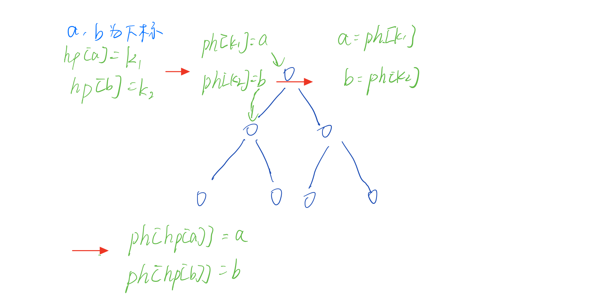

##### [788. 逆序对的数量](https://www.acwing.com/problem/content/790/)

> i 右边的数一定是比 j点要大的


----

##### [799. 最长连续不重复子序列](https://www.acwing.com/problem/content/801/)


> j 是靠左的指针，i是靠右的指针，当 i 往右移动的时候，j 不可能向左移动，因此 i，j 具有单调性，当 (i, j) 之前满足不重复子序列的时候就可以计算最大值了。图中res应该是i - j + 1

----

##### [2816. 判断子序列](https://www.acwing.com/problem/content/2818/)

这一题的核心在于证明：如果存在一个子序列的时候，使用双指针算法的时候也需要成立。

比如：存在一个子序列，那么当使用双指针算法的时候，只会在b数组中原先匹配的位置要靠前找到，因此成立

a：1, 2, 3

b：1, 2, 2, 3, 3

满足的序列可以是b[0], b[2], b[4]，使用双指针的时候可以是b[0], b[1], b[3]。

----

##### [802. 区间和](https://www.acwing.com/problem/content/804/)

这道题的数组范围很大，但是大多数都是为0的，是一种值域很大，但是数却很稀疏的情况

可以先把数离散化，得到的相对坐标，并不影响值。比如要求[1,20]之间的和，但是里面只有下标1，20有值，离散化成连续从1开始的自然数1，2并不影响求和

----

##### [51. 数字排列](https://www.acwing.com/problem/content/47/)

> 这题主要是存在重复元素，不能直接用dfs，要做一些处理

**例子：**比如有一个数12123，先排序11223。注意，1 和 1并不是一样的，是有先后顺序的。如果，第一个 1 放在_ _ _ _ 1，那么第二个 1就没位置放了，它只能在第一个 1 的后面，**也就是要让所有相同的数字相对的位置不变**

```c++
class Solution {
public:
    vector<vector<int>> ans;  // 定义答案
    vector<int> path;  // 将num[u]填充在path的某一个位置
    vector<vector<int>> permutation(vector<int>& nums) {
        path.resize(nums.size()); // 占坑
        sort(nums.begin(), nums.end());  // 将12123排序成11223
        dfs(nums, 0, 0, 0);
        return ans;
    }
    /*
   	 u代表需要将nums[u]填到path的哪个位置
   	 start代表是将nums[u]的起始位置，如果_ _ _ _ 1,那么下一个1只能从(4 + 1)开始找位置
   	 state表示的是path中某个位置是否被用过，用二进制来标志，比如11001,就表示第1 2 5的位置被用过了
    */
    void dfs(vector<int> &nums, int u, int start, int state) {
        if (u == nums.size()) {
            ans.push_back(path);
            return;
        }
        if (!u || nums[u] != nums[u - 1]) start = 0;
        for (int i = start; i < nums.size(); i++) {
            if (!(state >> i & 1)) {
                path[i] = nums[u];
                dfs(nums, u + 1, i + 1, state + (1 << i));
            }
        }
    }
};
```

----

##### [143. 最大异或对](acwing.com/problem/content/145/)

**暴力做法**

```c++
for (int i = 0; i < n; i++) {  // 枚举第一个数
  for (int j = 0; j < i; j++) {  // 枚举第二个数， 为什么是i，可以参考99乘法表1*1 2*1 2*2 3*1 3*2 3*3 4*1...
    res = max(res, a[i] ^ a[j]);    
  }
}
```

**优化**

- 对于暴力做法，第二重循环是为了在 $a_0$~$a_{i-1}$之间找到和$a_i$异或最大的数	
- $a_i$的范围是0~$2^{31}-1$ ，对于二进制来说就是31位
  1. 假如有一个31位的数$a_i$=$101110....1$
  2. 想要使得亦或值最大，那么在最高位上就要尽量为1，如此便可以排除使得异或为0的数
  3. 对于$a_j$ ，第30位就尽量为0，第29位就尽量为1，第28位就尽量0，如果第27位只能为1，那也只能为1....，位数的范围下标从0开始


- 通过trie将$a_j$ 存起来，要求使得$a_i$^$a_j$ 最大，每次都从上到下去求每一位的异或值


- 在构 建异或树的时候要先查找再插入，因为同样数异或为0，先插入没有意义，虽然并没有区别，为了判断边界一开始为空树的问题，可以先插入再查找

----

[837. 连通块中点的数量](https://www.acwing.com/problem/content/839/)

**连通块**

> 如果 a 能走到 b ，b 能走到 a，那就称a b是在同一个连通块中的

- size[N] 表示某个连通块中点的数量，但是只有根节点有意义

---

##### [839. 模拟堆](https://www.acwing.com/problem/content/841/)

需要开两个额外的数组

- ph[k] = j，表示第k个插入的树在数组的下标是j
- hp[j] = k，表示下标为j的数是第k个插入的

当在进行down操作的时候，ph[k1] = i，ph[k2] = j会进行交换，也就是会交换值和交换下标，转成ph[k1] = j，ph[k2] = i。但是并不知道这两个下标是什么时候插入，因此就没法操作了，所以要有一个hp来存下标为i，j是什么时候插入的



因此

- `swap(ph[hp[a]], ph[hp[b]])`，指的是交换第k个插入的下标
- `swap(hp[a], hp[b])`，指的是交换第k插入的次序，也就是交换k1，k2

```c++
void heap_swap(int a, int b) {
  swap(ph[hp[a]], ph[ha[b]]);   // 指的是交换下标
  swap(hp[a], hp[b]);           // 因为值已经交换了，那么原先的第k个插入就已经不适用了，所以需要交换它们的插入次序
  swap(h[a], h[b]);             // 交换值
}
```

---

##### [845. 八数码](https://www.acwing.com/problem/content/847/)


