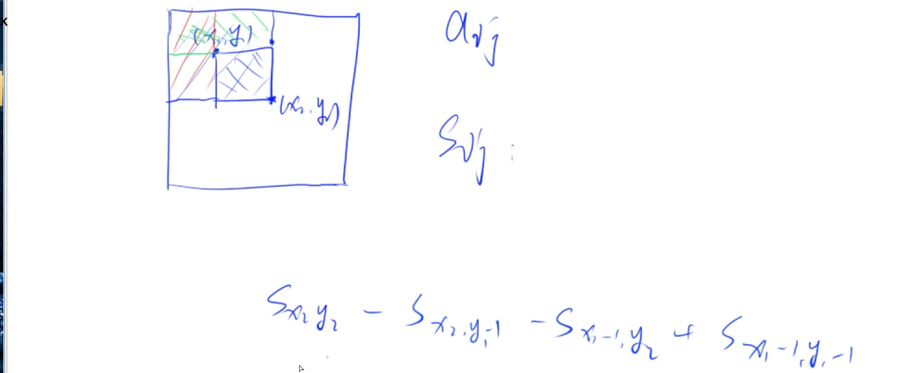
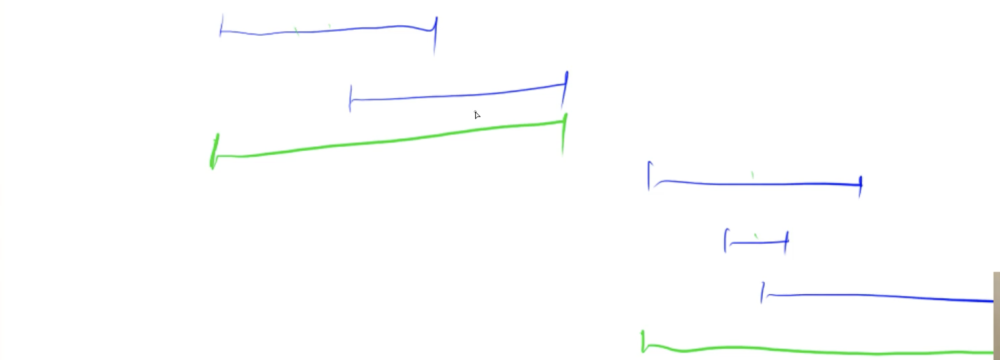
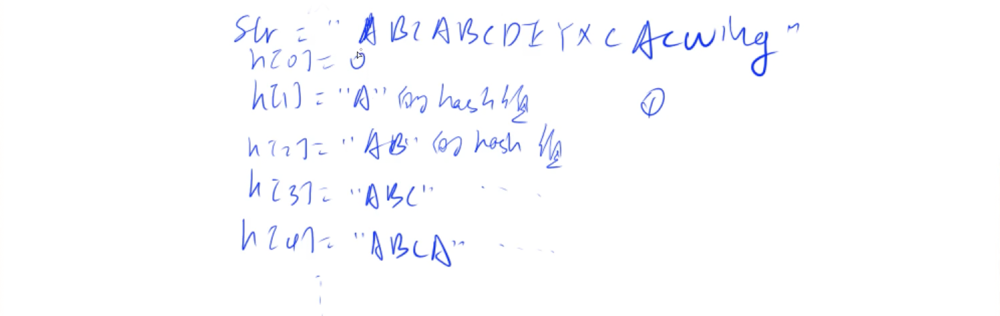

####  曼哈顿距离

$|x1 - x2| + |y1 - y2|$

[727.菱形](https://www.acwing.com/problem/content/description/729/)

****

#### 约数

约数都是成对出现的，因此可以将暴力枚举优化

> 每次都枚举较小的数，$d <= x / d$   --> $d < \sqrt{x}$。
>
> 需要注意的是，当$x$为完全平方数的时候，$x$可以为6，同时 $x / d$ 也为6，因此冲突了，需要作一下判断

[725. 完全数](https://www.acwing.com/problem/content/727/)

---

#### 质数

可以使用约数来实现

[726. 质数](https://www.acwing.com/problem/content/728/)

---

#### 最小公倍数

>  两数乘积 = 最小公倍数 * 最大公约数

---

## 基础算法

### 排序

#### 概念

**稳定：**两个相同的值在排序的过程中，它们的位置不发生改变

---

#### 快速排序

>  思想：分治
>
> 时间复杂度：平均、最好：$O(nlog_2n)$，最坏：$O(n^2)$

---

**步骤**：

有一个数组`q`，左边界为`l`，右边界为`r`

1. 确定分界点：`q[l]`, `q[l + r / 2]`, `q[r]`, `q[i]`,`i`随机，这个点是可以随意确定的
2. 调整区间：假设分界点的值为$x$，使得$x$左边的值 $<=x$， 右边的值 $>=x$
3. 递归处理左右两边

----

**实现：**

1. 额外开两个数组a，b
2. 遍历 q ，将 $<=x$ 的值放在 a 里，将 $>=x$ 的值放在 b 里
3. 合并 a，b到 q 中

----

**优化实现：**使用双指针 i = l， j = r

1. i 往右走，直到 `q[i] > x `
2. j 往左走，直到 `q[j] < x`
3. `q[i]` 和 `q[j]` 交换，以满足步骤2，同时 i 向右移一位，j 向左移一位


----

**代码实现：**

```c++
void quick_sort(int q[], int l, int r) {
    if (l >= r) return ;
	// i = l - 1, j = r + 1，是因为双指针是先移动再比较的
    int x = q[(l + r) / 2], i = l - 1, j = r + 1;
    while(i < j) {
        do i++; while(q[i] < x);
        do j--; while(q[j] > x);
        if (i < j) swap(q[i], q[j]);`
    }
  // 取j还是i都可以，就是取i的时候x边界不能为l，取j的时候，x的边界不能为r
    quick_sort(q, l, j);
    quick_sort(q, j + 1, r);
}
```

---

#### 归并排序

> 思想：分治
>
> 时间复杂度：平均、最好、最坏：$O(nlog_2n)$

拆分需要 $log_2n$ 次，每一层都需要计算 $n$ 次


---

**步骤：**

1. 确定分界点：$mid = (l + r) / 2$
2. 递归排序 left，right
3. 归并，合二为一


----

**归并思想**

1. 有两个排好序的数组 a，b ，也可以看作是q数组的 left 和 right  和一个结果数组 res
2. i 为 a 的起始， j 为 b 的起始
3. a[i] 与 b[j] 比较，将小的值放进res。当 i 到终点时，将 b 后面的值直接放进res，当 j 到终点时，同理。


----

**代码实现：**

```c++
void merge_sort(int q[], int l, int r) {
    if (l >= r) return;
    int mid = l + r >> 1;
    merge_sort(q, l, mid), merge_sort(q, mid + 1, r);
    int i = l, j = mid + 1, k = 0;
    while (i <= mid && j <= r) {
        if (q[i] < q[j]) tmp[k ++] = q[i ++];
        else tmp[k ++] = q[j ++];
    }
    while (i <= mid) tmp[k ++] = q[i ++];
    while (j <= r) tmp[k ++] = q[j ++];
    
    for (i = 0, j = l; i < k; i++, j++) {
        q[j] = tmp[i];
    }
}
```

---

[788. 逆序对的数量](https://www.acwing.com/problem/content/790/)

----

### 二分

> 可以将一个区间一分为二，使得右边满足某个性质，左边不满足整个性质
>
> 单调性一定可以二分，但是可以二分的不一定要满足单调性

#### 整数二分


**满足左边性质的情况**

1. mid 满足性质，l = mid，
2. mid 不满足性质，r = mid - 1，因为mid不符合性质可以排除

**模板**

```c++
int bsearch_1(int l, int r) {
  while (l < r) {
    int mid = l + r + 1 >> 1;
    if (check(mid)) l = mid;
    else r = mid - 1;
  }
}
```

----

**注意：**mid 需要为 $(l + r + 1) / 2$，因为，当l = r - 1的时候并且`check(mid) = true` 时，$mid = (l + r) / 2 = l$ ，因此 l = mid会造成死循环

**满足右边性质的情况**

1. mid满足性质， r = mid
2. mid 不满足性质，l = mid + 1，因为 mid 不符合性质

**模板**

```c++
int bsearch_2(int l, int r) {
  while (l < r) {
    int mid = l + r >> 1;
    if (check(mid)) r = mid;
    else l = mid + 1;
  }
}
```

-----

#### 浮点数二分

> 没有整数因素影响，可以严格缩小一半

----

当满足 $r-l\leq10^{-6}$ 可以看作是一个点

**为什么要以 $10^{-6}$ 作为判断的点：**

> Math.abs(x)<1e-6其实相当于x == 0
>
> 1e-6(也就是0.000001)叫做epslon，用来抵消浮点运算中因为误差造成的相等无法判断的情况。它通常是一个非常小的数字（**具体多小要看你的运算误差**）
>
> 比如说因为精度误差，用十进制举例，我们要算1/3+1/3+1/3 == 1（从数学上说，肯定相等），但是因为精度问题，等号左边算出来是0.3333333+0.3333333+0.3333333 = 0.9999999，存在了误差，右边是1.0000000，那么如果直接用 == ，返回false，我们希望它被视作相等。那么就要两数相减取绝对值小于epslon的办法。

**模板：求数x的开根号**

```c++
int blsearch() {
  int l = 0, r = x;
  while (r - l > 1e-8) {  // 看情况调整精度  或者换成for (int i = 0; i < 100; i++)
    double mid = (l + r) / 2;
    if (mid * mid >= x) r = mid;
    else l = mid;  // 没有边界
  } 
}
```

----

### 高精度

> A + B   $A\leq10^6,B\leq10^6$ 
>
> A - B    $A\leq10^6, B\leq10^6$  这里跟加法都是值的位数 
>
> A * a     len(A)$\leq10^6$, a$\leq10^{-9}$    这里的a是数值

用数组存数字，数组的高位存数字的高位，主要是方便进位，因为往后面加数字容易


----

#### 加法


对于每一位的结果都可以用 A+B+t 来表示，t表示的是进位

```c++
vector<int> add(vector<int> &A, vector<int> &B) {
    vector<int> c;
    int t = 0;
    for (int i = 0; i < A.size() || i < B.size(); i++) {
        if (i < A.size()) t += A[i];  // 这里不能用if(A[i])  因为初始化的时候不能保证是0
        if (i < B.size()) t += B[i];
        c.push_back(t % 10);
        t /= 10;
    }
    if (t) c.push_back(t);
    return c;
}
```

---

#### 减法


1. t 表示的是借位，如果有借位那么就需外额外减
2. A，B代表数，$A_i,B_i$ 代表某一位

```c++
// 判断A B那个大，A > B, 则sub(A, B); B > A, 则sub(B, A)
bool cmp(vector<int> &a, vector<int> &b) {
    if (a.size() != b.size()) return a.size() > b.size();
    for (int i = a.size() - 1; i >= 0; i--) {
        if (a[i] != b[i]) return a[i] > b[i];  // 下面是我写的
        // if (a[i] > b[i]) return true;
        // else if (a[i] < b[i]) return false;
    }
    return true;
}

vector<int> sub(vector<int> &a, vector<int> &b) {
    vector<int> c;
    int t = 0;
    for (int i = 0; i < a.size(); i++) {
        t = a[i] - t;
        if (i < b.size()) t -= b[i];
        c.push_back((t + 10) % 10);    // (-1+10)%10=9 (1+10)%10=1
        if (t < 0) t = 1;              // 这里如果写-1，那t就应该是t = a[i] + t
        else t = 0;
    }
    while (c.size() > 1 && c.back() == 0) c.pop_back();  // 当数是003的情况下，需要去掉数组高位的0，如果个位是0，不需要去掉
    return c;
}
```

----

#### 乘法

**步骤：**

1. 数组A存大数字，a为小数字
2. $A_i \times a$ ：用某一位乘上小数字的整体
3. $C_i$ 为 $(A_i \times a + t) \% 10$，进位为 $(A_i \times a + t) / 10$

---

```C++
vector<int> mul(vector<int> &a, int b) {
    vector<int> C;
    int t = 0;
    for (int i = 0; i < a.size() || t; i++) {
        if (i < a.size()) t += a[i] * b;  // 优化部分 ||t 跟 if 能够代替下面那一句
        C.push_back(t % 10);
        t /= 10;
    }
    
   // while (t > 0) {
    //     C.push_back(t % 10);
    //     t /= 10;    
    // }
    while (C.size() > 1 && C.back() == 0) C.pop_back();  // 在main中判断b是否为0，如果为0就直接输出0，不调用这个函数
    
    return C;
}
```

----

#### 除法

----

### 前缀和、差分

#### 前缀和

##### 一维前缀和

**定义：**$S_i=a_1+a_2+a_3+...+a_i$

---

**步骤：**

1. 如何求$S_i$：
   - `for i = 1; i <= n; i++ `
   - $S[i] = S[i - 1] + a[i]$
   - $S[0] = 0$
2. 作用：方便求某一个区间 [l, r] 的和，为$S[r] - S[l-1]$

----

**模板：**

[795. 前缀和](https://www.acwing.com/problem/content/description/797/)

----

##### 二维前缀和



求$(x_1, y_1)$到$(x_2,y_2)$的前缀和需要先求大的$S_{x2y2}$，再求两个矩形绿色和红色$S_{x_2y_{1-1}}$，$S_{x_{1-1}y_2}$，由于左上角的矩形被减两次，因此需要加上$S_{x_{1-1}y_{1-1}}$，式子为：$S[x2,y2]-S[x2,y1-1]-S[x1-1,y2]+S[x1-1,y1-1]$

**如何求$S[i, j]$**:

1. $S[0,0]=0$
2. 求$S[i,j - 1]$
3. 求$S[j-1,i]$
4. $S[i-1,j-1]$被加了两次
5. $S[i,j] = S[i,j-1] + S[i-1,j] - S[i - 1,j - 1] + a[i,j]$

----

**模板**

[796. 子矩阵的和](https://www.acwing.com/problem/content/798/)

----

#### 差分

##### 一维差分

> 前缀和的逆运算：其实就是根据前缀和求 b，也就是差分


**作用：**通过 b 使得 a 全部 +c 。如果通过普通做法那么就需要暴力遍历a，然后+c

**做法：**

1. 要使得区间 [l, r] 的 $a_l$~$a_r$ + c
2. $b_l +c$ 使得$a_l$~$a_n$ + c
3. $b_{r+1}-c$  使得$b_{r+1}$~$b_n$ - c，因为不需要除了[l, r] 之外的数也加上c

**构造差分b**

> $b_1 = a_1$
>
> $b_2=a_2-a_1$
>
> $b_3=a_3-a_2$
>
> $b_n=a_n-a_{n-1}$

 这样构造可以满足**作用**

----

**实现**

1. 使用a来**初始化**b：是根据**做法**的第2、3步来实现的，对每个区间 [i, i],a[i] 都执行一遍`insert`操作，就可以构造出b
2. 累加 b 来实现新的前缀和

```c++
// 根据差分操作来初始化b
void insert(int l, int r, int c) {
    b[l] += c;
    b[r + 1] -= c;
}
// 求前缀和
for (int i = 1; i <= n; i++){ 
    b[i] += b[i - 1];
    printf("%d ", b[i]);
}
```

---

[797. 差分](https://www.acwing.com/problem/content/799/)

----

##### 二维差分

> 跟二维前缀和比较相似，只不过是由于差分的性质，看起来是倒过来了


给$(x_1,y_1)$到$(x_2,y_2)$ 加上c

1. $b[x_1][y_1]+c$
2. $b[x_1][y_2+c]-c$，绿色部分
3. $b[x_2+1][y_1]-c$，红色部分
4. $b[x_2 + 1][y_2 + 1]+c$，因为右下角的部分被减了两次

**插入：**$(i,j)$~$(i,j) + a[i][j]$，原理就是相当于在$(i,j)$ ~ $(i,j)$加上了一个$a[i][j]$

----

[798. 差分矩阵](https://www.acwing.com/problem/content/800/)

----

### 双指针

> 运用了某种单调的性质将$O(n^2)$优化到$O(n)$

```c++
for (int i = 0, j = 0; i < n; i++) {
  while(j < i && check(i, j)) j++;
  // 具体的逻辑
}
```

----

​	[799. 最长连续不重复子序列](https://www.acwing.com/problem/content/801/)

----

### 位运算

**求 n 的二进制表示中第 k 位是几**

>  15 = $(1111)_2$ ，其中个位的下标是0

1. 先把第k位移到最后一位，n >> k
2. 看个位是几，x & 1

比如，当n为10时

```c++
int n = 10;
for (int k = 3; k >= 0; k--) {
  cout << (n << k & 1);   
}
/*
	结果为1010
	流程是这样的，因为要输出高位1，所以k是从3开始，这也是有理由的
	1010右移3位为1
	1010右移2位为10
	1010右移1位为101
	1010右移0位为1010
	注意：这四个数字都要输出 个位，因此需要 &1 
*/
```

---

**lowbit(x)：返回x的最后一位1**

> x = 1010， lowbit(x) = 10
>
> x = 101000， lowbit(x) = 1000

**原理：x & -x**

正数的补码等于本身，负数的补码等于反码+1

> x = 1010...1000
>
> -x = ~x + 1
>
> ~x = 0101...0111
>
> ~x + 1 = 0101...1000
>
> x & -x = x & ~x + 1 = 0000...1000

**实现：求 x 中 1 的个数**

> 其实最主要的是x & -x 结果中只有一位1，因此就可以直接减去从而实现了消去 x 的最后一位 1

```c++
int n = 5;
while (x) x -= x & -x, res ++; // res为x中1的个数
```

----

[801. 二进制中1的个数](https://www.acwing.com/problem/content/803/)

---

###  离散化


**定义：**将值映射到从0开始的自然数

当值需要当作下标来做的时候，但是个数只有$10^5$个，因此如果把$0$~$10^9$范围的值作为下标的话显然是不可行的，比如[799. 最长连续不重复子序列](https://www.acwing.com/problem/content/801/)，因为值的范围是$10^5$ ，所以问题不大

---

**步骤**

1. a[] 中可能存在重复元素，需要**去重**

   ```c++
   // unique会返回没有重复元素的最后一个下标，重复的元素会被丢到后面去，再通过earse就可以删除末尾的重复元素
   alls.earse(unique(alls.begin(), alls.end()), alls.end()) 
   ```

   

2. 如何快速算出 x 离散化后的值，比如说 x=50000，离散化后的值为4，通过**二分**来做，因此需要排序

```c++
int find(int x) {
  int l = 0, r = alls.size() - 1;
  while (l < r) {
    int mid = l + r << 1;
    if (alls[mid] >= x) r = mid; // 满足右边性质
    else l = mid + 1;
  }
 	return r + 1; // 映射的是1 2 3 ... n ，下标从1开始
}
```

---

[802. 区间和](https://www.acwing.com/problem/content/804/)

----

### 区间合并

> 有交集的两个区间可以合并成一个大的区间

绿颜色为合并后的区间



**步骤**


1. 按区间的左端点排序
2. 对于[st, ed] 区间来说，第二个区间有三种情况
   - 区间在[st, ed]内，ed不变
   - 区间的ed超过[st, ed]，延长[st, ed]，更新为第二种情况的ed
   - 区间在[st, ed]外，由于是按照左端点排序的，因此后续所有区间都在[st, ed]外，因此[st, ed]即为一种答案，更新[st, ed]为粉颜色的[st, ed]

```c++
typedef pair<int, int> PII;
void merge(vector<PII> &segs) {
    vector<PII> res;
    sort(segs.begin(), segs.end());
    int st = -2e9, ed = -2e9;  // 要设置为[负无穷，正无穷]，但是因为l, r的范围是-1e9~1e9，因此负无穷可以设置为-2e9
    for (auto seg : segs) {
        if (ed < seg.first) {
            if (st != -2e9) res.push_back({st, ed});  // 这个区间合并完了，加入到结果中
            st = seg.first;
            ed = seg.second;   // 更新[st, ed]
        } else {
            ed = max(ed, seg.second);  // 计算ed
        }
    }
    if (st != -2e9) res.push_back({st, ed});  // 最后一个[st, ed]需要加进来，要防止segs为空，所以要if判断一下
    segs = res;  // 因为要输出segs.size(),传的是引用
}
```

[803. 区间合并](https://www.acwing.com/problem/content/805/)

----

## 数据结构

### 链表

---

#### 单链表

**用途：**

1. 邻接表
   - 存储图
   - 存储树

---

**实现：**


$e[i]$ 为节点 $i$ 的值，$ne[i]$ 为节点 $i$ 的next指针是多少，也就是节点 $i$ 指向的值

-----

将某个节点 x 插入到头节点。

1. x节点指向的下一个节点为head指向的下一个节点：`ne[idx] = head;`
2. head 指向的下一个节点更改为 x：`head = idx;`
3. 赋值：`e[idx] = x;`
4. idx 被使用了：`idx++;`


```c++
const int N = 100010;
int e[N], ne[N], idx;  // idx表示已经用到了哪个点

void init() {
	head = -1;  // 头节点指向空节点
  idx = 0; // 用了0个点
}

void add_to_head(int x) { // 插入到头节点
  e[idx] = x;
  ne[idex] = head;
  head = idx;      // x是值，idx是节点，比如第一张图中，e[0] = 3，x为3，ne[0] = 1, idx为0，idx++为1
  idx ++;
}

void add(int k, int x) { // 将值 x 插入到 k 点之后，原理跟插入头节点差不多
  e[idx] = x;
  ne[idx] = ne[k];
  ne[k] = idx;
  idx ++;
}

void remove(int k) { // 将下标是k的后面的节点删掉
  ne[k] = ne[ne[k]];
}

void delete(int k) { // 将下标是 k 的节点删掉
  // 因为没办法拿前一个节点，那就只能拿后面的节点来操作一下，方法就是k节点当作是k后面节点互换，找替身
	e[k] = e[ne[k]];  // 把k后面的值给k
  ne[k] = ne[ne[k]]; // 删除k后面的节点，
  
  
}
```


---

#### 双链表

> **用途：**优化某些问题

$l[i]$ 表示节点 i 左边的节点， $r[i]$表示节点 i 右边的节点

**初始化：**初始化0（head），1（tail）号点，


**插入节点**


1. 赋值：`e[idx] = x;`
2. x 节点的右边节点为 k 的右边节点：`r[idx] = r[k]`
3. x 节点的左边节点为 k 的右边节点的左边节点：`l[idx] = k;`
4. k 节点的右边节点的左边节点为 x：`l[r[k]] = idx;`
5. k 节点的右边节点为 x：`r[k] = idx`     ps：跟第4步不能倒过来，因为这步会影响`r[k]`

```c++
const int N = 100010;
int e[N], l[N], r[N], idx;

void init() {
  r[0] = 1, l[1] = 0;
  idx = 2;
}

// 在k的右边插入x，如果要在左边插入，调用add(l[k], x)
void add(int k, int x) { 
  e[idx] = x;
  r[idx] = r[k];
  l[idx] = k;
  l[r[k]] = idx;
  r[k] = idx;
 	idx ++;
}
// 删除第k个点，画图一目了然，
void remove(int k) {
  r[l[k]] = r[k];   
  l[r[k]] = l[k];
}
```

----

### 栈

> 先进后出

```c++
const int N = 100010;
int stk[N], tt;

stk[++ tt] = x;  // 入栈

tt--;  // 弹出
stk[tt] // 栈顶元素
if (tt > 0) not empyt;
else empty;
```

---

#### 单调栈

> 在一个序列中，求每个数左边离它最近且比他小的数在什么位置

**暴力做法**

```c++
for (int i = 0; i < n; i++) {
  for (int j = i - 1; j >= 0; j--) {
    if (a[j] < a[i]) break;
  }
}
```

**单调栈做法**

1. 如果$a[3] \geq a[5]$ ，存在$a[3] < a[i]$ ，所以$a[5] < a[i]$ 因此 5 是答案
2. 根据上式可以发现一个规律，$x < y ，a[x] \geq a[y] $，这样的逆序对，y是答案，因此存储的是y

```c++
const int N = 100010;
int stk[N], tt;

int main() {
    int n;
    cin >> n;
    for (int i = 0; i < n; i++) {
        int x;
        cin >> x;
        while (tt && stk[tt] >= x) tt --;  // 逆序对 删到栈顶
        if (tt) cout << stk[tt] << " ";   // 存在比x小的
        else cout << "-1 ";   // 不存在输出- 1
        stk[++ tt] = x;   // 
    }
    return 0;
}
```

[830. 单调栈](https://www.acwing.com/problem/content/832/)

---

### 队列

> 先进先出

```c++
const int N = 10001;
// 队尾插入元素，队头弹出元素
int q[N], hh, tt = -1;

q[++ tt] = x;  // 入队

hh++;  // 出队

if (hh <= tt) not empty;
else empty;

q[hh];   // 取出队头元素
```

---

#### 单调队列

> 求一个滑动窗口里面的最大值或者最小值

 

该窗口最小值是 3

**暴力做法**

两层for循环，时间复杂度为$O(nk)$，$n, k \leq 10^6$，时间复杂度太高

**单调队列做法**


1. 思路和单调栈一致，队列里是否有某些元素没有用的，将这些元素删掉，是否会得到单调性
2. 对于窗口 $[3, -1, -3]$ 来说，3比-3早出现，并且3 > -3，因此它们构成逆序对，在这种情况下，3不可能是答案
3. 根据2，队列里存储的值是单调递增的，最小值为q[hh]，也就是队头
4. 如果队头元素超出了滑动窗口的范围，就需要把队头弹出

**输出滑动窗口的最小值**

```c++
const int N = 1000010;
int q[N], a[N];
int hh, tt = -1, k, n;

int main() {
  scanf("%d", &n, &k);
  for (int i = 0; i < n; i++) scanf("%d", &a[i]);
  for (int i = 0; i < n; i++) {
    for (int i = 0; i < n; i++) {
      // 判断是否出了滑动窗口
      if (hh <= tt && i - k + 1 > q[hh]) hh++;
      //判断逆序对, 末尾出队。 如果要输出最大值，那就写<=
      while (hh <= tt && a[q[tt]] >= a[i]) tt--;
      q[++ tt] = i;
      // 窗口开始的位置是[0,2]
      if (i >= k - 1) printf("%d ", a[q[hh]]);
  }
}
```

----

### KMP

> 模式串P在字符串S所有出现位置的起始下标

**暴力做法**

```c++
S[N], P[M]
for (int i = 1; i <= n; i++) {
  bool flag = true;
  for (int j = 1; j <= m; j++) {
    if (s[i + j - 1] != p[j]) {    // s[i + j - 1]表示从i开始往后匹配j位是否跟p[j]想对应
   		flag = false;
      break;
    }
  }
}
```

---

**优化**


1. 当 j 移动到粉圆圈时，`s[i + j - 1] != p[j]`，也就是不匹配了
2. 观察是否可以利用前面利用匹配的字符串来帮助我们少枚举一些
3. 发现最多可以移动 k 位使得橙色部分的字符串是相等的
4. 可以得出
   1. 以某个点位终点的后缀和前缀是相等的，相等的最大长度是多少
   2. **`next[i] = j`**：表示以 i 位终点长度为 j 的后缀和以 1 为起点的前缀是相等的，即`p[1...j] = p[i + j - 1, j]`


**操作**


1. 当 i 遍历到绿圆圈时，发现字符串S跟模式串P不匹配了
2. 回到优化的思路，需要找到绿线**长度最长**的前缀和后缀相等，也就是next[j]
3. 所以第二条红线以i - 1为分界点，前面的长度就是next[j]，也就是2. 的前缀和后缀
4. 当移动到next[j] 之后，再看是否与 s[i] 匹配
   1. 如果匹配：那么 i 继续往后走
   2. 如果不匹配：递归调用next[j]，回到步骤2，3，4

**求next的过程**


> 其实跟前面是类似的，对于模式串P来说也是要去匹配的

1. 看 i 跟P2 的j + 1是否匹配
   1. 匹配，j往后，i往后
   2. 不匹配，`j = ne[j]`，因为next求的是匹配长度的最大值

```c++
#include<iostream>

using namespace std;

const int N = 100010, M = 1000010;
int n, m;
char p[N], s[M];
int ne[N];

int main() {
    cin >> n >> p + 1 >> m >> s + 1;
    
    // 求next的过程
    for (int i = 2, j = 0; i <= n; i++) {    // ne[1] = 0，只能为0
        while (j && p[i] != p[j + 1]) j = ne[j];
        if (p[i] == p[j + 1]) j++;
        ne[i] = j;
    }
    
    for (int i = 1, j = 0; i <= m; i++) {
        while (j && s[i] != p[j + 1]) j = ne[j];   // j有路走，并且下一次字符不相等
        if (s[i] == p[j + 1]) j++;  // 字符匹配上了，j向后走一个位置，i也向后走
        if (j == n) {     // j走完了，输出匹配的起始位置
            printf("%d ", i - n);  
            j = ne[j]; // 要求出所有的下标，需要将j重复赋值去匹配
        }
    }
    return 0;
}
```

---

[831. KMP字符串](https://www.acwing.com/problem/content/833/)

----

### Trie

> 高效地存储和查找字符串。集合的数据结构


- 存储：以当前节点为结尾的单词是会有一个标记的
- 查找：如果说存了abc, abcde，结尾的标记是c和e，要查找abcd是否存在，答案是不存在，虽然能找一条路径abcd，但是d没有标记


```c++
const int N = 100010;
int son[N][26], cnt[N], idx; // idx 下标是0的点，既是根节点又是空节点
char str[N];

void insert(char str[]) {
    int p = 0; // 从根节点开始
    for (int i = 0; str[i]; i ++) {
        int u = str[i] - 'a'; // u: 0~25，代表a~z
      /*
        p其实就是idx，跟单链表一样的，用idx标明该点是什么时候插入的。
        son[p][u]就表示在p点字符为u-'a'
      */
        if (!son[p][u]) son[p][u] = ++idx;  // 如果不存在就创建一个点
        p = son[p][u];  // p就指向了当前的点
    }
    cnt[p] ++;  // 标记，以p点结尾的字符串
}

int query(char str[]) {
    int p = 0;
    for (int i = 0; str[i]; i ++) {
        int u = str[i] - 'a';
        if (!son[p][u]) return 0;
        p = son[p][u];
    }
    return cnt[p];
}

```

---

[835. Trie字符串统计](https://www.acwing.com/problem/content/837/)

[143. 最大异或对](https://www.acwing.com/problem/content/145/)

----

### 并查集

**作用**

- 将两个集合合并
- 询问两个元素是否在一个集合当中

---

**暴力做法**

>  有一个数x，y，用集合做法

```c++
belong[x] = a, belong[y] = a;
if (belong[x] == belong[y]) // 时间复杂度是O(1)
```

如果需要合并的话，假设一个集合的数的数量是1000，另一个是2000。需要合并这两个集合。将1000的集合加在2000的后面，最少也要操作1000次。

---

**并查集做法**：能在近乎$O(1)$ 的时间复杂度完成这两个操作

**步骤**

1. 用树的形式来维护所有的集合
2. 根节点的编号就是当前集合的编号
3. 对于每个点都存储它的父节点是谁，`p[x]`表示 x 的父节点
4. 对于每个节点都往上找它的树根
5. 树根的表示`p[x] = x`，因为根节点x是没有父节点的，那可以用自身表示它的父节点 
   - `while(p[x] != x) x  = p[x];`
6. 合并两个集合：`p[x]`是 x 的集合编号，`p[y]`是 y 的集合编号，`p[x] = y`，将 x 集合合并到 y 集合上


**优化：**路径压缩

> `while(p != p[x]) `这部分时间复杂度太高

- 有一个点 x 想往上找根节点，当找到根节点之后，把 x 经过的点都指向根节点


```c++
// 返回x的祖宗节点 + 路径压缩
int find(int x) {
  	if (p[x] != x) p[x] = find(p[x]); // 不理解的时候画图看看
    return p[x];
}
int main() {
    int n, m;
    scanf("%d%d", &n, &m);
  	// 每个节点都是在一个单独的集合里
    for (int i = 0; i < n; i++) p[i] = i;
    while (m --) {
        char op[2];
        int a, b;
        scanf("%s%d%d", op, &a, &b);
      /*
        M为合并操作，
        a的根节点为find(a), b的根节点为find(b)
        p[find(a)] 为a的根节点的父节点
      */
        if (op[0] == 'M') p[find(a)] = find(b);
        else {
          	// 判断是否在一个集合，就看根节点是否相同
            if (find(a) == find(b)) puts("Yes");
            else puts("No");
        }
    }
    return 0;
}
```

----

[836. 合并集合](https://www.acwing.com/problem/content/838/)

[837. 连通块中点的数量](https://www.acwing.com/problem/content/839/)

----

### 堆

**问题**

- 插入一个数：插入到数组末尾，执行up操作，`heap[++size] = x, up(size)`
- 求集合当中的最小值：`heap[1]`
- 删除最小值：将最后一个元素替换最小值，然后删掉最后一个元素，`heap[1] = heap[size--], down(1)`
- 删除任意一个元素：跟删除最小值类似，可以判断之后再做down或者up操作，也可以直接两个都做，`heap[k] = heap[size--], down(k), up(k)`
- 修改任意一个元素：`heap[k] = x, down(k), up(k)`


---

**结构：**是一颗完全二叉树

**小根堆：**每个节点的值都$\leq$左右儿子，因此根节点是最小值

**存储：**一维数组存，下标表示 x 为当前节点，2x为左儿子，2x+1为右儿子，因此下标从1开始


- down：把一个数变大了可能需要往下压

- up：把一个数变小了可能需要往上走

- 构建堆：`for(int i = n / 2; i; i--) down(i)`，能将时间复杂度降为n，如果从n开始 i--，那么时间复杂度就是$O(nlog_2n)$ 。

  理由如下：对于树的最后一层节点来说，down操作是没有必要的，因此从倒数第二层开始，除了最后一层的节点数量为$n/2$ ，倒数第二层的节点数量为 $4/n$，对于倒数第二层来说，down的次数为1；倒数第三层，down的次数为2....，这里的次数跟离最后一层的高度有关，因为是down操作。 公式推演如下
  $$
  \frac{n}{4}\times1 + \frac{n}{8}\times2 + \frac{n}{16}\times3....\\
  =>\quad n(\frac{1}{2^2} + \frac{2}{2^3} + \frac{3}{2^4} + \frac{4}{2^5|} + ....)\\
  令s = \frac{1}{2^2} + \frac{2}{2^3} + \frac{3}{2^4} + \frac{4}{2^5} + ....\\
  =>\quad 2s = \frac{1}{2} + \frac{2}{2^2} + \frac{3}{2^3} + \frac{4}{2^4} + ....\\
  错位相减得：2s - s = \frac{1}{2} + \frac{1}{2^2} + \frac{1}{2^3} + \frac{1}{2^4} + \frac{1}{2^5} + ....<1
  $$
  因此
  $$
  n(\frac{1}{2^2} + \frac{2}{2^3} + \frac{3}{2^4} + \frac{4}{2^5|} + ....)<n
  $$
  所以时间复杂度为$O(n)$

```c++
// 初始化（构建）堆
 for (int i = n / 2; i; i--) down(i);

void down(int u)
{
    int t = u;  // t表示最小值的点的编号
    if (u * 2 <= size && h[u * 2] < h[t]) t = 2 * u;  // 判断左孩子是否比当前节点小
    if (u * 2 + 1 <= size && h[u * 2 + 1] < h[t]) t = 2 * u + 1;   // 判断右孩子是否比当前节点小或者左孩子小
    if (u != t) // 如果u变化了，那么就需要交换值，继续往下走
    {
        //swap(h[t], h[u]);
     	  heap_swap(t, u);
        down(t);
    }
}

void up(int u) {
  while (u / 2 && h[u / 2] > h[u]) { // u / 2代表父节点，字节点的值小于父节点，需要向上走，直到走到根或者大于父节点为止
    //swap(h[u / 2], h[u]);
    heap_swap(u / 2, u);
    u /= 2;
  }
}
```

---

[838. 堆排序](https://www.youtube.com/watch?v=WlBZD0x1Leo)

[839. 模拟堆](https://www.acwing.com/problem/content/841/)

----

### 哈希表

**内容：**

- 存储结构
  - 开放寻址法
  - 拉链法
- 字符串哈希方式

---

**作用：**把一个比较庞大的值域映射到一个比较小的空间，一般是$0$~$N$，$N:10^5$~$10^6$

**做法**

1. 有N（$10^5$）个数，数的范围是$-10^9$~$10^9$ 
2. 哈希函数$h(x)\in(0,10^5)$
   - $x \quad mod\quad 10^5$ 
   - 解决冲突，比如$h(5) = 2, h(10)=2$ 

**解决冲突**

- 拉链法：对于每个槽都是一个单链表，冲突的数插在链表头或者末尾都可以
  - 时间复杂度：哈希算法是一种期望算法，虽然是拉了个链，但是链的长度是个长度，非常短，因此在一般情况下，哈希表的时间复杂度	都是$O(1)$ 
  - 添加：求$h(x)$，$x$添加到槽对应的链表上
  - 查找：求$h(x)$，看$x$是不是在对应的链表上
  - 删除：不会真的删掉，会用一个布尔变量记录一下

​	

- 开放寻址法：开一个2～3倍长度的数组，用哈希函数求出位置$h(x)$，如果当前位置有数，那就放在下一个位置
  - 添加：找到位置$k$，往后直到位置为空，插入
  - 查找：找到位置$k$
    - 位置$k$有数并且等于$x$
    - 位置$k$有数，单不等于$x$，往后查找
    - 位置$k$没数，$x$不存在
  - 删除：按查找的的方式找$x$，也是用布尔变量标记一下


---

**代码**

一般做哈希的时候，$mod$的数要取成质数，并且要离2的整次幂尽可能的远，这样造成的冲突最小

- 拉链法

```c++

const int N  = 100003; // N的范围是0～10^5, 所以可以求一个>10^5的质数
// 求质数，可以求出100003
for (int i = 100000;; i ++) 
{
    bool flag = true;
		for (int j = 2; j * j <= i; j++)
    {
      	if (i % j == 0)
      {	
        	flag = false;
          break;
      }
    }
  	if (flag) N = i, break;
}

int h[N], e[N], ne[N], idx;
memset(h, -1, sizeof h); // h存的头节点，在链表中，头节点初始化为-1

void insert(int x)
{
    int k = (x % N + N) % N; // x为负数时，在c++中x%N为负数，所以多加一个N变成正数
    // 加到链表的头
    e[idx] = x;
    ne[idx] = h[k];
    h[k] = idx;
    idx ++;
}

bool find(int x) 
{
    int k = (x % N + N) % N;
    for (int i = h[k]; i != -1; i = ne[i]) 
    {
        if (e[i] == x) return true;   
    }
    return false;
}
```

- 开放寻址法

null的意义：

1. memset(h, 0x3f, sizeof h)，给$h$逐字节添加0x3f，因为int为4字节，因此$h$中的每个数都为0x3f3f3f3f，同时$x$的范围是$-10^9$~$10^9$，0x3f3f3f3f > $10^9$
2. find的含义，如果找到了x，则返回x所在的位置，h[k] != 0x3f3f3f3f，h[k] == x；如果没找到x，那么h[k] == 0x3f3f3f3f，k的位置刚好是空位，x可以插入在此位置

```c++
// N的范围和拉链法的一样，求大于200000的质数

const int N = 200003, null = 0x3f3f3f3f;

int h[N];
memset(h, 0x3f, sizeof h);
int find(int x) 
{
    int k = (x % N + N) % N;
    while (h[k] != null && h[k] != x) 
    {
        k++;
        if (k == N) k = 0;  // k～N-1都已经被用过了，要重头开始
    }
    return k;
}
int main() {
  	int x;
  	scanf("%d", &x);
    int k = find(x);
    if (op[0] == 'I') h[k] = x;
    else 
    {
      if (h[k] != null) printf("Yes\n");
      else printf("No\n");
    }  
}

```

[840. 模拟散列表](https://www.acwing.com/problem/content/842/)

----

#### **字符串前缀哈希算法**



**思路：**

1. 将字符串看成是一个$p$ 进制的数，$(ABCD)_p$ ，假设A是1，B是2，那么$(ABCD)_p=1 \times p^3 + 2 \times p^2 + 3\times p^1 + 4 \times p^0$，就将一个字符串转换成了十进制数字
2. 由于字符串的长度非常大，因此结果就可能非常大，所以就将$(ABCD)_p \quad mod \quad Q$，$Q$是一个比较小的数，因此就把字符串映射成$0$~$Q-1$
3. 注意的点
   - 不能映射成0。如果A映射成0，那么AA也会映射成0，会有冲突
   - 没有解决冲突，因为假定不存在冲突。
   - 经验值：$p = 131 或 13331$，$Q=2^{64}$，$99.99\%$的情况不存在冲突
   - 用unsigned long long 存储$h$，因为这个类型溢出的话就相当于取模$2^{64}$
4. 预处理$h$， $h(i) = h(i - 1) \times p + str(i)$

**好处**

> 可以利用求出来的前缀哈希，用一个公式计算出来所有字段的哈希


要求$(L,R)$ 之间的子串，已知 $h[L-1],h[R]$ 

由于左边是高位，所以
$$
h[R]:p^{R-1}+p^{R-2}+...+p^0 \\
h[L-1]:p^{L-2}+p^{L-3}+...+p^0
$$
为了使$h[L-1]$跟$h[R]$对齐，也就是将$h[L-1]$往左移若干位，$h[L-1] \times p^{R-L+1}$
$$
h[R]-h[L-1] \times p^{R-L+1} : p^{R-L}+p^{R-L-1}+p^{R-L-2}+...+p^0
$$

```c++
typedef unsigned long long ULL;
const int N = 100010, P = 131;

int n, m;
ULL h[N], p[N];
char str[N];

int get(int l, int r) 
{
    return h[r] - h[l - 1] * p[r - l + 1];
}

p[0] = 1; // P ^ 0 = 1 
for (int i = 1; i <= n; i++) 
{
  p[i] = p[i - 1] * P;  // 预处理P^i
  h[i] = h[i - 1] * P + str[i];  // 字符串哈希
}
```

[841. 字符串哈希](https://www.acwing.com/problem/content/843/)


---

### STL

#### ***vector***

> 变长数组，倍增的思想
>
> 系统为某一程序分配空间时所需要的时间，与空间大小无关，与申请次数有关
>
> 倍增：当空间不足时，申请一个$\times2$的空间，将原来数组复制过去。长度为n，申请空间的次数时$O(log_2n)$，额外复制的次数均摊时$O(1)$ 

```c++
#include<vector>

vector<int> a(n); // 定义长度为n的vector
vecto<int> a(n, 10); // 定义长度为n的vector，并且定义里面的数都为3

vector<int> a[10]; // 数组：定义10个vector

// 所有容器都有 时间复杂度O(1)
a.size();  // 返回元素的个素
a.empty(); // 空返回true

a.clear(); // 清空

a.front();     // 返回第一个数
a.back();      // 返回最后一个数
a.push_back(); // 向最后插入一个数
a.pop_back();  // 删除vector最后一个数

// 迭代器
a.begin(); // vector的第0个数
a.end(); // 最后一个数的后一个数
for (vector<int>::iterator i = a.begin(); i != a.end(); i++) cout << *i << endl;
for (auto x : a) cout << x << " ";

[]; // 随机寻址

// 支持比较运算，字典序比较
vector<int> a(4, 3), b(3, 4);
if (a < b) puts("Yes");

```

---

#### ·***pair***

```c++
pair<int, string> p;
p = make_pair(10, "zzz");
p = {2, "yyy"};
p.first, p.second;
//支持比较运算 first为第一关键字，second为第二关键字
```

---

#### ***string***

> 字符串，可变长

```c++
#include<cstring>

string s = "zzfdsafz";
a.size();
a.empty();
a.clear();

cout << s.substr(1, 2); // 输出子串，第一个参数：起始位置；第二个参数：长度
a.substr(1); // 返回从1开始的子串

printf("%s\n", s.c_str()); // 输出s的起始地址，也就可以输出整个字符串
```

----

#### ***queue***

> 队列

```c++
#include<quque>

queue<int> q;

q.push();  // 向队尾插入一个元素
q.pop();   // 弹出队头元素 
q.front(); // 返回队头元素
q.back();  //  返回队尾元素

q.size();
q.empty(); 

// 没有clear函数 要重新构造的话
q = queue<int>();
```

----

#### ***priority_queue***

> 优先队列

```c++
#include<queue>

priority_queue<int> heap; // 默认大根堆 也没有clear函数
// 小根堆
heap.push(-x);
priority_queue<int, vector<int> greater<int>> heap;

heap.push(); // 插入一个元素
heap.top();  // 返回堆顶元素
heap.pop();  // 弹出堆顶元素
```

----

#### ***stack***

> 栈

```c++
#include<stack>

stack<int> stk;

stk.push();
stk.pop();
stk.top();

stk.size();
stk.empty();
// 没有clear
```

---

#### ***deque***

> 双端队列，加强版vector， 但是速度慢

```c++
#include<deque>

deque<int> q;

q.size();
q.empty();
q.clear();

q.front();
q.back();

q.push_front()/q.pop_front();
q.push_back()/q.pop_back();

//迭代器
begin()/end();

// 随机寻址
[];
```

---

#### ***set、map、mulitset、mutilmap***

> 基于平衡二叉树（红黑树，平衡二叉树的一种）来实现的，动态维护有序序列

```c++
#include<set>
#include<map>

size();
empty();
clear();

/*
	set multiset
*/
insert();        // 插入一个数
find();          // 不存在返回end()的迭代器
count();         // 返回某一个数的个数
begin(), end();  // 返回前驱和后继 时间复杂度O(logn)
/*
	1. erase(x)，x是一个数，删除所有x。 O(k + logn) k为x的个数
  2. erase(x), x是一个迭代器，删除这个迭代器。在set中没区别，在mutiset中有区别，迭代器指向的一个数 
*/
erase();
// 不存在返回end
lower_bound(x); // >= x最小的数的迭代器
upper_bound(x); // > x的最小的数的迭代器


/*
  map multimap
*/
insert(); // 插入的数是pair
erase();  // 参数可以是pair或者迭代器
find(); 
[];       // 时间复杂度是O(logn)

map<string, int> map;
map["zzz"] = 1;
cout << map["zzz"];
```

----

#### ***unordered_set、unordered_map、unordered_multiset、unordered_multimap***

> 基于哈希表来实现的

跟上面操作类似，但是没有lower_bound/upper_bound

#### ***bitset***

> 压位

bool每一个占一字节，如果要开1024个bool，就需要1024B = 1KB

将字节压到每一位，每一个字节能存八位，那么1024个bool只需要128B

**例子**

假设有$10000 \times 10000$的bool数组，$10^4 \times 10^4 = 10^8$ ，$10^8B = 10^2MB$ ，因此有可能超内存限制

```c++
bitset<10000> s; // 定义长度为10000的bitset

~s, &, |, ^;
<< >>;
== !=;
[]; // 取出来某一位是0或者是1

count(); // 返回有多少个1
any();   // 判断是否至少有一个1
none();  // 判断是否全为0

set(); 		 // 把所有位置成1
set(k, v); // 将第k位变成v
reset();   // 把所有位置变成0
flip();    // 等价~
flip(k);   // 把第k位~(取反)
```

---

## 搜索与图论

### DFS

> 深度优先搜索：只有搜到底的时候才会回溯，当回溯发现当前点还未搜完，那么就会继续向下搜


**特点**

- 数据结构：栈stack
- 空间复杂度：$O(h)$，跟高度有关
- 不具有最短性

---

[842. 排列数字](https://www.acwing.com/problem/content/844/)

**步骤：**

1. 第一位为1，第二位为2，第三位为3
2. 回溯为第二位，发现没有分支，回溯到第1位
3. 继续第二位为3，第三位为2
4. 回溯到第二位，没有分支，回溯第一位，没有分支，回溯到根
5. 第一位为2、3同理

**回溯的时候要恢复现场**


---

[843. n-皇后问题](https://www.acwing.com/problem/content/845/)

**第一种解法**

可以跟全排列一样去做，n皇后的条件多，要求对角线、列、排都不能有冲突。如果在某一个分支上放了跟前面节点冲突的点，那么这个点就不满足条件，后面你放多少都是不满足的，因此可以把这部分剪掉，称为**剪枝**

下图，dg[N], udg[N]，对角线，反对角线


- 对角线：$y = -x + b => b = x + y$

- 反对角线：$y = x + b => b = y - x$ 
- $dg[i + u]$， $udg[i - u + n]$，因为$i - u$ 有可能是负数，加n可以变为正数，反正只是将映射关系，不影响结果。$i$是列$y$，$u$是行$x$

**第二种解法**

第一种是按照行来排列的，第二种是根据放还是不放来排列，


```c++
void dfs(int x, int y, int s) {
    if (y == n) y = 0, x ++;  // 在某一行走到了末尾，那么就需要换行
    if (x == n) {							// 已经到x - 1的下一行，代表结束了
        if (s == n) {        // s是皇后的数量
            for (int i = 0; i < n; i++) puts(g[i]);
             puts("");
        }
       
        return ;
    }
    
    dfs(x, y + 1, s);        // 不放皇后的分支
    // 放皇后的分支
    if (!col[y] && !row[x] && !dg[x + y] && !udg[y - x + n]) {
        col[y] = row[x] = dg[x + y] = udg[y - x + n] = true;
        g[x][y] = 'Q';
        dfs(x, y + 1, s + 1);
        g[x][y] = '.';
        col[y] = row[x] = dg[x + y] = udg[y - x + n] = false;
    }
}
```


---

### BFS

> 宽度优先搜索：一层一层的搜


**特点**

- 数据结构：队列queue
- 空间复杂度：$O(2^h)$，跟每一层的节点数有关
- 具有短路性：每一层一定会搜与它最近的点。假如上图每条边的权重都为1，第一层离根节点的距离为1、第二层为2、第三层为3。并且只有边权为1时才能用最短路

---

[844. 走迷宫](https://www.acwing.com/problem/content/846/)


```c++
queue   初始化;
while queue不为空
{
  t 取出队头
  扩展queue，
}
```

```c++
int g[N][N];  // 点
int d[N][N]; // distance
PII q[N * N]; // 模拟队列
int n, m;

int bfs() {
   int hh = 0, tt = -1;
   memset(d, -1, sizeof d); // 初始化为-1，代表没走过
   q[++ tt] = {0, 0}; // 初始点为0,0
   d[0][0] = 0;      // {0,0}的距离为0
   int dx[4] = {-1, 0, 1, 0}, dy[4] = {0, 1, 0, -1};
   
   while (hh <= tt) {
       auto t = q[hh ++];  // 取出队头
     // 遍历四个方向
       for (int i = 0; i < 4; i++) {
           int x = t.first + dx[i], y = t.second + dy[i];
         // 不越界、没走过、能走过去
           if (x >= 0 && x < n && y < m && y >= 0 && d[x][y] == -1 && g[x][y] == 0) {
               d[x][y] = d[t.first][t.second] + 1;
               q[++ tt] = {x, y};
           }
       }
   }
   
   return d[n - 1][m - 1];
}
```

---

### 树和图的深度与广度优先遍历

> 树是特殊的图，并且无环、连通

- 有向图：$a->b$
- 无向图：$a-b$ =>  $a->b$， $b->a$，可以看作是一种特殊的有向图

**存储**

- 邻接矩阵：空间复杂度为$O(n^2)$，适合存储**稠密图**

​	$g[a,b] = x$ ，存的$a$ -> $b$的边，如果有权重，$x$为权重值，如果没有，$x$为布尔值

- 邻接表

​	每个点都有一个单链表，存储这个点可以到的点

​	

```c++
const int N = 100010, M = N * 2;
int h[N], e[M], ne[M], idx;
// 初始化头节点，跟单链表一样，都初始化为-1
memset(h, -1, sizeof h);

// a -> b建立一条边，h[a]指向头节点
void insert(int a, int b) {
  e[idx] = b, ne[idx] = h[a], h[a] = idx ++;
}
```

---

**遍历**：每个点都只会被遍历一次，时间复杂度为$O(n + m)$

- **深度遍历**：一路走到底，然后回溯


```c++
bool st[N];
void dfs(int u ) {
	st[u] = true; // 标记一下，表示已经遍历过了
  
  for (int i = h[u]; i != -1; i = ne[i]) {
    // 一条路走到黑，j就是编号，h[j]就是编号j指向的节点，下一个就从h[j]开始，到底了之后回溯
    j = e[i];
    if (!st[j]) dfs(j); 
  }
}
int main() {
  dfs(1);
}
```

[846. 树的重心](https://www.acwing.com/problem/content/848/)


1. 树的深度优先遍历可以很快的求出每个子树的大小，比如求子树4的节点数量，4深度搜索3、6也就是$size(3) + size(6) + 1$ ，就是当前子树的节点数量
2. 如果要删掉节点$4$， 那么父节点$1$为一个连通块，儿子有两个连通块，父节点$1$的几点数量可以为$n-size(4)$
3. 这里的核心是，$4$是从$1$下来的，所以说当走到$4$的时候是不会再走上去了，所以另一部分才是$n-size(4)$

```c++
int ans = N;
// 以u为根节点子树中节点的个数，包括
int dfs(int u) {
    st[u] = true;
  // sum：存储以u为根的树点的个数，因为包括u，所以要+1
  // res：存储删除根节点u，连通块中点数的最大值
    int sum = 1, res = 0;
    for (int i = h[u]; i != -1; i = ne[i]) {
        int j = e[i];
        if (!st[j]) {
            int s = dfs(j);
            res = max(res, s);
            sum += s;
        }
    }
  // sum的用处主要是在这里，如上图删除4，上面的连通块点的数量就是n - sum
    res = max(res, n - sum);
  // ans:最大值的最小值
    ans = min(ans, res);
    return sum;
}
int main() {
  // 九个点，但是只有8条边，所以要-1
   for (int i = 0; i < n - 1; i++) {
        int a, b;
        cin >> a >> b;
        add(a, b), add(b, a);
    }
}
```

----

- **广度遍历**：层层遍历

、

```c++
queue <- 初始化1
while (queue不为空){
  t <- q队头;
  扩展t的所有邻点x;
  if (x未被遍历){
    q <- x;
    d[x] = d[t] + 1;
  }
}
```

[847. 图中点的层次](https://www.acwing.com/problem/content/849/)

这道题跟走迷宫差不多，走迷宫是遍历四个方位的点，这道题是遍历邻点，**本质都是搜离自己最近的点**

```c++
int bfs() {
    int hh = 0, tt = -1;
    q[++ tt] = 1;
    memset(d, -1, sizeof d);
    d[1] = 0;
    
    while (hh <= tt) {
        auto t = q[hh ++];
        for (int i = h[t]; i != -1; i = ne[i]) {
            int j = e[i];
            if (d[j] == -1) {
                d[j] = d[t] + 1;
                q[++ tt] = j;
            }
        }
    }
    return d[n];
}
```

---

### 拓扑排序

> 拓扑序列针对有向图
>
> 可以证明有向无环图一定存在一个拓扑序列，也就是至少存在一个入度为 $0$ 的点，有向无环图也被称为拓扑图

**定义**：若一个由图中所有点构成的序列 $A$ 满足：对于图中的每条边 $(x,y)$，$x$ 在 $A$ 中都出现在 $y$ 之前，总而言之就是这个图从前往后，不会回头的

**概念：**

- 入度：有几条边指向某个点
- 出度：这个点有几条边出去了

如图，$3$ 的入度为 $2$， 出度为 $0$，


**求拓扑序列**

1. 入度为 $0$ 的点都可以作为起点，排在最前面的位置。
2. 为什么要删掉 $t->j$ 这条边：$t$ 是属于队头拿出来的，必然是入度为 $0$ 的点，当枚举出边 $j$ 的时候，$j$ 是一定满足在 $t$ 后面的，所以要把 $t->j$ 这条边删掉，删掉 $t->j$ 会影响$j$ 的入度，当 $j$ 的入度为 $0$ 的时候 $j$ 就可以入队了。
3. 环是不存在入度为 $0$ 的点，所以不可能是拓扑序列

```c++
queue <- 入度为 0 的点入队;
while (q不空) {
  t <- 队头;
  枚举 t 的所有出边 t->j;
    删掉t->j这条边, d[j] --;  // d[j]表示j这个点的入度     
    if (d[j] == 0) q <- t;
}
```

```c++
// 结束时，队列里就是拓扑序列
bool topsort() {
    int hh = 0, tt = -1;
  // 将入度为0的点加入队列
    for (int i = 1; i <= n; i++) 
        if (d[i] == 0) q[++ tt] = i;
    
    while (hh <= tt) {
        int t = q[hh ++];
        for (int i = h[t]; i != -1; i = ne[i]) {
            int j = e[i];
            d[j] --;
          // 入度为0就可以作为起点入队了
            if (d[j] == 0) {
                q[++ tt] = j;
            }
        }
    }
    return tt == n - 1;
 
}
```

-----

### 最短路

源点：起点

汇点：终点

$n$ 为点数，$m$ 为边数，$m～n^2$ 可以称为稠密图，$m～n\leq10^5$ 可以称为稀疏图

难点在于如何抽象题目，建图，然后再套用模板

- 单源最短路：从 $1$ 号点到其他点的最小距离
  - 所有边权都是正数
    - 朴素版 $dijkstra$，时间复杂度 $O(n^2)$，适合稠密度
    - 堆优化版 $dijkstra$，时间复杂度 $O(mlog_2n)$ ，适合稀疏图
  - 存在负权边
    - $Bellman-Ford$，时间复杂度 $O(nm)$ 
    - $SPFA$，时间复杂度：一般情况 $O(m)$， 最坏 $O(nm)$。如果有写不超过 $k$ 条边，那么只能用$BF$ 
- 多源汇最短路：起点终点不止一个，有多个询问
  - $Floyd$，时间复杂度 $O(n^3)$ 

---

#### 朴素版Dijkstra

```c++
/*
	dist[N]：表示当前点到起点的距离
	st[N]：存的是已经确定是最短路的点
	g[N][N]：邻接矩阵，存边权值
	存在自环和重边，g[x][y] = min(g[x][y], c),取最小的权重的边
*/
dist[1] = 0, dist[i] = 正无穷;
for i : 1 ~ n
{
  t <- 是不在st中，但是是距离是最近的点;  // O(n^2)
  
  将t加入st中;     // O(n)
  
  用t更新其他点的距离   // O(m)其实就是O(n^2)，稠密图n^2~m，或者，本质就是遍历了所有的边，画图知晓
}
```

```c++
int g[N][N], dist[N];
int n, m;
bool st[N];
memset(g, 0x3f, sizeof g);

int dijkstra() {
    memset(dist, 0x3f, sizeof dist);
    dist[1] = 0;
    for (int i = 0; i < n; i++) { // 循环n次，因为有n个点
        int t = -1;
      //  找到一个没有确定最小的距离的点，但是距离是最小的
        for (int j = 1; j <= n; j++) {
            if (!st[j] && (t == -1 || dist[t] > dist[j]))
                t = j;
        }
        // 找到了，将t加入st中
        st[t] = true;
        // 用t更新其他点的距离
        for (int j = 1; j <= n; j++) {
            dist[j] = min(dist[j], dist[t] + g[t][j]);
        }
    }
  // 如果不存在1-n的边，那么权重就是0x3f3f3f3f，为何不是2倍的0x3f3f3f3f，是因为取的min，dist[j]就是0x3f3f3f3f
    if (dist[n] == 0x3f3f3f3f) return -1;
    return dist[n];
}
```


1. 上图就是 `dist[j] = min(dist[j], dist[t] + g[t][j])` ，但是在 for 循环中，$j$ 是会等于 $1$ 的，因此有会这种情况，`dist[1] = min(dist[1], dist[t] + g[t][1])` ，由于`g[t][1] = 0x3f3f3f3f `，`dist[1]`还是等于本身不变。
2. 在第一个`for(int j = 1)` 的循环中，假如有1->2权重为2的边，1->3权重为4的边，那么应该用的权重为2的边，体现的代码是`dist[t] > dist[j]`。
2. 为什么`for(int j = i)`开始不行：这个图并不是拓扑图，不是一路往前走，有可能会回头的

---

#### 堆优化版Dijkstra

```c++
dist[1] = 0, dist[i] = 正无穷;
for i : 1 ~ n
{
  t <- 是不在st中，但是是距离是最近的点;  // 堆获取最小值的时间复杂为O(1)
  
  将t加入st中;    // O(n)
  
  用t更新其他点的距离  // 堆修改值的时间复杂度是O(logn)，因此这步时间复杂为度O(mlogn)
}
```

```c++
// w[idx] 表示a->b的边权值
void add(int a, int b, int c) {
    w[idx] = c, e[idx] = b, ne[idx] = h[a], h[a] = idx ++;
}

int dijkstra() {
    memset(dist, 0x3f, sizeof dist);
    dist[1] = 0;
    priority_queue<PII, vector<PII>, greater<PII>> heap;
  // first存的距离，second存的点，小根堆先按pair.first排序，因此距离最小的点在堆顶
    heap.push({0, 1});
    while (heap.size()) {
        auto t = heap.top();
        heap.pop();
        int ver = t.second, distance = t.first;
      /*
      	因为每次dist[j] = distance + w[i]的时候，都会把j放进去堆，
      	假如有1->2，权重为3；1->3，权重为1；3->2，权重为1
      	 1. 用1更新其他点的距离，会把2、3加进堆里
      	 2. 由于是找距离最小的点，所以会先找3
      	 3. 用3去更新其他点的距离，会把2加进堆里
      	 4. 开始用2了，这个时候堆里存的{2, 2}、{3, 2}
      	 5. 因为小根堆，要拿距离最小的点{2, 2}, 因此{3, 2}是冗余的点，下次碰见的时候需要跳过
      */
        if (st[ver]) continue;
        st[ver] = true;
        for (int i = h[ver]; i != -1; i = ne[i]) {
            int j = e[i];
            if (dist[j] > distance + w[i]) {
                dist[j] = distance + w[i];
                heap.push({dist[j], j});
            }
            
        }
    }
    if (dist[n] == 0x3f3f3f3f) return -1;
    return dist[n];
}
```


---

#### Bellman-Ford

```c++
for n 次
{
  for 所有边 a -w-> b
    dist[b] = min(dist[b], dist[a] + w); // 松弛操作
}
```

完事之后，所有边满足：$dist[b] \leq dist[a] + w$，三角不等式

有负权回路的话，最短路**不一定**存在，每经过一个环都会$5+(-4+-2)=-1$，走无穷次就会到$-\infty$


**为什么要用备份**：防止发生串联

1. $dist[i] = +\infty$ 
2. 第一次循环，更新所有边：$dist[2] = 1,\quad dist[3] = 6,\quad dist[3] = 3,\quad dist[4] = 7,\quad dist[5] = 12$，造成了边遍历边更新的问题
3. 题目要求是 $1$~$n$ ，最多经过 $k$ 条边，如果不用备份，一开始就更新完了所有的边
4. 需要保证每一次迭代都只会更新路径 $+1$ 的边
5. 使用了备份的情况下
   1. $dist[3] = 6,\quad dist[2] = 1$
   2. $dist[4] = 10,\quad dist[3] = 3$
   3. $dist[5] = 15, \quad dist[4] = 7$，$k=3$ 条边，$15$ 为答案
   4. $dist[5] = 12$，$k=4$ ，$12$ 为答案
6. 因为备份的是上一次的结果的，其他没更新到的点都是$+\infty$，所以就算是负权边去更新，`min`的结果也是$+\infty$ 

```c++
const int N = 510, M = 10010;
int n, m, k;
struct Edge {
    int a, b, c;
}edges[M];
int dist[N], backup[N]; // backup是用来备份的，存上一次dist的结果

int bellman_ford() {
    memset(dist, 0x3f, sizeof dist);
    dist[1] = 0;
    for (int i = 0; i < k; i++) {  // 经过k条边的最短路
      // 保存上一次的dist
        memcpy(backup, dist, sizeof dist);
        for (int j = 0; j < m; j++) {  // 更新所有边
            int a = edges[j].a, b = edges[j].b, w = edges[j].c;
          // 要用上一次的dist结果来更新，如果是用当前的话，就会把每条边都更新了
            dist[b] = min(dist[b], backup[a] + w); 
        }
    }
  // 因为存在负权边，可能会小于0x3f3f3f3，所以只要保证大于某个比较大的数
    if (dist[n] > 0x3f3f3f3f / 2 ) return 0x3f3f3f3f;
    return dist[n];
}
```

---

BF可以用来求是否存在负环

1. 迭代 $n$ 次，如果第 $n$ 次还有更新边的话，表示有一条长度为 $n$ 的最短路
2. 有一条长度为 $n$ 的路径，那就有 $n+1$ 个点，实际上只有 $n$ 个点。
3. 根据**抽屉原理**，一定存在两个点是一样的，也就是存在一个环，并且是负环
4. 时间复杂度较高，一般用 $SPFA$ 来求

---

#### SPFA

> 没有负环可以用SPFA，一般情况下都没有负环
>
> 从bellman-ford的dist[b] = min(dist[b], dist[a] + w)进行优化，只有dist[a]变小，dist[b]才会变小

```c++
queue <- 1;  // 队列里面存的是变小的节点，也就是上述的dist[a]
while q 不为空 {
  1.
   t <- q.front;
   q.pop();
  
  2. 
   用t来更新t的所有出边 t-w>b// 因为t变小了，那么它的出边的点也应该变小
    更新成功: q <- b,ps如果q里面已经有b，那么就不用重复加	 
}
```


```c++
int q[N], st[N], dist[N];
int n, m;
int w[N], h[N], e[N], ne[N], idx;

void add(int a, int b, int c) {
    w[idx] = c, e[idx] = b, ne[idx] = h[a], h[a] = idx ++;
}

int spfa() {
    memset(dist, 0x3f, sizeof dist);
    int hh = 0, tt = -1;
    q[++ tt] = 1;
    dist[1] = 0;
    st[1] = true;
    while (hh <= tt) {
        auto t = q[hh ++];
        st[t] = false;
        
        for (int i = h[t]; i != -1; i = ne[i]) {
            int j = e[i];
            if (dist[j] > dist[t] + w[i]) {
                dist[j] = dist[t] + w[i];
                if (!st[j]) {
                    st[j] = true;
                    q[ ++ tt] = j;
                }
            }
        }
    }
    if (dist[n] == 0x3f3f3f3f) return 0x3f3f3f3f;
    return dist[n];
}
```

**SPFA求负环**

- dist[x]：最短距离， dist[x] = dist[t] + w[i];

- cnt[x]：经过的边数，cnt[x] = cnt[t] + 1，更新了之后要加一条边，跟 dist 类似的

1. 如果 $cnt[x] \geq n$ ，就证明了经过了 $n$ 条边，由**抽屉原理**可知，就存在 $n + 1$ 个点，所以存在环。

2. SPFA是求最短距离，要更新dist[x] 那必然是因为距离变小了，由此得知，这个环是负环
3. 如果是正环，那么距离必定比不经过环的距离要大。这是由于经过的边数增加，在都是正数的情况下，经过 $n$ 条边的距离大于经过 $n - 1$ 条边的距离

```c++
// 手写队列需要开大一点，q[N], N = 10^7，不行就再开大一些
bool spfa() {
    queue<int> q;
    int tt = -1, hh = 0;
    
  /*
  	求负权回路主要是看一个相对变小的状态，不是求最短路需要一个精确的值，因此不初始化dist也没关系
  	如果只是q.push(1)，那么如果1-n之间没有负权回路的话就会返回false，所以一开始需要把所有点都加入到队列里，只要看到某个点到某个点经过了回路就行
  */
    for (int i = 1; i <= n; i++) {
        st[i] = true;
        q.push(i);
    }
    
    while (q.size()) {
        int t = q.front();
        q.pop();
        st[t] = false;
        for (int i = h[t]; i != -1; i = ne[i]) {
            int j = e[i];
            if (dist[j] > dist[t] + w[i]) {
                dist[j] = dist[t] + w[i];
              // 给cnt[j]加边
                cnt[j] = cnt[t] + 1;
                if (cnt[j] >= n) return true;
                if (!st[j]) {
                    q.push(j);
                    st[j] = true;
                }
            }
        }
    }
    return false;
}
```

---

#### Floyd

基于动态规划：$d[k, i, j]$ 表示从 $i$ 出发，经过 $1$ 到 $k$ 这些中间点，到达 $j$ 的最短距离。

​	`d[k, i, j] = d[k - 1, i, k] + d[k -1, k, j]`

d[i, j]：存储所有边

```c++
for (k = 1~n) {
  for (i = 1~n) {
    for (j = 1~n) {
      d[i,j] = min(d[i,j], d[i,k] + d[j,k]);
    }
  }
}
```

循环之后 d[i, j] 就是 $i$~$j$ 的最短距离

```c++
void floyd() {
    for (int k = 1; k <= n; k++) 
        for (int i = 1; i <= n; i++) 
            for (int j = 1; j <= n; j++) 
                d[i][j] = min(d[i][j], d[i][k] + d[k][j]);
}

// 自环初始化为0，在取min的时候也是0，重边就取最小值
for (int i = 1; i <= n; i++) {
  for (int j = 1; j <= n; j++) {
    if (i == j) d[i][j] = 0;
    else d[i][j] = INF;
  }
}

while (m --) {
  int a, b, c;
  scanf("%d%d%d", &a, &b, &c);
  d[a][b] = min(d[a][b], c);
} 
```

---

### 最小生成树

> 无向图
>
> 定义：一个连通图的生成树是一个极小的连通子图，它包含图中全部的 $n$ 个顶点，但只有构成一棵树的 $n-1$ 条边

[图解：什么是最小生成树？](https://zhuanlan.zhihu.com/p/136387766)


- Prim（普利姆）
  - 朴素版Prim，时间复杂度 $O(n^2)$，稠密图
  - 堆优化版Prim，时间复杂度 $O(mlog_2n)$，稀疏图，不常用
- Kruskal（克鲁斯卡尔），时间复杂度 $O(mlog_2m)$ ，稀疏图

#### 朴素版Prim

```c++
dist[i] <- 正无穷;
for (i = 0; i < n) {
  t <- 找到集合外距离最近的点;
  用t更新其他点到 集合 的距离;
  st[t] = true;
}
```

```c++
int prim() {
    memset(dist, 0x3f, sizeof dist);
    int res = 0;
    for (int i = 0; i < n; i++) {
        int t = -1;
        for (int j = 1; j <= n; j++) {
            if (!st[j] && (t == -1 || dist[t] > dist[j])) 
                t = j;
        }
        /*
      		一开始初始化为0x3f3f3f3f，如果是i=0，dist[t]必然是0x3f3f3f3f
      		如果i!=0，dist[t]=INF，就说明图不连通
        */
        if (i && dist[t] == INF) return INF;
      	/*
        	dist[t] 就是集合外最近的点，到集合的距离就是最近的，可以放在答案中
        	如果先用t去更新其他点，那么必然会更新g[t][t]，如果存在自环的话dist[t]就会被更新，答案就会发现改变
      	*/
        if (i) res += dist[t];
        st[t] = true;
        
        for (int j = 1; j <= n; j++) dist[j] = min(dist[j], g[t][j]);
        
        
    }
    return res;
}
```


1. 用 $t$ 更新其他点到 集合 的距离这一步就决定了一个点到集合的边数只有一条
2. 上图中，当用点 $3$ 去更新点到集合的距离时，发现点 $4$ 到集合的距离是 $3<4$，所以是不会被更新的
3. 跟 $dijkstra$ 的区别：这里是没有dist数组的，$dijkstra$ 是要求点 $x$ 到 $1$ 号点距离，这里只是求到集合的最小距离

---

#### 堆优化版Prim

> 基本用不到，不管

```c++
dist[i] <- 正无穷;   // 用堆来维护
for (i = 0; i < n) {
  t <- 找到集合外距离最近的点;    // O(n)  
  用t更新其他点到 集合 的距离;    // O(mlogn) 跟dijkstra一样
  st[t] = true;      					// O(n)
}
```

---

#### Kruskal

**步骤**

1. 将所有边按照权重从小到大排序，$O(mlog_2m)$ 。

   这一步是 Kruskal算法时间复杂度的瓶颈，但是快排的常量低，比如同样都是 $O(nlogn)$ 的两个算法，前者只进行一次运算，后者进行了 $100$ 次运算。理论上两者的级别是一样的，但是后者要比前者慢 $100$ 倍。

2. 枚举每条边 $a, b$，权重 $c$ ，

   $if$ $a, b$ 不连通

   ​	将这条边加入到集合中

   时间复杂度 $O(m)$ 

3. 用并查集来做第 $2$ 步，因为是根据权重从小到大到枚举的，所以第一次枚举到 $a, b$ 一定是权重最小的，那么就可以直接加入到集合当中

```c++
struct Edge {
    int a, b, w;
  /*
  	函数加上const后缀的作用是表明函数本身不会修改类成员变量。
  	加上const，对于const的和非const的实参，函数就能接受；如果不加，就只能接受非const的实参。
  	避免在函数调用时对实参的一次拷贝，提高了效率。
  */
    bool operator< (const Edge &W)const {
        return w < W.w;
    }
}edges[N];

int main()
{
   sort(edges, edges + m);
    
    for (int i = 1; i <= n; i++) p[i] = i;
    
    int res = 0, cnt = 0;
    for (int i = 0; i < m; i++) {
        int a = edges[i].a, b = edges[i].b, w = edges[i].w;
        if (find(a) != find(b)) {
            p[find(a)] = find(b);
            res += w;
            cnt ++;
        }
    }
    
    if (cnt < n - 1) puts("impossible");
    else printf("%d\n", res);
}
```


---

### 二分图

- 染色法：dfs，时间复杂度是线性的。时间复杂度 $O(n + m)$ 
- 匈牙利算法，时间复杂度：最坏$O(mn)$，实际运行时间一般远小于 $O(mn)$ 

#### 染色法

> 判定一个图是否是二分图

**定义：**二分图，当且仅当一个图中不含有奇数环。边数都是在集合之间，集合内部没有边

 

如果存在奇数环，那集合内部就会存在边。编号 $1$ 为集合 $1$，编号 $2$ 为集合 $2$ ，当前 $3$ 条边构不成环，想要构成环，那么 $1$ 和 $2$ 就重叠了，与环的性质矛盾	


**充分性：**

1. 如果一个点还没被加到集合中去，那么就把这个点加入到第一个集合中。
2. 遍历所有点，一条边的两个端点一定是在不同的集合
3. 由此可以确定所有的点的颜色。由于图中不含有奇数环，所以染色过程中一定没有矛盾

```c++
for (int i = 1; i <= n; i++) {
  if (i 为染色)
    	dfs(i, 1);
}
```

```c++
bool dfs(int u, int c) {
  // 上色
    color[u] = c;
    for (int i = h[u]; i != -1; i = ne[i]) {
        int j = e[i];
      // 相邻两点颜色一样，返回false
        if (color[j] == c) {
            return false;
        }
      // 邻点没被染色，但是之后遍历的点有冲突，返回false
        if (!color[j]) {
          // 3-1=2, 3-2=1
            if (!dfs(j, 3 - c)) return false;
        }
    }
    return true;
}
int main() {
  // 因为图不是连通图，需要判断每个连通图，如果某个已经被染色了，证明是在前几个点的连通图上，不需要重复染色
  for (int i = 1; i <= n; i++) {
        if (!color[i]) {
            if (!dfs(i, 1)) {
                flag = false;
                break;
            }
        }
    }
}
```

---

#### 匈牙利算法

- 每次匹配的时候，如果当前的点已经属于别的点，那么看属于的点能不能匹配其他点

- 因而时间复杂度为：遍历所有点 $O(n)$ ，最坏情况下把所有边都遍历一遍 $O(n \times m)$ ，实际上有些边遍历不到

回去画图


```c++
int h[N], e[M], ne[M], idx;
int match[N];
bool st[N];
int n1, n2, m;

bool find(int x) {
    for (int i = h[x]; i != -1; i = ne[i]) {
        int j = e[i];
        if (!st[j]) {
          /*
          	st的含义：
          		假设n1 = 1有两个邻点n2 = 1, 2
          		   n2 = 2有一个邻点n2 = 1
          		n1第一次匹配match[1] = 1成功，n2向匹配时，n2 = 1对于n2是没尝试匹配过的，但是match[1]!=0
              那就只能看跟n2 = 1原先匹配的是否能换个人，这就为find(match[j])的含义
              n1 = 1再次匹配时，这时要去遍历邻点，此时st[1] = true，所以n1 = 1不会再去尝试匹配n2 = 1，尝试匹配第二次n2 = 2匹配成功并且返回true，n1 = 2也就顺理成章的匹配n2 = 1
          		
          */
            st[j] = true;
            if (match[j] == 0 || find(match[j])) {
                match[j] = x;
                return true;
            }
        }
    }
    return false;
}

int main() {
  for (int i = 1; i <= n1; i++) {
        memset(st, false, sizeof st);
        if (find(i)) res ++;
    }
}
```

**st的含义：**

假设

$n_1 = 1$ 有两个邻点 $n_2 = 1, 2$
$n_2 = 2$ 有一个邻点 $n_2 = 1$

1. $n_1 = 1$ 第一次匹配 $match[1] = 1$ 成功，$n_1 = 2$ 匹配时，$n_2 = 1$ 对于 $n_1 = 2$ 是没尝试匹配过的，但是 $match[1]!=0$ 
2. 那就只能看跟 $n_2 = 1$ 原先匹配的是否能换个人，这就为 `find(match[j])` 的含义
3. $n_1 = 1$ 再次匹配时，这时要去遍历邻点，此时 $st[1] = true$ ，所以 $n_1 = 1$ 不会再去尝试匹配 $n_2 = 1$，尝试匹配 $n_2 = 2$ 成功并且返回 $true$，$n_1 = 2$ 也就顺理成章的匹配  $n_2 = 1$ 
4. 因而 $st$ 每次都需要初始化为 `false`

---

## 数学知识

### 数论

> 做数论题一定要算时间复杂度

#### 质数

定义

> 在$\geq1$的整数中，如果只包含1和本身这两个约数，就被称为质数，或者为素数
>
> 质数和合数都是针对$\geq1$的自然数

---

##### 质数的判定——试除法

**暴力做法**

```c++
bool is_prime(int n) {
    if (n < 2) return;
    
    for (int i = 2; i < n; i++) {
        if (n % i == 0) {
            return false;
        }
    }
    return true;
}
```

**优化**：$O(\sqrt{n})$

1. $d|n$,$\frac{n}{d}|n$，其中|表示整除，也就是如果$d|n$成立那么$\frac{n}{d}|n$也成立
2. 比如n = 12，d = 3，n\d = 4，因此枚举的时候可以只枚举较小的那一个
3. $d\leq\frac{n}{d}$ => $d^2 \leq n$  => $d \leq \sqrt{n}$

```c++
bool is_prime(int n) {
    if (n < 2) return;
    /*
     不推荐写：
     1. i * i <= n,因为如果i~2147483647的话，有可能会产生溢出的问题。~表示接近，后者表示int的最大值
     2. i <= sqrt(n),这是由于sqrt操作每次都需要执行，同时sqrt又是比较慢的操作
    */
    for (int i = 2; i <= n / i; i++) {
        if (n % i == 0) {
            return false;
        }
    }
    return true;
}
```

---

##### 分解质因数——试除法

> 质因子：一个数能被分解成多个质数相乘，$n = p_1^{k_1} * p_2^{k_2}*p_3^{k_3}...$

**思路**

枚举从$2$~$n$的所有数

1. 当枚举到$i$的时候，就意味着从$2$ ~ $i-1$的所有质因子都被除干净了 
2. 如果$n\%i==0$ 也就是 $n$ 是 $i$ 的倍数并且 $n$ 当中不包含从 $2$ ~ $i-1$ 质因子，因此 $i$ 一定是一个质数

```c++
void divide(int n) {
  for (int i = 2; i <= n; i++) {
    if (n % i == 0) {
      int s = 0;
      while (n % i == 0) {
        n /= i;
        s ++;
      }
      printf("%d %d", i, s);
    }
  }
}
```

---

**优化**：时间复杂度 $O(\sqrt{n})$ ，但是是最坏 $\sqrt{n}$ ；当 $n = 2^k$ 时，最好是 $\log_2n$

1. $n$ 中最多只包含一个 $\sqrt{n}$ 的的质因数，如果有两个的话，相乘就大于 $n$ 了，
2. 如果最后 $n>1$，那么剩下的就是那个大于 $\sqrt{n}$ 的数 

```c++
void divide(int n) {
    for (int i = 2; i <= n / i; i++) {
        if (n % i == 0) {
            int s = 0;
            while (n % i == 0) {
                n /= i;
                s ++;
            }
            printf("%d %d\n", i, s);
        }
    }
    if (n > 1) printf("%d %d\n", n, 1);
    puts("");
}
```

---

##### 筛质数

**思路**


1. 枚举 $2$ ~ $n$ ，每次删掉 $i$ 的倍数
2. 假设 $p$ 没有被删除，也就意味着从 $2$ ~ $p-1$ 没有 $p$ 的约数，所以 $p$ 是质数

---

**朴素做法**

时间复杂度：记成 $O(\log_2n)$
$$
\frac{n}{2} + \frac{n}{3} + \frac{n}{4} + \frac{n}{5} + \cdots + \frac{n}{n}
\\ =>
n(\frac{1}{2} + \frac{1}{3} + \frac{1}{4} + \frac{1}{5} + \cdots + \frac{1}{n})
\\ 其中
\frac{1}{2} + \frac{1}{3} + \frac{1}{4} + \frac{1}{5} + \cdots + \frac{1}{n}是调和级数
\\=\ln n + c,其中c = 0.577\cdots为欧拉常数，无限不循环小数
\\ 所以原式\approx n\ln n < n \log_2n
$$

```c++
void get_primes(int n) {
    for (int i = 2; i <= n; i++) {
        if (!st[i]) {
            primes[cnt ++] = i;
        }
        for (int j = i + i; j <= n; j += i) st[j] = true;
    }
}
```

---

**优化**

1. **埃氏筛法**

只需要筛掉质数的倍数

```c++
void get_primes(int n) {
    for (int i = 2; i <= n; i++) {
        if (!st[i]) {
            primes[cnt ++] = i;
          	for (int j = i + i; j <= n; j += i) st[j] = true;
        }
    }
}
```

时间复杂度：

质数定理： $1$ ~ $n$ 中有 $\frac{n}{\ln n}$ 个质数，所以原本要算 $n$ 次，现在只要算$\frac{n}{\ln n}$ 次

因此原式$=\frac{n\ln n}{\ln n} = n$ ，但是实际上时间复杂度为：$O(n\log n\log n)$，这两者基本上是一个级别的，假如 $n = 2^{32}, \log_2n = 32, \log_2n = 5$，也就是$ n \times 5$

---

2. **线性筛法**

```c++
void get_primes(int n) {
    for (int i = 2; i <= n ; i++) {
        if (!st[i]) primes[cnt ++] = i;
        for (int j = 0; primes[j] <= n / i; j++) {
            st[primes[j] * i] = true;
            if (i % primes[j] == 0) break;
        }
    }
}
```

----

#### 约数

##### 试除法求所有的约数

与求质数是一样的，$d|n$,$\frac{n}{d}|n$  成对出现

时间复杂度：$O(\sqrt{N})$

```c++
vector<int> get_divisors(int n) {
    vector<int> res;
    for (int i = 1; i <= n / i; i++) {
        if (n % i == 0) {
            res.push_back(i);
            if (i != n / i) res.push_back(n / i);
        }
    }
    sort(res.begin(), res.end());
    return res;
}
```

---

##### 约数个数

$N = P_1^{\alpha_1}\cdot P_2^{\alpha_2}\cdot P_3^{\alpha_3}\cdot P_4^{\alpha_4}$

约数个数为：$(\alpha_1 + 1)(\alpha_2 + 1)(\alpha_3 + 1)(\alpha_4 + 1)$

其中每个约数$d = P_1^{\beta_1}\cdot P_2^{\beta_2}\cdot P_3^{\beta_3}\cdot P_4^{\beta_4}$，其中$0\leq \beta_i \leq \alpha_i$

##### 约数之和

$s = (P_1^0+P_1^1+P_1^2+P_1^{\alpha_1})\cdot\cdot\cdot(P_k^0+P_k^1+P_k^2+P_k^{\alpha_k})$

---

### 组合计数

---

### 高斯消元

---

### 简单博弈论

---

## 动态规划

> dp优化都是对dp代码或者dp方程做一个等价变形，因此一开始需要把基本形式写出来

### 背包问题

#### 01背包问题

> 每个物品只能使用一次

---

#### 完全背包问题

> 每个物品能用无限次

---

#### 多重背包问题

> 每个物品最多只有$s_i$个

##### 朴素版

##### 优化版

---

#### 分组背包问题

> 有$N$组，每组里面有若干个物品，每一组最多只能选一个

----

## 备注

```c++
/*
 	读取字符时，如果用%c的话，可能会读取一些空白字符，因此建议读入字符串
*/
char op[2];
scanf("%s", op);
op[0];
strcmp(str1, str2); // 比较两个字符串，相等返回0

```

----

#### **java swap**

```java
private static void heap_swap(int a, int b) {
  swap(ph, hp[a], hp[b]);
  swap(hp, a, b);
  swap(h, a, b);
}

private static void swap(int[] arr, int x, int y) {
  int t = arr[x];
  arr[x] = arr[y];
  arr[y] = t;
}


```


算法追求的是短时间内看懂，工程化是方便维护
