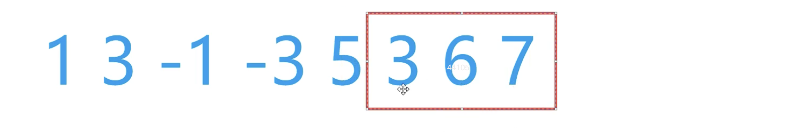
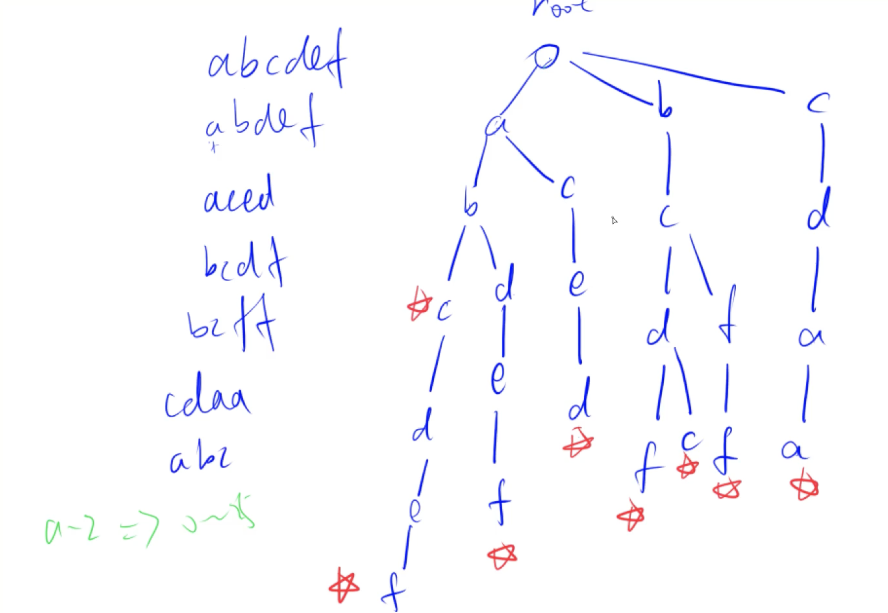
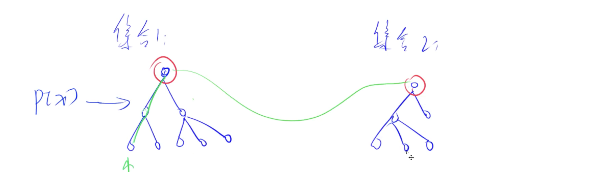

####  曼哈顿距离

$|x1 - x2| + |y1 - y2|$

[727.菱形](https://www.acwing.com/problem/content/description/729/)

****

#### 约数

约数都是成对出现的，因此可以将暴力枚举优化

> 每次都枚举较小的数，$d <= x / d$   --> $d < \sqrt{x}$。
>
> 需要注意的是，当$x$为完全平方数的时候，$x$可以为6，同时 $x / d$ 也为6，因此冲突了，需要作一下判断

[725. 完全数](https://www.acwing.com/problem/content/727/)

---

#### 质数

可以使用约数来实现

[726. 质数](https://www.acwing.com/problem/content/728/)

---

#### 最小公倍数

>  两数乘积 = 最小公倍数 * 最大公约数

---

## 基础算法

### 排序

#### 概念

**稳定：**两个相同的值在排序的过程中，它们的位置不发生改变

---

#### 快速排序

>  思想：分治
>
> 时间复杂度：平均、最好：$O(nlog_2n)$，最坏：$O(n^2)$

---

**步骤**：

有一个数组`q`，左边界为`l`，右边界为`r`

1. 确定分界点：`q[l]`, `q[l + r / 2]`, `q[r]`, `q[i]`,`i`随机，这个点是可以随意确定的
2. 调整区间：假设分界点的值为$x$，使得$x$左边的值 $<=x$， 右边的值 $>=x$
3. 递归处理左右两边

----

**实现：**

1. 额外开两个数组a，b
2. 遍历 q ，将 $<=x$ 的值放在 a 里，将 $>=x$ 的值放在 b 里
3. 合并 a，b到 q 中

----

**优化实现：**使用双指针 i = l， j = r

1. i 往右走，直到 `q[i] > x `
2. j 往左走，直到 `q[j] < x`
3. `q[i]` 和 `q[j]` 交换，以满足步骤2，同时 i 向右移一位，j 向左移一位


----

**代码实现：**

```c++
void quick_sort(int q[], int l, int r) {
    if (l >= r) return ;
	// i = l - 1, j = r + 1，是因为双指针是先移动再比较的
    int x = q[(l + r) / 2], i = l - 1, j = r + 1;
    while(i < j) {
        do i++; while(q[i] < x);
        do j--; while(q[j] > x);
        if (i < j) swap(q[i], q[j]);`
    }
  // 取j还是i都可以，就是取i的时候x边界不能为l，取j的时候，x的边界不能为r
    quick_sort(q, l, j);
    quick_sort(q, j + 1, r);
}
```

---

#### 归并排序

> 思想：分治
>
> 时间复杂度：平均、最好、最坏：$O(nlog_2n)$

拆分需要 $log_2n$ 次，每一层都需要计算 $n$ 次


---

**步骤：**

1. 确定分界点：$mid = (l + r) / 2$
2. 递归排序 left，right
3. 归并，合二为一


----

**归并思想**

1. 有两个排好序的数组 a，b ，也可以看作是q数组的 left 和 right  和一个结果数组 res
2. i 为 a 的起始， j 为 b 的起始
3. a[i] 与 b[j] 比较，将小的值放进res。当 i 到终点时，将 b 后面的值直接放进res，当 j 到终点时，同理。


----

**代码实现：**

```c++
void merge_sort(int q[], int l, int r) {
    if (l >= r) return;
    int mid = l + r >> 1;
    merge_sort(q, l, mid), merge_sort(q, mid + 1, r);
    int i = l, j = mid + 1, k = 0;
    while (i <= mid && j <= r) {
        if (q[i] < q[j]) tmp[k ++] = q[i ++];
        else tmp[k ++] = q[j ++];
    }
    while (i <= mid) tmp[k ++] = q[i ++];
    while (j <= r) tmp[k ++] = q[j ++];
    
    for (i = 0, j = l; i < k; i++, j++) {
        q[j] = tmp[i];
    }
}
```

---

[788. 逆序对的数量](https://www.acwing.com/problem/content/790/)

----

### 二分

> 可以将一个区间一分为二，使得右边满足某个性质，左边不满足整个性质
>
> 单调性一定可以二分，但是可以二分的不一定要满足单调性

#### 整数二分


**满足左边性质的情况**

1. mid 满足性质，l = mid，
2. mid 不满足性质，r = mid - 1，因为mid不符合性质可以排除

**模板**

```c++
int bsearch_1(int l, int r) {
  while (l < r) {
    int mid = l + r + 1 >> 1;
    if (check(mid)) l = mid;
    else r = mid - 1;
  }
}
```

----

**注意：**mid 需要为 $(l + r + 1) / 2$，因为，当l = r - 1的时候并且`check(mid) = true` 时，$mid = (l + r) / 2 = l$ ，因此 l = mid会造成死循环

**满足右边性质的情况**

1. mid满足性质， r = mid
2. mid 不满足性质，l = mid + 1，因为 mid 不符合性质

**模板**

```c++
int bsearch_2(int l, int r) {
  while (l < r) {
    int mid = l + r >> 1;
    if (check(mid)) r = mid;
    else l = mid + 1;
  }
}
```

-----

#### 浮点数二分

> 没有整数因素影响，可以严格缩小一半

----

当满足 $r-l\leq10^{-6}$ 可以看作是一个点

**为什么要以 $10^{-6}$ 作为判断的点：**

> Math.abs(x)<1e-6其实相当于x == 0
>
> 1e-6(也就是0.000001)叫做epslon，用来抵消浮点运算中因为误差造成的相等无法判断的情况。它通常是一个非常小的数字（**具体多小要看你的运算误差**）
>
> 比如说因为精度误差，用十进制举例，我们要算1/3+1/3+1/3 == 1（从数学上说，肯定相等），但是因为精度问题，等号左边算出来是0.3333333+0.3333333+0.3333333 = 0.9999999，存在了误差，右边是1.0000000，那么如果直接用 == ，返回false，我们希望它被视作相等。那么就要两数相减取绝对值小于epslon的办法。

**模板：求数x的开根号**

```c++
int blsearch() {
  int l = 0, r = x;
  while (r - l > 1e-8) {  // 看情况调整精度  或者换成for (int i = 0; i < 100; i++)
    double mid = (l + r) / 2;
    if (mid * mid >= x) r = mid;
    else l = mid;  // 没有边界
  } 
}
```

----

### 高精度

> A + B   $A\leq10^6,B\leq10^6$ 
>
> A - B    $A\leq10^6, B\leq10^6$  这里跟加法都是值的位数 
>
> A * a     len(A)$\leq10^6$, a$\leq10^{-9}$    这里的a是数值

用数组存数字，数组的高位存数字的高位，主要是方便进位，因为往后面加数字容易


----

#### 加法


对于每一位的结果都可以用 A+B+t 来表示，t表示的是进位

```c++
vector<int> add(vector<int> &A, vector<int> &B) {
    vector<int> c;
    int t = 0;
    for (int i = 0; i < A.size() || i < B.size(); i++) {
        if (i < A.size()) t += A[i];  // 这里不能用if(A[i])  因为初始化的时候不能保证是0
        if (i < B.size()) t += B[i];
        c.push_back(t % 10);
        t /= 10;
    }
    if (t) c.push_back(t);
    return c;
}
```

---

#### 减法


1. t 表示的是借位，如果有借位那么就需外额外减
2. A，B代表数，$A_i,B_i$ 代表某一位

```c++
// 判断A B那个大，A > B, 则sub(A, B); B > A, 则sub(B, A)
bool cmp(vector<int> &a, vector<int> &b) {
    if (a.size() != b.size()) return a.size() > b.size();
    for (int i = a.size() - 1; i >= 0; i--) {
        if (a[i] != b[i]) return a[i] > b[i];  // 下面是我写的
        // if (a[i] > b[i]) return true;
        // else if (a[i] < b[i]) return false;
    }
    return true;
}

vector<int> sub(vector<int> &a, vector<int> &b) {
    vector<int> c;
    int t = 0;
    for (int i = 0; i < a.size(); i++) {
        t = a[i] - t;
        if (i < b.size()) t -= b[i];
        c.push_back((t + 10) % 10);    // (-1+10)%10=9 (1+10)%10=1
        if (t < 0) t = 1;              // 这里如果写-1，那t就应该是t = a[i] + t
        else t = 0;
    }
    while (c.size() > 1 && c.back() == 0) c.pop_back();  // 当数是003的情况下，需要去掉数组高位的0，如果个位是0，不需要去掉
    return c;
}
```

----

#### 乘法

**步骤：**

1. 数组A存大数字，a为小数字
2. $A_i \times a$ ：用某一位乘上小数字的整体
3. $C_i$ 为 $(A_i \times a + t) \% 10$，进位为 $(A_i \times a + t) / 10$

---

```C++
vector<int> mul(vector<int> &a, int b) {
    vector<int> C;
    int t = 0;
    for (int i = 0; i < a.size() || t; i++) {
        if (i < a.size()) t += a[i] * b;  // 优化部分 ||t 跟 if 能够代替下面那一句
        C.push_back(t % 10);
        t /= 10;
    }
    
   // while (t > 0) {
    //     C.push_back(t % 10);
    //     t /= 10;    
    // }
    while (C.size() > 1 && C.back() == 0) C.pop_back();  // 在main中判断b是否为0，如果为0就直接输出0，不调用这个函数
    
    return C;
}
```

----

#### 除法

----

### 前缀和、差分

#### 前缀和

##### 一维前缀和

**定义：**$S_i=a_1+a_2+a_3+...+a_i$

---

**步骤：**

1. 如何求$S_i$：
   - `for i = 1; i <= n; i++ `
   - $S[i] = S[i - 1] + a[i]$
   - $S[0] = 0$
2. 作用：方便求某一个区间 [l, r] 的和，为$S[r] - S[l-1]$

----

**模板：**

[795. 前缀和](https://www.acwing.com/problem/content/description/797/)

----

##### 二维前缀和


求$(x_1, y_1)$到$(x_2,y_2)$的前缀和需要先求大的$S_{x2y2}$，再求两个矩形绿色和红色$S_{x_2y_{1-1}}$，$S_{x_{1-1}y_2}$，由于左上角的矩形被减两次，因此需要加上$S_{x_{1-1}y_{1-1}}$，式子为：$S[x2,y2]-S[x2,y1-1]-S[x1-1,y2]+S[x1-1,y1-1]$

**如何求$S[i, j]$**:

1. $S[0,0]=0$
2. 求$S[i,j - 1]$
3. 求$S[j-1,i]$
4. $S[i-1,j-1]$被加了两次
5. $S[i,j] = S[i,j-1] + S[i-1,j] - S[i - 1,j - 1] + a[i,j]$

----

**模板**

[796. 子矩阵的和](https://www.acwing.com/problem/content/798/)

----

#### 差分

##### 一维差分

> 前缀和的逆运算：其实就是根据前缀和求 b，也就是差分


**作用：**通过 b 使得 a 全部 +c 。如果通过普通做法那么就需要暴力遍历a，然后+c

**做法：**

1. 要使得区间 [l, r] 的 $a_l$~$a_r$ + c
2. $b_l +c$ 使得$a_l$~$a_n$ + c
3. $b_{r+1}-c$  使得$b_{r+1}$~$b_n$ - c，因为不需要除了[l, r] 之外的数也加上c

**构造差分b**

> $b_1 = a_1$
>
> $b_2=a_2-a_1$
>
> $b_3=a_3-a_2$
>
> $b_n=a_n-a_{n-1}$

 这样构造可以满足**作用**

----

**实现**

1. 使用a来**初始化**b：是根据**做法**的第2、3步来实现的，对每个区间 [i, i],a[i] 都执行一遍`insert`操作，就可以构造出b
2. 累加 b 来实现新的前缀和

```c++
// 根据差分操作来初始化b
void insert(int l, int r, int c) {
    b[l] += c;
    b[r + 1] -= c;
}
// 求前缀和
for (int i = 1; i <= n; i++){ 
    b[i] += b[i - 1];
    printf("%d ", b[i]);
}
```

---

[797. 差分](https://www.acwing.com/problem/content/799/)

----

##### 二维差分

> 跟二维前缀和比较相似，只不过是由于差分的性质，看起来是倒过来了


给$(x_1,y_1)$到$(x_2,y_2)$ 加上c

1. $b[x_1][y_1]+c$
2. $b[x_1][y_2+c]-c$，绿色部分
3. $b[x_2+1][y_1]-c$，红色部分
4. $b[x_2 + 1][y_2 + 1]+c$，因为右下角的部分被减了两次

**插入：**$(i,j)$~$(i,j) + a[i][j]$，原理就是相当于在$(i,j)$ ~ $(i,j)$加上了一个$a[i][j]$

----

[798. 差分矩阵](https://www.acwing.com/problem/content/800/)

----

### 双指针

> 运用了某种单调的性质将$O(n^2)$优化到$O(n)$

```c++
for (int i = 0, j = 0; i < n; i++) {
  while(j < i && check(i, j)) j++;
  // 具体的逻辑
}
```

----

​	[799. 最长连续不重复子序列](https://www.acwing.com/problem/content/801/)

----

### 位运算

**求 n 的二进制表示中第 k 位是几**

>  15 = $(1111)_2$ ，其中个位的下标是0

1. 先把第k位移到最后一位，n >> k
2. 看个位是几，x & 1

比如，当n为10时

```c++
int n = 10;
for (int k = 3; k >= 0; k--) {
  cout << (n << k & 1);   
}
/*
	结果为1010
	流程是这样的，因为要输出高位1，所以k是从3开始，这也是有理由的
	1010右移3位为1
	1010右移2位为10
	1010右移1位为101
	1010右移0位为1010
	注意：这四个数字都要输出 个位，因此需要 &1 
*/
```

---

**lowbit(x)：返回x的最后一位1**

> x = 1010， lowbit(x) = 10
>
> x = 101000， lowbit(x) = 1000

**原理：x & -x**

正数的补码等于本身，负数的补码等于反码+1

> x = 1010...1000
>
> -x = ~x + 1
>
> ~x = 0101...0111
>
> ~x + 1 = 0101...1000
>
> x & -x = x & ~x + 1 = 0000...1000

**实现：求 x 中 1 的个数**

> 其实最主要的是x & -x 结果中只有一位1，因此就可以直接减去从而实现了消去 x 的最后一位 1

```c++
int n = 5;
while (x) x -= x & -x, res ++; // res为x中1的个数
```

----

[801. 二进制中1的个数](https://www.acwing.com/problem/content/803/)

---

###  离散化


**定义：**将值映射到从0开始的自然数

当值需要当作下标来做的时候，但是个数只有$10^5$个，因此如果把$0$~$10^9$范围的值作为下标的话显然是不可行的，比如[799. 最长连续不重复子序列](https://www.acwing.com/problem/content/801/)，因为值的范围是$10^5$ ，所以问题不大

---

**步骤**

1. a[] 中可能存在重复元素，需要**去重**

   ```c++
   // unique会返回没有重复元素的最后一个下标，重复的元素会被丢到后面去，再通过earse就可以删除末尾的重复元素
   alls.earse(unique(alls.begin(), alls.end()), alls.end()) 
   ```

   

2. 如何快速算出 x 离散化后的值，比如说 x=50000，离散化后的值为4，通过**二分**来做，因此需要排序

```c++
int find(int x) {
  int l = 0, r = alls.size() - 1;
  while (l < r) {
    int mid = l + r << 1;
    if (alls[mid] >= x) r = mid; // 满足右边性质
    else l = mid + 1;
  }
 	return r + 1; // 映射的是1 2 3 ... n ，下标从1开始
}
```

---

[802. 区间和](https://www.acwing.com/problem/content/804/)

----

### 区间合并

> 有交集的两个区间可以合并成一个大的区间

绿颜色为合并后的区间


**步骤**


1. 按区间的左端点排序
2. 对于[st, ed] 区间来说，第二个区间有三种情况
   - 区间在[st, ed]内，ed不变
   - 区间的ed超过[st, ed]，延长[st, ed]，更新为第二种情况的ed
   - 区间在[st, ed]外，由于是按照左端点排序的，因此后续所有区间都在[st, ed]外，因此[st, ed]即为一种答案，更新[st, ed]为粉颜色的[st, ed]

```c++
typedef pair<int, int> PII;
void merge(vector<PII> &segs) {
    vector<PII> res;
    sort(segs.begin(), segs.end());
    int st = -2e9, ed = -2e9;  // 要设置为[负无穷，正无穷]，但是因为l, r的范围是-1e9~1e9，因此负无穷可以设置为-2e9
    for (auto seg : segs) {
        if (ed < seg.first) {
            if (st != -2e9) res.push_back({st, ed});  // 这个区间合并完了，加入到结果中
            st = seg.first;
            ed = seg.second;   // 更新[st, ed]
        } else {
            ed = max(ed, seg.second);  // 计算ed
        }
    }
    if (st != -2e9) res.push_back({st, ed});  // 最后一个[st, ed]需要加进来，要防止segs为空，所以要if判断一下
    segs = res;  // 因为要输出segs.size(),传的是引用
}
```

[803. 区间合并](https://www.acwing.com/problem/content/805/)

----

## 数据结构

### 链表

---

#### 单链表

**用途：**

1. 邻接表
   - 存储图
   - 存储树

---

**实现：**


$e[i]$ 为节点 $i$ 的值，$ne[i]$ 为节点 $i$ 的next指针是多少，也就是节点 $i$ 指向的值

-----

将某个节点 x 插入到头节点。

1. x节点指向的下一个节点为head指向的下一个节点：`ne[idx] = head;`
2. head 指向的下一个节点更改为 x：`head = idx;`
3. 赋值：`e[idx] = x;`
4. idx 被使用了：`idx++;`


```c++
const int N = 100010;
int e[N], ne[N], idx;  // idx表示已经用到了哪个点

void init() {
	head = -1;  // 头节点指向空节点
  idx = 0; // 用了0个点
}

void add_to_head(int x) { // 插入到头节点
  e[idx] = x;
  ne[idex] = head;
  head = idx;      // x是值，idx是节点，比如第一张图中，e[0] = 3，x为3，ne[0] = 1, idx为0，idx++为1
  idx ++;
}

void add(int k, int x) { // 将值 x 插入到 k 点之后，原理跟插入头节点差不多
  e[idx] = x;
  ne[idx] = ne[k];
  ne[k] = idx;
  idx ++;
}

void remove(int k) { // 将下标是k的后面的节点删掉
  ne[k] = ne[ne[k]];
}

void delete(int k) { // 将下标是 k 的节点删掉
  // 因为没办法拿前一个节点，那就只能拿后面的节点来操作一下，方法就是k节点当作是k后面节点互换，找替身
	e[k] = e[ne[k]];  // 把k后面的值给k
  ne[k] = ne[ne[k]]; // 删除k后面的节点，
  
  
}
```


---

#### 双链表

> **用途：**优化某些问题

$l[i]$ 表示节点 i 左边的节点， $r[i]$表示节点 i 右边的节点

**初始化：**初始化0（head），1（tail）号点，


**插入节点**


1. 赋值：`e[idx] = x;`
2. x 节点的右边节点为 k 的右边节点：`r[idx] = r[k]`
3. x 节点的左边节点为 k 的右边节点的左边节点：`l[idx] = k;`
4. k 节点的右边节点的左边节点为 x：`l[r[k]] = idx;`
5. k 节点的右边节点为 x：`r[k] = idx`     ps：跟第4步不能倒过来，因为这步会影响`r[k]`

```c++
const int N = 100010;
int e[N], l[N], r[N], idx;

void init() {
  r[0] = 1, l[1] = 0;
  idx = 2;
}

// 在k的右边插入x，如果要在左边插入，调用add(l[k], x)
void add(int k, int x) { 
  e[idx] = x;
  r[idx] = r[k];
  l[idx] = k;
  l[r[k]] = idx;
  r[k] = idx;
 	idx ++;
}
// 删除第k个点，画图一目了然，
void remove(int k) {
  r[l[k]] = r[k];   
  l[r[k]] = l[k];
}
```

----

### 栈

> 先进后出

```c++
const int N = 100010;
int stk[N], tt;

stk[++ tt] = x;  // 入栈

tt--;  // 弹出
stk[tt] // 栈顶元素
if (tt > 0) not empyt;
else empty;
```

---

#### 单调栈

> 在一个序列中，求每个数左边离它最近且比他小的数在什么位置

**暴力做法**

```c++
for (int i = 0; i < n; i++) {
  for (int j = i - 1; j >= 0; j--) {
    if (a[j] < a[i]) break;
  }
}
```

**单调栈做法**

1. 如果$a[3] \geq a[5]$ ，存在$a[3] < a[i]$ ，所以$a[5] < a[i]$ 因此 5 是答案
2. 根据上式可以发现一个规律，$x < y ，a[x] \geq a[y] $，这样的逆序对，y是答案，因此存储的是y

```c++
const int N = 100010;
int stk[N], tt;

int main() {
    int n;
    cin >> n;
    for (int i = 0; i < n; i++) {
        int x;
        cin >> x;
        while (tt && stk[tt] >= x) tt --;  // 逆序对 删到栈顶
        if (tt) cout << stk[tt] << " ";   // 存在比x小的
        else cout << "-1 ";   // 不存在输出- 1
        stk[++ tt] = x;   // 
    }
    return 0;
}
```

[830. 单调栈](https://www.acwing.com/problem/content/832/)

---

### 队列

> 先进先出

```c++
const int N = 10001;
// 队尾插入元素，队头弹出元素
int q[N], hh, tt = -1;

q[++ tt] = x;  // 入队

hh++;  // 出队

if (hh <= tt) not empty;
else empty;

q[hh];   // 取出队头元素
```

---

#### 单调队列

> 求一个滑动窗口里面的最大值或者最小值

 

该窗口最小值是 3

**暴力做法**

两层for循环，时间复杂度为$O(nk)$，$n, k \leq 10^6$，时间复杂度太高

**单调队列做法**


1. 思路和单调栈一致，队列里是否有某些元素没有用的，将这些元素删掉，是否会得到单调性
2. 对于窗口 $[3, -1, -3]$ 来说，3比-3早出现，并且3 > -3，因此它们构成逆序对，在这种情况下，3不可能是答案
3. 根据2，队列里存储的值是单调递增的，最小值为q[hh]，也就是队头
4. 如果队头元素超出了滑动窗口的范围，就需要把队头弹出

**输出滑动窗口的最小值**

```c++
const int N = 1000010;
int q[N], a[N];
int hh, tt = -1, k, n;

int main() {
  scanf("%d", &n, &k);
  for (int i = 0; i < n; i++) scanf("%d", &a[i]);
  for (int i = 0; i < n; i++) {
    for (int i = 0; i < n; i++) {
      // 判断是否出了滑动窗口
      if (hh <= tt && i - k + 1 > q[hh]) hh++;
      //判断逆序对, 末尾出队。 如果要输出最大值，那就写<=
      while (hh <= tt && a[q[tt]] >= a[i]) tt--;
      q[++ tt] = i;
      // 窗口开始的位置是[0,2]
      if (i >= k - 1) printf("%d ", a[q[hh]]);
  }
}
```

----

### KMP

> 模式串P在字符串S所有出现位置的起始下标

**暴力做法**

```c++
S[N], P[M]
for (int i = 1; i <= n; i++) {
  bool flag = true;
  for (int j = 1; j <= m; j++) {
    if (s[i + j - 1] != p[j]) {    // s[i + j - 1]表示从i开始往后匹配j位是否跟p[j]想对应
   		flag = false;
      break;
    }
  }
}
```

---

**优化**


1. 当 j 移动到粉圆圈时，`s[i + j - 1] != p[j]`，也就是不匹配了
2. 观察是否可以利用前面利用匹配的字符串来帮助我们少枚举一些
3. 发现最多可以移动 k 位使得橙色部分的字符串是相等的
4. 可以得出
   1. 以某个点位终点的后缀和前缀是相等的，相等的最大长度是多少
   2. **`next[i] = j`**：表示以 i 位终点长度为 j 的后缀和以 1 为起点的前缀是相等的，即`p[1...j] = p[i + j - 1, j]`


**操作**


1. 当 i 遍历到绿圆圈时，发现字符串S跟模式串P不匹配了
2. 回到优化的思路，需要找到绿线**长度最长**的前缀和后缀相等，也就是next[j]
3. 所以第二条红线以i - 1为分界点，前面的长度就是next[j]，也就是2. 的前缀和后缀
4. 当移动到next[j] 之后，再看是否与 s[i] 匹配
   1. 如果匹配：那么 i 继续往后走
   2. 如果不匹配：递归调用next[j]，回到步骤2，3，4

**求next的过程**


> 其实跟前面是类似的，对于模式串P来说也是要去匹配的

1. 看 i 跟P2 的j + 1是否匹配
   1. 匹配，j往后，i往后
   2. 不匹配，`j = ne[j]`，因为next求的是匹配长度的最大值

```c++
#include<iostream>

using namespace std;

const int N = 100010, M = 1000010;
int n, m;
char p[N], s[M];
int ne[N];

int main() {
    cin >> n >> p + 1 >> m >> s + 1;
    
    // 求next的过程
    for (int i = 2, j = 0; i <= n; i++) {    // ne[1] = 0，只能为0
        while (j && p[i] != p[j + 1]) j = ne[j];
        if (p[i] == p[j + 1]) j++;
        ne[i] = j;
    }
    
    for (int i = 1, j = 0; i <= m; i++) {
        while (j && s[i] != p[j + 1]) j = ne[j];   // j有路走，并且下一次字符不相等
        if (s[i] == p[j + 1]) j++;  // 字符匹配上了，j向后走一个位置，i也向后走
        if (j == n) {     // j走完了，输出匹配的起始位置
            printf("%d ", i - n);  
            j = ne[j]; // 要求出所有的下标，需要将j重复赋值去匹配
        }
    }
    return 0;
}
```

---

[831. KMP字符串](https://www.acwing.com/problem/content/833/)

----

### Trie

> 高效地存储和查找字符串。集合的数据结构



- 存储：以当前节点为结尾的单词是会有一个标记的
- 查找：如果说存了abc, abcde，结尾的标记是c和e，要查找abcd是否存在，答案是不存在，虽然能找一条路径abcd，但是d没有标记


```c++
const int N = 100010;
int son[N][26], cnt[N], idx; // idx 下标是0的点，既是根节点又是空节点
char str[N];

void insert(char str[]) {
    int p = 0; // 从根节点开始
    for (int i = 0; str[i]; i ++) {
        int u = str[i] - 'a'; // u: 0~25，代表a~z
      /*
        p其实就是idx，跟单链表一样的，用idx标明该点是什么时候插入的。
        son[p][u]就表示在p点字符为u-'a'
      */
        if (!son[p][u]) son[p][u] = ++idx;  // 如果不存在就创建一个点
        p = son[p][u];  // p就指向了当前的点
    }
    cnt[p] ++;  // 标记，以p点结尾的字符串
}

int query(char str[]) {
    int p = 0;
    for (int i = 0; str[i]; i ++) {
        int u = str[i] - 'a';
        if (!son[p][u]) return 0;
        p = son[p][u];
    }
    return cnt[p];
}

```

---

[835. Trie字符串统计](https://www.acwing.com/problem/content/837/)

[143. 最大异或对](https://www.acwing.com/problem/content/145/)

----

### 并查集

**作用**

- 将两个集合合并
- 询问两个元素是否在一个集合当中

---

**暴力做法**

>  有一个数x，y，用集合做法

```c++
belong[x] = a, belong[y] = a;
if (belong[x] == belong[y]) // 时间复杂度是O(1)
```

如果需要合并的话，假设一个集合的数的数量是1000，另一个是2000。需要合并这两个集合。将1000的集合加在2000的后面，最少也要操作1000次。

---

**并查集做法**：能在近乎$O(1)$ 的时间复杂度完成这两个操作

**步骤**

1. 用树的形式来维护所有的集合
2. 根节点的编号就是当前集合的编号
3. 对于每个点都存储它的父节点是谁，`p[x]`表示 x 的父节点
4. 对于每个节点都往上找它的树根
5. 树根的表示`p[x] = x`，因为根节点x是没有父节点的，那可以用自身表示它的父节点 
   - `while(p[x] != x) x  = p[x];`
6. 合并两个集合：`p[x]`是 x 的集合编号，`p[y]`是 y 的集合编号，`p[x] = y`，将 x 集合合并到 y 集合上



**优化：**路径压缩

> `while(p != p[x]) `这部分时间复杂度太高

- 有一个点 x 想往上找根节点，当找到根节点之后，把 x 经过的点都指向根节点


```c++
// 返回x的祖宗节点 + 路径压缩
int find(int x) {
  	if (p[x] != x) p[x] = find(p[x]); // 不理解的时候画图看看
    return p[x];
}
int main() {
    int n, m;
    scanf("%d%d", &n, &m);
  	// 每个节点都是在一个单独的集合里
    for (int i = 0; i < n; i++) p[i] = i;
    while (m --) {
        char op[2];
        int a, b;
        scanf("%s%d%d", op, &a, &b);
      /*
        M为合并操作，
        a的根节点为find(a), b的根节点为find(b)
        p[find(a)] 为a的根节点的父节点
      */
        if (op[0] == 'M') p[find(a)] = find(b);
        else {
          	// 判断是否在一个集合，就看根节点是否相同
            if (find(a) == find(b)) puts("Yes");
            else puts("No");
        }
    }
    return 0;
}
```

----

[836. 合并集合](https://www.acwing.com/problem/content/838/)

[837. 连通块中点的数量](https://www.acwing.com/problem/content/839/)

----

### 堆

**问题**

- 插入一个数：插入到数组末尾，执行up操作，`heap[++size] = x, up(size)`
- 求集合当中的最小值：`heap[1]`
- 删除最小值：将最后一个元素替换最小值，然后删掉最后一个元素，`heap[1] = heap[size--], down(1)`
- 删除任意一个元素：跟删除最小值类似，可以判断之后再做down或者up操作，也可以直接两个都做，`heap[k] = heap[size--], down(k), up(k)`
- 修改任意一个元素：`heap[k] = x, down(k), up(k)`


---

**结构：**是一颗完全二叉树

**小根堆：**每个节点的值都$\leq$左右儿子，因此根节点是最小值

**存储：**一维数组存，下标表示 x 为当前节点，2x为左儿子，2x+1为右儿子，因此下标从1开始


- down：把一个数变大了可能需要往下压

- up：把一个数变小了可能需要往上走

- 构建堆：`for(int i = n / 2; i; i--) down(i)`，能将时间复杂度降为n，如果从n开始 i--，那么时间复杂度就是$O(nlog_2n)$ 。

  理由如下：对于树的最后一层节点来说，down操作是没有必要的，因此从倒数第二层开始，除了最后一层的节点数量为$n/2$ ，倒数第二层的节点数量为 $4/n$，对于倒数第二层来说，down的次数为1；倒数第三层，down的次数为2....，这里的次数跟离最后一层的高度有关，因为是down操作。 公式推演如下
  $$
  \frac{n}{4}\times1 + \frac{n}{8}\times2 + \frac{n}{16}\times3....\\
  =>\quad n(\frac{1}{2^2} + \frac{2}{2^3} + \frac{3}{2^4} + \frac{4}{2^5|} + ....)\\
  令s = \frac{1}{2^2} + \frac{2}{2^3} + \frac{3}{2^4} + \frac{4}{2^5} + ....\\
  =>\quad 2s = \frac{1}{2} + \frac{2}{2^2} + \frac{3}{2^3} + \frac{4}{2^4} + ....\\
  错位相减得：2s - s = \frac{1}{2} + \frac{1}{2^2} + \frac{1}{2^3} + \frac{1}{2^4} + \frac{1}{2^5} + ....<1
  $$
  因此
  $$
  n(\frac{1}{2^2} + \frac{2}{2^3} + \frac{3}{2^4} + \frac{4}{2^5|} + ....)<n
  $$
  所以时间复杂度为$O(n)$

```c++
// 初始化（构建）堆
 for (int i = n / 2; i; i--) down(i);

void down(int u)
{
    int t = u;  // t表示最小值的点的编号
    if (u * 2 <= size && h[u * 2] < h[t]) t = 2 * u;  // 判断左孩子是否比当前节点小
    if (u * 2 + 1 <= size && h[u * 2 + 1] < h[t]) t = 2 * u + 1;   // 判断右孩子是否比当前节点小或者左孩子小
    if (u != t) // 如果u变化了，那么就需要交换值，继续往下走
    {
        //swap(h[t], h[u]);
     	  heap_swap(t, u);
        down(t);
    }
}

void up(int u) {
  while (u / 2 && h[u / 2] > h[u]) { // u / 2代表父节点，字节点的值小于父节点，需要向上走，直到走到根或者大于父节点为止
    //swap(h[u / 2], h[u]);
    heap_swap(u / 2, u);
    u /= 2;
  }
}
```

---

[838. 堆排序](https://www.youtube.com/watch?v=WlBZD0x1Leo)

[839. 模拟堆](https://www.acwing.com/problem/content/841/)

----

### 哈希表

**内容：**

- 存储结构
  - 开放寻址法
  - 拉链法
- 字符串哈希方式

---

**作用：**把一个比较庞大的值域映射到一个比较小的空间，一般是$0$~$N$，$N:10^5$~$10^6$

---

### stl

---

## 备注

```c++
/*
 	读取字符时，如果用%c的话，可能会读取一些空白字符，因此建议读入字符串
*/
char op[2];
scanf("%s", op);
op[0];
strcmp(str1, str2); // 比较两个字符串，相等返回0

```

