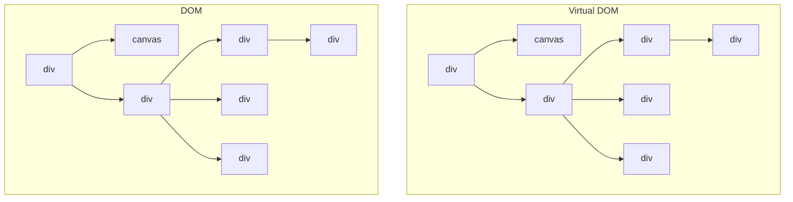
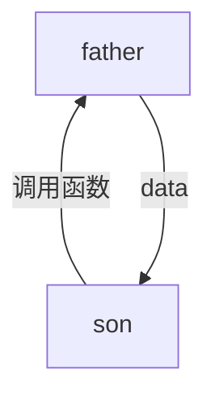
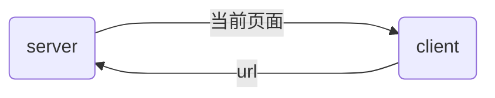
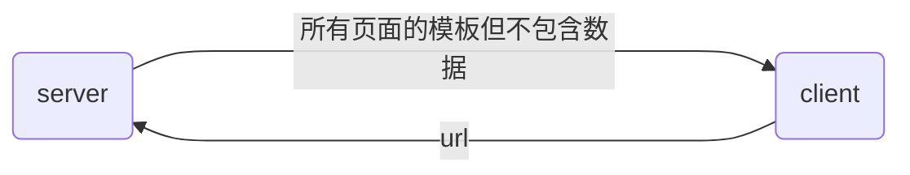

####  备注

`<div>`和`<span>`的区别在于块状元素和行内元素，可以用这个性质来区分其他标签是不是这两个元素的扩展

`<pre>`：等宽字体 

`<autdio> , <vedio>`在使用`<source>`的时候需要添加`type`指定格式

`<autdio>`的`controls autoplay`可以放在一起使用

`<input name="username" id="inputId">`要和`<label for="inputId">`绑定使用，`name`是会现在`url`上的

`<input type="radio" name="" value="" id="">`:`name`是为什么让多个radio只能选择一个, `value`是被选择时显示在`url`上的。同理，其他`type`类型的`value`值也是显示在`url`上的值，也就是被`submit`的值

`<textarea rows="" cols="">` 其中两个参数代表的是初始的大小

`<select> <option selected></select>` 参数`selected`默认选择

`<ul>, <ol>`：全称`unordered list`, `ordered list`

`<a href="#id">`可以用这种方式链接到页面内的某个`id` 的标签

[fsd](fff)

**语义标签**


```html
    <div class="header"></div>
    <div class="nav"></div>
    <div class="content"></div>
    <div class="footer"></div>
    语义标签等价于以上，只是为了方便阅读
    <header></header>
    <nav></nav>

    <section></section>
    <article></article>
    <aside></aside>
    
    <footer></footer>
```

----

给标签定义一个`class`就可以单独实现`css`属性，在`css`中用`.className`来是实现对应的`class`

`class`内可以写多个对象，比如`<p class="blue-p  big">`  

选择器，越具体的选择器权重越高 。加上`!important`的选择器权重最高

颜色可以用QQ、微信的截图工具取色

------

`text-align`：**子标签**可以继承**父标签**的对齐方式

`<div>` `line-height`跟`height`都设为一个像素可以让内容竖直居中

`text-decoration: none`可以用这个属性去掉`a`标签的下划线 

`text-shadow:5px 10px 2px grey阴影的偏移方向：`x`是朝右的，`y`是朝下的，第三个参数是模糊效果，这个参数可以写多个阴影用**逗号隔开**

`background-size`的两个属性`contain`,`cover`，前者是让图片按比例完全展开，后者是让背景完全被覆盖，不管图片，可以使用`%`

`background`的属性是可以用逗号加多个的，比如说加两个图片，设置两个图片的高度和长度,`opacity`可以把图片变成透明的

`border-radius`是指角的半径

`<div>`嵌套`<div>`的时候，第二层`div`如果设置一个外边距，那么就会拖着第一层的`div`一起移动，如果想要不拖着的话有三种解决方式

- `.div-outer{border-top: 1px solid;}`

- `.div-outer{padding-top: 1px;}`

- **`.div-outer{overflow: hidden;}`**：

- ```css
  .div-outer::before {
    content:"";
    display:table;
  }
  ```

`content-box`：`width = content + padding + border`

` Z-index:2,postion:relative`：`Z-index`是只有不在`static`时候才生效，`Z`代表的Z轴，数字越大就越显示在外面，会覆盖内层

`absolution, fixed`：都是会找到第一个非`static`的父元素

`top, right, bottom, left`：偏移量

`display`为`inline`或`inline-block`时，使用`float`后会统一变成`block。`

---

在调整窗口大小的时候会发现里面的内容会变化，因为在设计`css`的时候添加了`@media(min-width:xxxpx)` 所以就会感觉调到不到合适的尺寸，那是因为是为了适应不同设备的宽度

将屏幕宽度分成12份，每种屏幕都有不同的media去划分，`xs, sm, md, lg, xl`，然后用class="col-size-num"去区分每种屏幕在这种情况下应该干什么。

```html
<div class="col col-sm-6 col-md-4">1</div>
<div class="col col-sm-6 col-md-4">2</div>
<div class="col col-sm-12 col-md-4">3</div>
```

```css
.col {
 
    float: left;
    background-color: lightskyblue;
    border: 0.1px solid yellow;
    box-sizing: border-box; 
} 

@media(min-width:768px) {
    .col-md-1 {
        width:1/12%;
    }
    .col-md-2 {
        width: 2/12%;
    }
    ...
}

@media(max-width:768px) {
    .col-sm-1 {
        width: calc(100% / 12);
    }
    .col-sm-2 {
        width: calc(200% / 12); 
    }
}

/* 同理，lg，xl的大小只要在class里加上具体要怎么划分的大小，css再加上对应的@media即可*/
```

**以上方式在bootstrap中均实现好了，只要引入对应的的文件就行**。`bootstrap.min.css`, `bootstrap.min.js`

```html
<div class="row">
	<div class="col...">
    ...
  </div>
</div>
/*row里面的接的元素必须是col*/
```

```html
<div class="m-2">  等同于margin:2px;
  
</div>
```

`container`是可以自适应的改变页面区域大小

```html
<div class="container"></div>   
```


-----

**ECMASCRIPT6：ES6**

`<script type="module">`：加上`module`可以严格限制变量的作用域，只在这个标签生效，如果不加就会影响全局

```javascript
let s1 = "Hello";
let s2 =  s1.substr(0, 1) + 'a' + s1.substr(2);
let [a, b] = [1, 2]; //可以通过这种方式赋值
// 通过这种方式改变字符串，js里的字符串是只读变量
```

字典里的键在定义可以用`""` 也可以不用，但是在取值的时候就要加`""`，同时可以动态加值。有两种取值方式：`map[key] or map.key`，但是第二种方式有缺陷。

```js
<script type="module">
        let d = {
            name: 'zyc',
            age: '20'
        };
        let key = 'name';
        console.log(d.key);  // 不输出
				console.log(d[key]); // 输出zyc
				delete.d.name;   // 删除name
    </script>
```

`parseInt()`取整 

```js
/*
	document.querySelector()参数可以直接写标签，class名，只会匹配第一个满足的标签
	querySelectorAll可以获取所有的内容
*/
let input = document.querySelector("textarea"); 
let input = document.querySelectorAll("textarea");
let input = document.querySelector(".className")

// addEventlistener可以给某个标签绑定一个函数
// 第一个参数是绑定的是哪种事件，第二个参数是表示触发事件的时候会执行这个函数
input.addEventListener("click", function(){
  
})
```

**例子**：将`textarea`的内容通过`button`点击事件输出到`pre`上

```js
let input = document.querySelector("textarea");
let run = document.querySelector("button");
let output = document.querySelector("pre");


function main() {
    run.addEventListener("click", function () {
        let s = input.value;     // 获取textarea的内容
        output.innerHTML = s;    // innerHTML pre标签中html里的内容
    });
}
```

```x.toFixed(4)```：保留4位小数	

`Math.ceil(x)`：上取整

`Math.floor(x)`：下取整	

`Math.round(x)`：取整

----

```js
 let person = {
        name: "zyc",
        age: "18",
        money: 0,
        friends: ['zzz', 'yyy', 'ccc'],
        clothes: {
            color: "yellow",
            price: "20",
        },
        add_money: function(x) {
              this.money += x;  // this：返回拥有这个函数的对象也就是person
        }
 
    }
```

数组也是一个对象，所以下标的值可以看作是字符串，因此取负数也没关系

```js
let a = [1, 2, 3, 4, 5, 6, 7];
a.sort(function(a, b) {
  return b - a;
})

/*
	三种情况：
	负数：a < b，此时a在b前面
	0:无所谓
	正数：a > b, 此时a在b后面
	
	此时有两个数a = 3, b = 4，带代入函数，b - a > 0 => b > a 所以a在b的后面，从而实现倒序。
	
*/
```

**函数套娃**

```js
let add = (a, b) => {
    return () => {     // 也可以返回一个对象
        console.log("hello world!");
    }
}
console.log(add(3, 4)()); // 输出hello world
```

在`class`中，`this`代表的是一个实例

```js
class Point {
  constructor(x, y) {
    this.x = x;
    this.y = y;
  }
}
let p = new Point(3, 4); // 此时的p			

class ColorPoint extends Point {
    constructor(x, y, color) {
        super(x, y);   // 这里指父类的构造函数
        this.color = color;
    }

    toString() {
        return `${this.red} ${super.toString}`;  // 这里指父类的实例
    }
}
// 多态，同一个函数可以表现为不同的状态
```

静态成员函数可以被继承

 开发项目：树形结构，一个文件过于冗杂的时候就可以拆分再拆分

```js
<div tabindex="0"></div>  加了tabindex='0' 之后div就可以聚焦了
/*
	触发事件调用函数的参数会直接将事件传过去，所以参数命名是随意的
*/
input.addEventListener('keydown', (event) => { // (parameter) event: KeyboardEvent
        console.log(event.type, event.code, event.altKey, event.shiftKey, event.ctrlKey);
    })
    input.addEventListener('keyup', (fs) => {  // (parameter) et: KeyboardEvent
        console.log(fs.type);
    })
```

----

**jQuery**：操控、获取`HTML`的标签，更容易绑定标签，更容易改变`css`

```js
/*
jQuery的写法，$div是习惯在前面加个$，本质就是一个字符；$('div')的$其实就是一个函数调用，只是jquery取名叫$，
*/
let div = document.querySelector('div');
let $div = $('div');   
console.log(div);
console.log($div);
```

两种绑定事件的方式

```js
let $div = $('div');
$div.on('click', function (fs) {
console.log(fs.type);
});
$div.click(function (fs) {
console.log(fs.type)
});
```

```js
let $div = $('div');
let $input = $('input');
console.log($div.html); // 获取某个标签完整的内容。比如<div>text</div>

$div.text(); // 获取div里的内容
$div.text('text') // 修改div的内容为text

$input.val();  // 更多是用来获取和修改input 和 textarea里的内容

```

**ajax**：在不刷新页面的情况下，只从服务端获取某些数据，一般会获取一个`JSON`也就是字典的数据，然后再自己去拼接出来

```js
$.ajax({
  url: url,
  type: "GET",
  data: {
    // 可以给服务器传个对象
  },
  dataType: "json",
  success: function(resp) {
    // 当运行没有报错的时候，会调用这个函数，也就是从后端获取信息之后会调用这个函数，然后后端返回结果会传到 resp 这个参数里，然后可以从 resp 解析东西出来
  },
});
```

-------

`setTimout, setInterval`

```js
		let q;
    console.log(q);
    $div.click(() => {
        if (q) return false;     // 因为双击事件老是会触发单击事件，所以加一个这个
        q = setTimeout(() => {
            console.log('hello world');
        }, 1000);
    });
    $div.on("dblclick", () => {
        console.log('stop')
        clearTimeout(q);
    });
```

`requestAnimationFrame`

```js
let id
let step = (timestamp) => {  // 每帧将div的宽度增加1像素  timestamp是执行的时刻毫秒数
    let div = document.querySelector('div');
    div.style.width = div.clientWidth + 1 + 'px';
    id = requestAnimationFrame(step);
};

id = requestAnimationFrame(step);

cancelAnimationFrame(id) // 可以设置一个点击事件，点击的时候停下来
```

------

**Map**

```js
    for (let [key, value] of map) {
        console.log(key, value);
    }

    map.forEach((value, key) => {   // 反过来
        console.log(key, value);   
    });
```

**map**

```js
map(x => {return x;})
或者
map(x => (x))
```


------

**localStorage**：存到用户本地，可以存一些用户的偏好 

-----

**window**

```js
$div.css("cursor", "pointer");    // cursor 鼠标悬浮时的样式


let main = () => {
    $div.on('click', function () {
        window.open("https://www.acwing.com");
        // location.href = "https://www.acwing.com";
    })
}
```

-----

### react

`react`会在内存里放一个虚拟的`Dom`树，这个虚拟的`Dom`树是跟真实的一样的， 由于`react`是数据驱动的，因此当数据发生改变的时候，`react`会去把有可能发生变化的节点都做出相应的改变，然后再跟真实的`Dom`树进行比较分析，最后只会修改相应的节点

**DOM树**：虚拟和真实，只是一个例子，不代表真实的`DOM`树



先写`JSX`，然后再编译称`JS`。其中`X`为`XML`，表示能在`JS`代码中写`XML`，`HTML`也是一种特殊的`XML`

```js
const person = {
  name:'zyc',
  talk: function() {
    let outer = this;
    
    setTimeout(function() {   // 或者使用箭头函数，不会重新绑定this的值。所以一般箭头函数用得多
      
        console.log(outer);
    }, 1000)
  },
};

person.talk();

```

```js
import {Player as myplayer} // 非default导入进来的可以使用as改名
```

-----

**组件**

- `import React`中的`React`具体用途，`jsx`编译称`js`的时候用到了`babel`，会将`HTML`转换的`React`对应的函数，也就是会将`render`里`html`转换成`React`.什么什么
- 继承`component`这个`React`组件
- `state`：其实就是一个局部变量
- `render()`：`componen`t类里的一个函数，返回当前这个组件最后渲染的`html`结构是什么
- `render()`里的`return`只能有一个标签，不能有并列的标签。所以可以将并列的标签用`<div>`括起来。也可以使用`<React.Fragment>`使结构不变，是一个虚拟元素
- `handle`：命名习惯，主要是实现处理事件的
- `setState()`：里面传的是要修改的内容，比如：`setState({x:this.state.x - 1})`

**绑定事件**

```jsx
class Box extends Component {
    state = { 
        x:0,
        colors: [],
     };

     handleLeftClick = (step) => {  // 箭头函数可以使this不重新绑定，依旧是指向Box
        this.setState({
            x: this.state.x  - step,
        })
        console.log('left', this);
     };
  
  	 handleRightClick(step) {   // 这里的函数不是Box调用的，因此this值为undefined
        this.setState({
            x: this.state.x + 1 + step,
        })
        console.log('right',this);
     };
     handleRightClickTmp = () =>  {    
        return this.handleRightClick(10);   // 通过这种方式可以给事件函数添加参数 或者也可以通过匿名函数，具体实现看下面onClick
     };  
  
    

    render() { 
        return (
            <React.Fragment>
            <div style={this.getStyles()}>{this.toString()}</div>
            <button onClick={() => this.handleLeftClick(10)	} className='btn btn-primary m-2'>左边</button>  // onclick是绑定了函数，不加括号的原因是只是传函数，而不是传返回值
            <button onClick={this.handleRightClickTmp} className='btn btn-danger m-2'>右边 </button>
            {this.state.colors.map(x => {
                 return <div key={x}>{x}</div>
             })}
            </React.Fragment>
        );
    };

    getStyles() {
        let styles = {
            width:"100px",
            height:"100px",
            backgroundColor:"lightblue",
            color:"white",
            lineHeight:"100px",
            textAlign:"center",
        };

        if (this.state.x === 0 ) {
            styles.backgroundColor = "orange";
        }
        return styles;
    }
    toString() {
        const {x} = this.state;
        return `${x}`;
    }
}
 
export default Box;
```

**`filter`**函数

```jsx
 state = { 
        solutions : [
            {key: 10, number:1164, title:"加工零件1", views:3265},
            {key: 11, number:1165, title:"加工零件2", views:3266},
            {key: 12, number:1166, title:"加工零件3", views:3267},
            {key: 13, number:1167, title:"加工零件4", views:3268},
            {key: 14, number:1168, title:"加工零件5", views:3269},
            {key: 15, number:1169, title:"加工零件6", views:3270},
            {key: 16, number:1170, title:"加工零件7", views:3271},
        ],
     } 
    handleDelete(solution) {
        // filter作用：依次将solutions里的每一个元素作用一遍filter()函数，filter里面传一个函数，如果为true则保留，false则删除
        const solutions = this.state.solutions.filter(s => {return s !== solution});
        this.setState({
            solutions: solutions
        });
    }
```

---

**component组合**




通过`props`能够接收到从上往下传递过来的数据如下

在`boxes`中，除了`key`以外的属性都会被传到`Box`组件中，在`Box`组件中可以通过`this.props`获取传递过来的值，如下就是`x`和`name`

如果说是定义了节点比如下面的`h`和`p`标签，那在`Box`中就是使用`this.props.children`获取值，因为传过去的时候是以数组的形式传的， 因此可以使用下标获取每一个标签

也可以通过这个特性将函数传给子组件，因此可以实现子组件调用父组件的函数

```jsx
handleDelete = () => {
  
}
render(
	return (
		<Box key=...
      	 x={..}
         name='zzz'
      	 checked       // 只定义属性不定义值的默认为true
    >
    	<h1>title</h1>    
    	<p>content</p>
       onDelelte={this.handleDelete}   // 可以将onDelete传给子组件，子组件可以调用可以父组件的函数
    </Box>
)
)
```

**注意**：每个组件的`this.state`只能在组件内部修改，不能在其他组件内修改。如果想通过父组件修改值然后传递给子组件是不能生效的，因为自组件的`state`只执行了一次，父组件修改值是不会影响子组件的

----

**无状态函数组件**：`stateless function component`

在这组件中，不用`this.props`，在参数写`props`就可以

```jsx
import React, { Component } from 'react';

// 简写sfc
const Navbar = (props) => {    // 不用this.props 直接传参props  
    return ( <nav className="navbar navbar-expand-lg navbar-light bg-light">
                <div className="container-fluid">
                    <a className="navbar-brand" href="#">Navbar
                        <span>Boxescount: {props.boxesCount}</span>
                    </a>
                </div>
            </nav> 
            );
}
 
export default Navbar;
```

**或者用另一种方式，直接解构出来**

```jsx
import React, { Component } from 'react';
import Box from './box';

// 可以不用props然后直接解构出来，记得加{}
const Boxes = ({boxes, onReset, onClickLeft, onClickRight, onDelete}) => {
    return (  <React.Fragment>
                <button onClick={onReset} className='btn btn-info m-2'>reset</button>
               
                {boxes.map(box => (
                    <Box 
                        key={box.key} 
                        x={box.x}
                        id={box.key}
                        box={box}
                        onLeft={() => onClickLeft(box)}
                        onRight={() => onClickRight(box)}
                        onDelete={onDelete}
                    >
                        <h1>title</h1>
                        <p>#{box.x}</p>
                        
                    </Box>
                ))}
               
            </React.Fragment>);
}
 
export default Boxes ;

```

---

`Mount`周期，执行顺序：`constructor() -> render() -> componentDidMount()`
`Update`周期，执行顺序：`render() -> componentDidUpdate()`：在更新的时候虚拟`DOM`树会修改发生改变的组件，但是不会每次都刷新页面，这点可以看开头`react`的介绍

`componentDidUpdate(prevProps, prevState)`：两个参数存的是前一个更新前的值，所以这个参数可以用来判断当数据发生改变时候，使用ajax去更新数据库

```jsx
prevState.boxes[0] !== this.state.boxes[0];
ajax......
```

`Unmount`周期，执行顺序：`componentWillUnmount()`       需要这个组件挂载完也就是对象创建完之后就可以使用`ajax`从服务器获取数据

-------

**路由**

> 使得前端页面能够与链接一一对应起来，这是因为网站需要url来打开特定的页面，应用与网站不同，应用是可以一层一层点进去的，因此前端渲染的时候网站是假装跟后端渲染一样

页面是由模板+数据组成的。

静态页面是数据写死的，服务端将数据填到模板

动态页面是数据存在数据库里

- 后端渲染：数据拼到模板里是在服务端操作的



- 前端渲染：数据拼到模板里是在浏览器上完成的

  在`react`中，`react`会将所有内容转换成`js`，再通过`webpack`打包成一个文件，因此这个文件是包含了所有的内容。因此页面需要哪些数据的时候再去跟`server`请求数据




`Routes`下包含`Route`

`Link`：`a`标签是执行跳转，`link`不是跳转，而是每次执行完之后会有一个默认的函数，行为变了

当如果动态匹配路由时，可以用`:变量名`获取另一边`Link`来的变量

```jsx
<Routes>
  {/* 会去从前往后匹配，匹配到了就会渲染出来，如果没匹配到就不渲染 */}
  <Route path="/"  element={<Home />} />
  <Route path="/linux"  element={<Linux />} />
  <Route path="/django"  element={<Django />} />
  <Route path="/web"  element={<Web />} />
   {/* 如果是链接又很多个，那么可以使用:chapter接收变量，然后在<WebContent />函数组件可以使用useParams()可以获取变量 */}
   <Route path='/web/content/:chapter' element={<WebContent />}></Route>
  
  {/* 如果要使用useSearchParams 那就不加后面的:chapter*/}
  <Route path='/web/content/' element={<WebContent />}></Route>
  
</Routes>

 {/* 其他的地方的a标签改为link标签，其中href改为to */}
<a className="navbar-brand" href="/">Navbar</a> {/*改为*/}
<link className="navbar-brand" to="/">Navb</Link> {/*这里要注意的是，如果不加to就会报错*/}

 {/* 跟上面链接多个路由挂钩 */}
{this.state.webs.map(web => (
  <div key={web.id}>
    <Link to={`/web/Content/${web.id}`}>{web.id}. {web.title}</Link>
  </div>  
))}
```

使用类组件来获取前面提及的变量，函数组件可以直接使用`useParams()`函数，因此有了以下的曲线救国的变种

```jsx
import React, { Component } from 'react';
import { useParams, userParams } from 'react-router-dom';


class WebContent extends Component {
    state = {  } 
    render() { 
        console.log(this.props.Params)  // 获取了从无状态函数组件传递来的Params
        return (
           
            <h1>web content</h1>
        );
    }
}
 // 这里可以理解为是在是在一个新的组件中使用了无状态函数组件，然后再这个无状态函数组件里使用了WebContent这个类组件
 // 然后在给这个类组件传递了Params这个数据，这个数据是输出前面:chapter变量的，因此在这个无状态函数组件的子组件中WebContent中就可以获取到这个数据
 // 这里的参数props目前是没什么用处的，讲义是多写了一个{...props}
export default  (props)  => (
    <WebContent
        {...props}
        Params={useParams()}
    />
);
```

`useSearchParams`的写法

```jsx
import React, { Component } from 'react';

import { useSearchParams } from 'react-router-dom';


class WebContent extends Component {
    state = { 
        searchParams: this.props.Params[0],    //. 这里就是useSearchParams的两个参数，是数组的形式
        setSearchParams:this.props.Params[1],
    } 
    render() { 
        console.log(this.state.searchParams.get('chapter'));
        return (
             <React.Fragment>
                <h1>web - {this.state.searchParams.get('chapter')}</h1>
                <div>内容</div>
            </React.Fragment>
        );
    }
}
 
export default  (props)  => (
    <WebContent
        Params={useSearchParams()}
    />
);

```

404重定向，因为路由是依旧匹配的，所以可以用通配符`*`来匹配没有被路由的路径，因此来达到重定向。背过就可以了

```jsx
 <Route path='/404' element={<NotFound />}></Route>
 <Route path='*' element={<Navigate replace to='/404' />}></Route>
```

实现类似https://www.acwing.com/activity/content/introduction/1150/的内容，只改变下方内容，上方内容都是相似的，这个时候就要用嵌套路由

**注意**：需要在父组件中添加`<Outlet />`组件，用来填充子组件的内容

```jsx
<Route path="/linux"  element={<Linux />} >
  {/* 这里就是类似https://www.acwing.com/activity/content/1150/里的内容，只改变页面部分内容但是又是新链接 */}
   {/* path里的路径会自动拼接成/linux/homework */}
  <Route path='homework' element={<h4>homework的内容</h4>}></Route>   
  <Route path='terminal' element={<h4>terminal的内容</h4>}></Route>
  <Route path='*' element={<h4>terminal的内容</h4>}></Route>
</Route>

render() { 
  return (
    <React.Fragment>
      <h1>linux</h1>
      <hr />
      <Link to='/linux/homework'>作业</Link>
      <Outlet />
    </React.Fragment>
  );
}
```


