## 一、基础

### 1.1 元字符

> 正则功能：**校验**数据的有效性、**查找符合要求的文本**以及对文本进行**切割和替换**等操作。

#### 元字符的定义

所谓元字符就是指那些在正则表达式中具有特殊意义的专用字符，正则表达式就是由一系列的元字符组成

> 比如`\d`（表示 0-9 这 10 个数字中的任意一个）、`\d{11}`（表示单个数字出现 11 次），其中`\d`和`{11}`就表示元字符。`.`表示匹配除换行符\n以外的任意字符


------

#### 元字符分类


1. **特殊单字符**


2. **空白符**

不同的系统在每行文本结束位置默认的“换行”会有区别。比如在 Windows 里是 \r\n，在 Linux 和 MacOS 中是 \n。


在正则中，也是类似于 \n 或 \r 等方式来表示空白符号，只要记住它们就行了。平时使用正则，大部分场景使用 \s 就可以满足需求，\s 代表任意单个空白符号。


3. **量词**

   比如，在文本中“颜色”这个单词，可能是带有 u 的 colour，也可能是不带 u 的 color，我们使用 colou?r 就可以表示两种情况了

   

4. **范围**

   

   匹配http https ftp

   

5. **练习手机号的匹配规则**

   1. 第 1 位固定为数字 1

   2. 第 2 位可能是 3，4，5，6，7，8，9

   3. 第 3 位到第 11 位我们认为可能是 0-9 任意数字。

      通过规则可以得出正则表达式是：`1[3-9 ]\d{9}`

----

### 1.2 量词与贪婪 

#### 贪婪匹配（Greedy）

定义：尽可能最大长度去匹配


使用 Python 示例如下，我们可以看到输出结果，也是得到了 4 个匹配结果：a* 在匹配开头的 a 时，会尝试尽量匹配更多的 a，直到第一个字母 b 不满足要求为止，匹配上三个 a，后面每次匹配时都得到了空字符串。

```python
>>> import re
>>> re.findall(r'a*', 'aaabb')
['aaa', '', '', '']
```

----

#### 非贪婪匹配（lazy）

定义：非贪婪模式会尽可能短地去匹配


这次匹配到的结果都是单个的 a，非贪婪模式会尽可能短地去匹配。其中*?表示满足条件的情况只匹配一次

```python
>>> import re
>>> re.findall(r'a*', 'aaabb') 
# 贪婪模式
['aaa', '', '', '']
>>> re.findall(r'a*?', 'aaabb')
# 非贪婪模式
['', 'a', '', 'a', '', 'a', '', '', '']
```


----

#### 独占模式（Possessive）

> 不管是贪婪模式，还是非贪婪模式，都需要发生回溯才能完成相应的功能。但是在一些场景下，我们不需要回溯，匹配不上返回失败就好了，因此正则中还有另外一种模式，独占模式，它类似贪婪匹配，但匹配过程不会发生回溯，因此在一些场合下性能会更好

**回溯例子：**

​	有一正则表达式：`regex = “xy{1,3}z”`

​	匹配的文本：`text = “xyyz”`

​	在匹配时，y{1,3}会尽可能长地去匹配，当匹配完 xyy 后，由于 y 要尽可能匹配最长，即三个，但字符串中后面是个 z 就会导致匹配不上，这时候正则就会==向前回溯==，吐出当前字符 z，接着用正则中的 z 去匹配。


如果把`regex = “xy{1,3}z”`改成`regex = “xy{1,3}?z”`

​	由于 y{1,3}? 代表匹配 1 到 3 个 y，尽可能少地匹配。匹配上一个 y 之后，也就是在匹配上 text 中的 xy 后，正则会使用 z 和 text 中的 xy 后面的 y 比较，发现正则 z 和 y 不匹配，这时正则就会==向前回溯==，重新查看 y 匹配两个的情况，匹配上正则中的 xyy，然后再用 z 去匹配 text 中的 z，匹配成功。


如何变成独占模式：独占模式会尽可能多地去匹配，如果匹配失败就结束，不会进行回溯（独占模式不回溯这个说法其实不够准确，可以理解成“独占模式不会交还已经匹配上的字符”，这样应该就能理解了），这样的话就比较节省时间。==具体的方法就是在量词后面加上加号（+）==

​	`regex = “xy{1,3}+yz”`，此时并不会去匹配z，


如果只是判断文本是否符合规则，则可以使用独占模式; 如果需要获取匹配的结果，则根据需要使用贪婪或非贪婪。

-----

#### 作业

有一篇英文文章，里面有很多单词，单词和单词之间是用空格隔开的，在引号里面的一到多个单词表示特殊含义，即引号里面的多个单词要看成一个单词。现在你需要提取出文章中所有的单词。我们可以假设文章中除了引号没有其它的标点符号，有什么方法可以解决这个问题呢？如果用正则来解决，你能不能写出一个正则，提取出文章中所有的单词呢（不要求结果去重）？

> we found "the little cat" is in the hat, we like "the little cat"
>
> 其中 the little cat 需要看成一个单词

答案：`\w+|"[^"]+"`

----

### 1.3 分组与引用

假设我们现在要去查找 15 位或 18 位数字。根据前面学习的知识，使用量词可以表示出现次数，使用管道符号可以表示多个选择，你应该很快就能写出\d{15}|\d{18}。但经过测试，你会发现，这个正则并不能很好地完成任务，因为 18 位数字也会匹配上前 15 位，具体如下图所示。

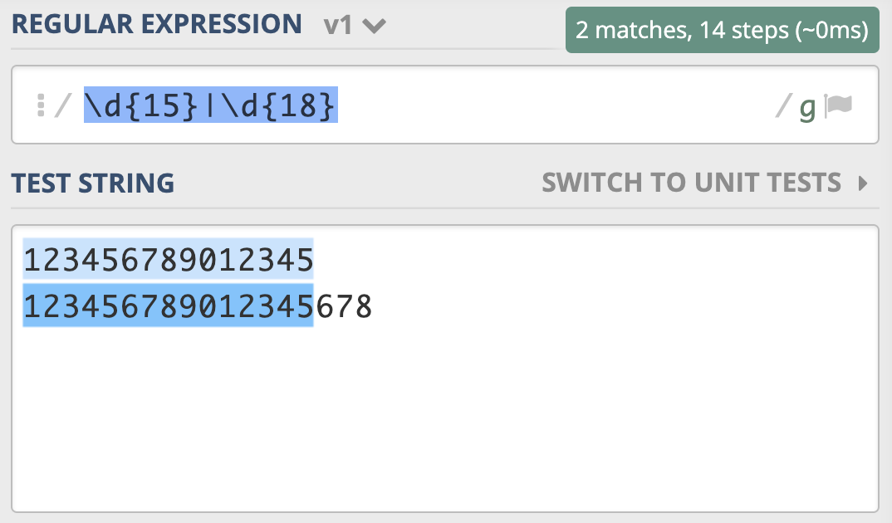

如果将\d{15}和\d{18}调换位置之后才发现是符合要求的

> 大多数正则实现中，多分支选择都是左边的优先原则

例子

>  可以使用 “北京市|北京” 来查找 “北京” 和 “北京市”，也可以使用“北京市?”


回到15位和18位的问题上，也可以看成是15位+是否有后3位：\d{15}\d{3}?	 

示例一：\d{15}\d{3}?  由于 \d{3} 表示三次，加问号非贪婪还是 3 次。表示的是\d{3}尽可能少的匹配，那结果还是会匹配到3位

示例二：\d{15}(\d{3})?  在 \d{3} 整体后加问号，表示后面三位有或无，此实例符合结果

#### 分组与编号

>括号在正则中的功能就是用于分组。简单来理解就是，由多个元字符组成某个部分，应该被看成一个整体的时候，可以用括号括起来表示一个整体，这是括号的一个重要功能。其实用括号括起来还有另外一个作用，那就是“复用”

**编号：**第几个括号就是第几个分组

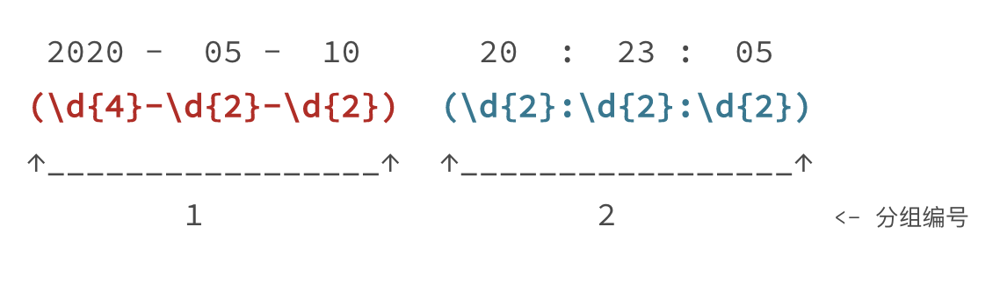

##### 不保存自组

在括号里面的会保存成子组，但有些情况下，你可能只想用括号将某些部分看成一个整体，后续不用再用它，类似这种情况，在实际使用时，是没必要保存子组的。这时我们可以在括号里面使用 `?: `不保存子组。

如果正则中出现了括号，那么我们就认为，这个子表达式在后续可能会再次被引用，所以不保存子组可以提高正则的性能。除此之外呢，这么做还有一些好处，由于子组变少了，正则性能会更好，在子组计数时也更不容易出错


##### 括号嵌套

确定分组方式

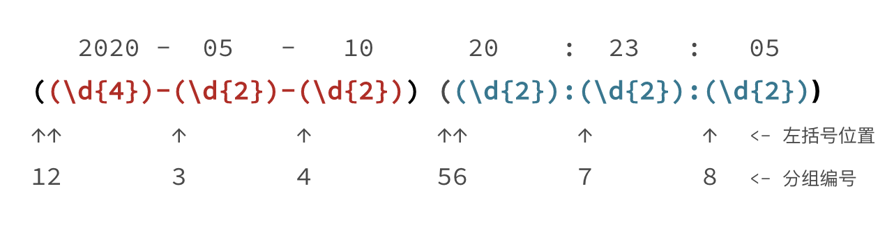

##### 命名分组

>  分组编号，但由于编号得数在第几个位置，后续如果发现正则有问题，改动了括号的个数，还可能导致编号发生变化，因此一些编程语言提供了命名分组（named grouping），这样和数字相比更容易辨识，不容易出错。命名分组的格式为(?P<分组名>正则)。

示例：Django 的路由中，命名分组示例如下

```python
url(r'^profile/(?P<username>\w+)/$', view_func)
```

在这个示例中，可以使用分组名称 ，不使用编号。但实际上，编号是已经确定好的，也可以使用编号。

==注意：==命名分组并不是所有语言都支持的，在使用时，你需要查阅所用语言正则说明文档，如果支持，**那你才可以使用**

***

#### 分组引用

使用 “反斜扛 + 编号”，即 `\number `的方式来进行引用，而 JavaScript 中是通过$编号来引用，如\$1

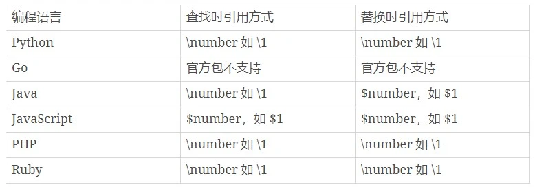

----

#### 分组引用在查找中使用

`(\W+)`会匹配所有的单词，所有的单词的分组编号都是1。

`(\W+) \1`：当`(\W+)`为cat时，`\1`也应该为cat，即`cat cat`才能被匹配上

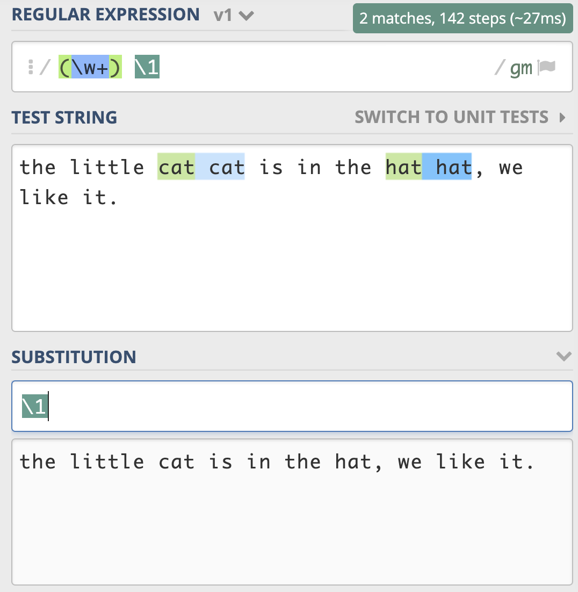

----

#### 分组查找替换中的使用

和查找类似，我们可以使用反向引用，在得到的结果中，去拼出来我们想要的结果。还是使用刚刚日期时间的例子，我们可以很方便地将它替换成， 2020 年 05 月 10 日这样的格式。

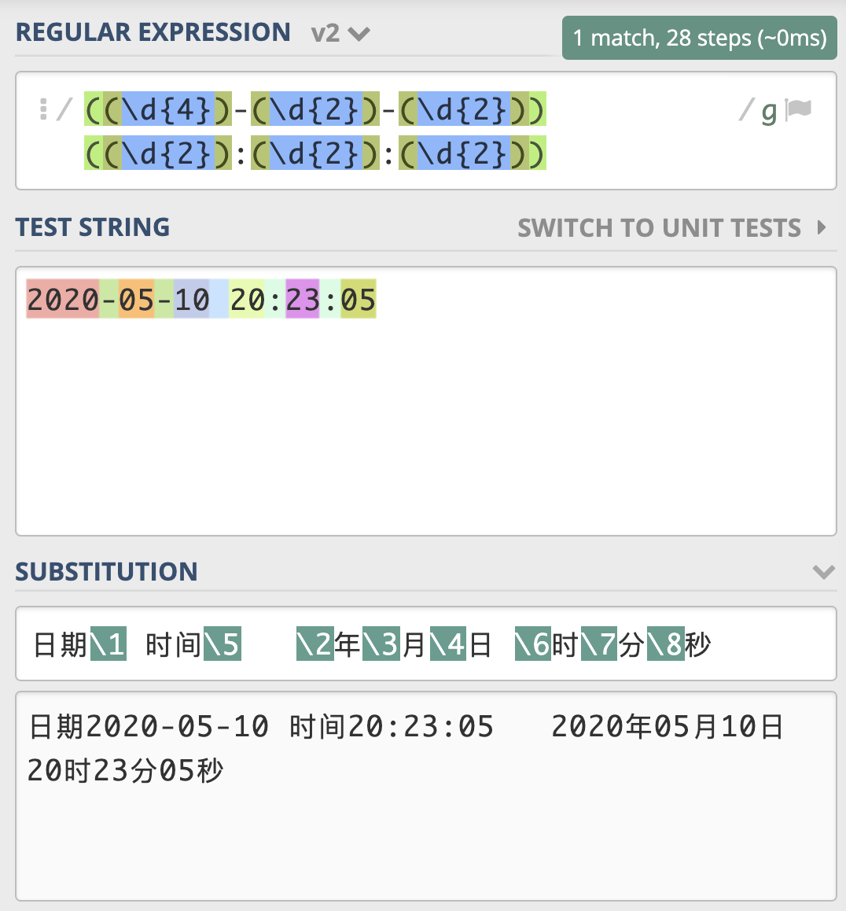

----

#### Sublime Text简介

文本编辑器`Sublime Text`，查找”或“替换”功能，在菜单 Find 中可以找到

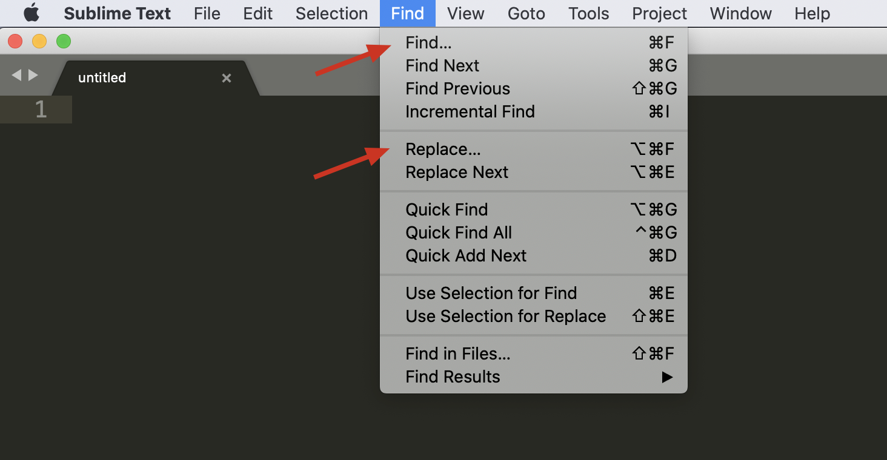

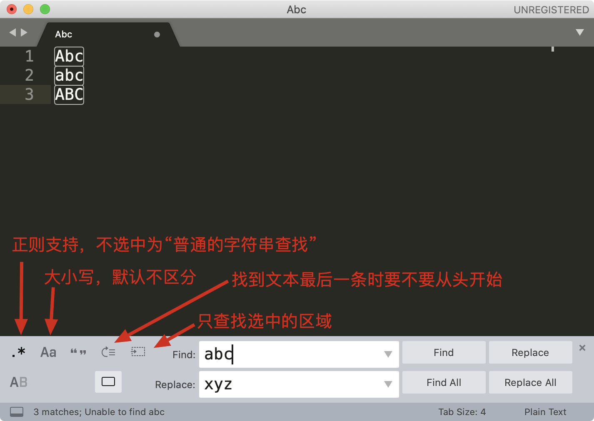

Find All的使用：点击Find All之后可以剪切处空白处粘贴

>  我们可以使用正则进行资源链接提取，比如从一个图片网站的源代码中查找到图片链接，然后再使用下载工具批量下载这些图片

##### 正则替换

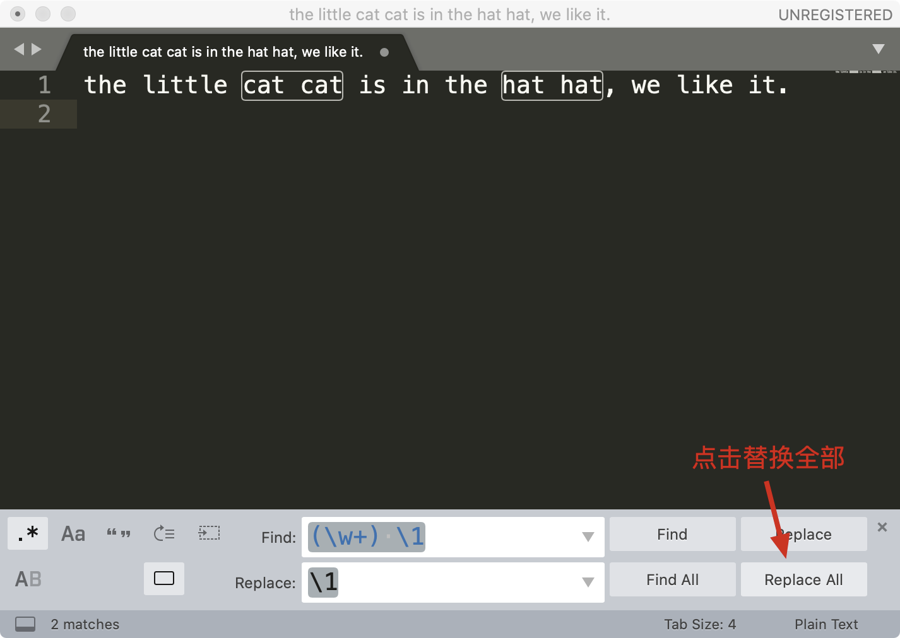

替换重复的单词

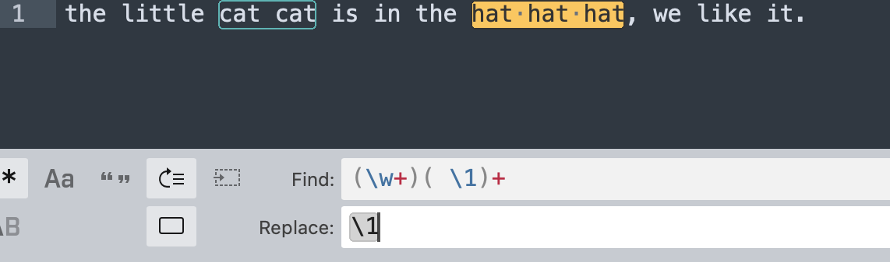

----

### 1.4 匹配模式

匹配模式，指的是正则中一些改变元字符匹配行为的方式，比如匹配时不区分英文字母大小写。常见的匹配模式有 4 种，分别是**不区分大小写模式、点号通配模式、多行模式和注释模式**。

这里的“模式”对应的是英文中的 mode，而不是 pattern。有些地方会把正则表达式 pattern 也翻译成模式

----

#### 不区分大小写模式（Case-Insensitive）

在进行文本匹配时，我们要关心单词本身的意义。比如要查找单词 cat，我们并不需要关心单词是 CAT、Cat，还是 cat。根据之前我们学到的知识，你可能会把正则写成这样：`[Cc][Aa][Tt]`，这样写虽然可以达到目的，但不够直观，如果单词比较长，写起来容易出错，阅读起来也比较困难

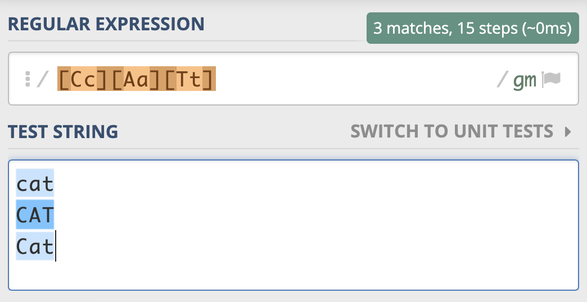

不区分大小写是匹配模式的一种。当我们把模式修饰符放在整个正则前面时，就表示整个正则表达式都是不区分大小写的。模式修饰符是通过 ==(? 模式标识)== 的方式来表示的。 我们只需要把模式修饰符放在对应的正则前，就可以使用指定的模式了。在不区分大小写模式中，由于**不分大小写的英文是 Case-Insensitive，那么对应的模式标识就是 I 的小写字母 i**，所以不区分大小写的 cat 就可以写成 (?i)cat

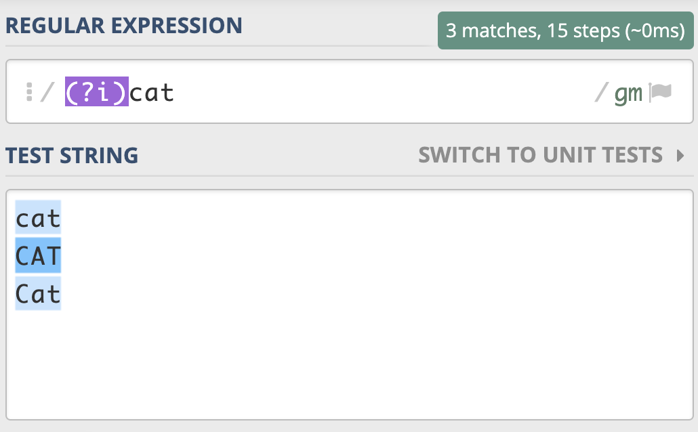

如果想要前面匹配上的结果，和第二次重复时的大小写一致，只需要用括号把修饰符和正则 cat 部分括起来，加括号相当于作用范围的限定，让不区分大小写只作用于这个括号里的内容

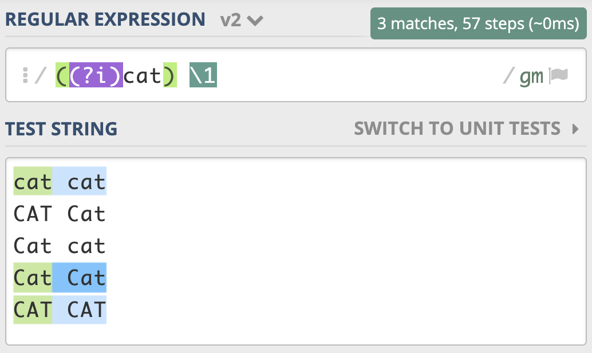

例子：the cat其中the匹配大小写，cat不匹配大小写

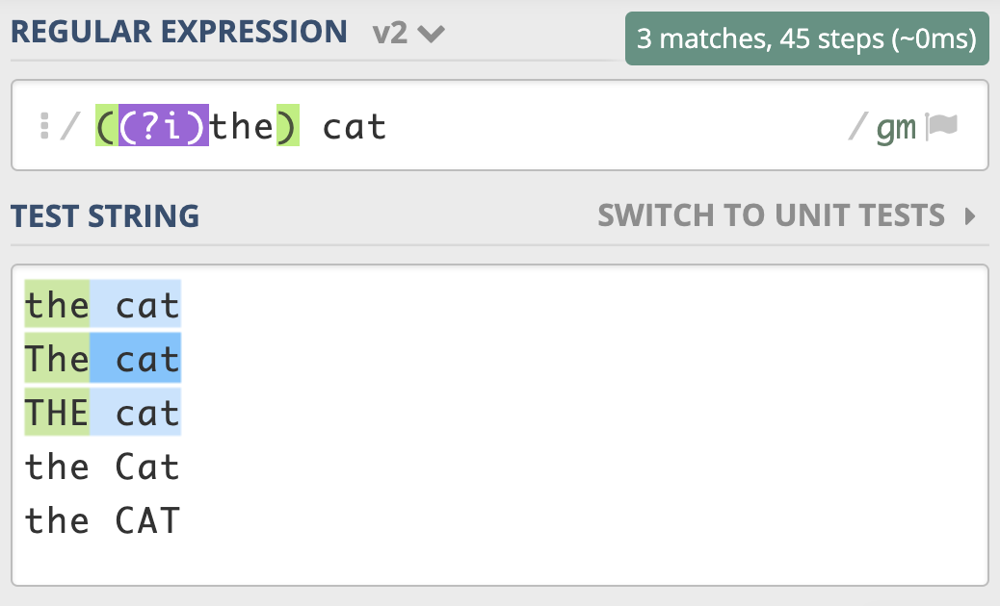

**注意：**，通过修饰符指定匹配模式的方式，在大部分编程语言中都是可以直接使用的，但在 JS 中我们需要使用 `/regex/i` 来指定匹配模式。在编程语言中通常会提供一些预定义的常量，来进行匹配模式的指定。比如 Python 中可以使用 `re.IGNORECASE 或 re.I` ，来传入正则函数中来表示不区分大小写

```python
>>> import re
>>> re.findall(r"cat", "CAT Cat cat", re.IGNORECASE)
['CAT', 'Cat', 'cat']
```

-----

#### 点号通配模式（Dot All）

.可以匹配上任何符号，但不能匹配换行。当需要匹配真正的“任意”符号的时候，可以使用 [\s\S] 或 [\d\D] 或 [\w\W] 等

但是这么写不够简洁自然，所以正则中提供了一种模式，让英文的点（.）可以匹配上包括换行的任何字符。

这个模式就是点号通配模式，有很多地方把它称作单行匹配模式，但这么说容易造成误解，毕竟它与多行匹配模式没有联系

单行的英文表示是 Single Line，单行模式对应的修饰符是 (?s)

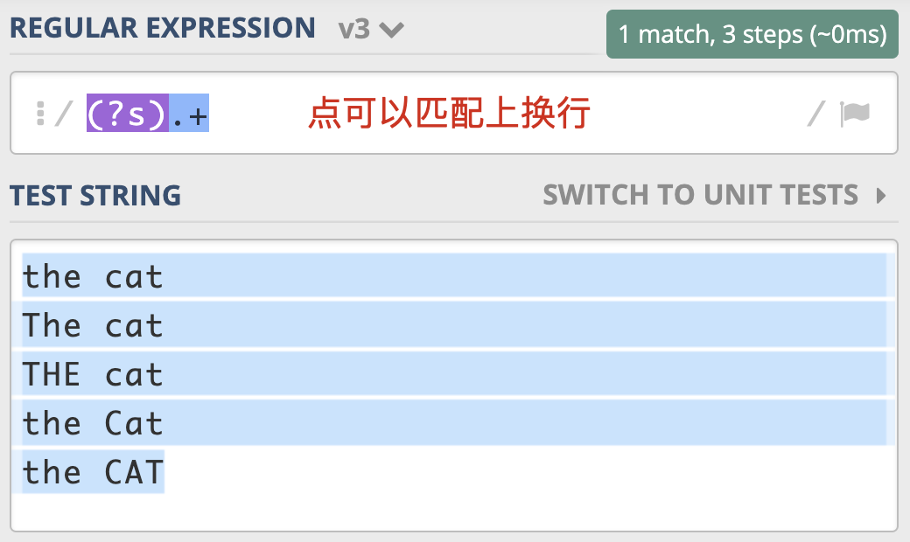

**注意：**JavaScript 不支持此模式，那么我们就可以使用前面说的[\s\S]等方式替代。在 Ruby 中则是用 Multiline

------

#### 多行匹配模式（Multiline）

> 通常情况下，^匹配整个字符串的开头，\$ 匹配整个字符串的结尾。多行匹配模式改变的就是 ^ 和 $ 的匹配行为	

Ps：这段需要考量，在regex101上获得的效果更多行匹配模式是，但是匹配的步数不一样。后续在windows电脑上再次尝试，与下图结果一样了。

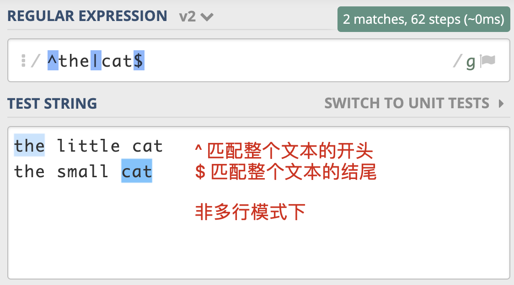

多行模式的作用在于，使 ^ 和 $ 能匹配上每行的开头或结尾，我们可以使用模式修饰符号 (?m) 来指定这个模式

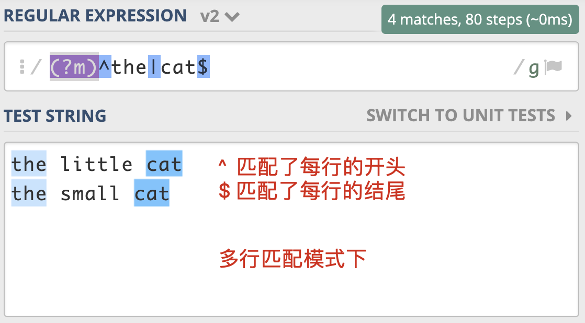

**作用：**在处理日志时，如果日志以时间开头，有一些日志打印了堆栈信息，占用了多行，我们就可以使用多行匹配模式，在日志中匹配到以时间开头的每一行日志

> 正则中还有 \A 和 \z（Python 中是 \Z） 这两个元字符容易混淆，\A 仅匹配整个字符串的开始，\z 仅匹配整个字符串的结束，在多行匹配模式下，它们的匹配行为不会改变，如果只想匹配整个字符串，而不是匹配每一行，用这个更严谨一些

-----

#### 注释模式（Comment）

> 作用：就是写注释，使用 (?#comment) 来表示

```
(\w+)(?#word) \1(?#word repeat again)
```

python3中使用x模式，在 x 模式下，所有的换行和空格都会被忽略。为了换行和空格的正确使用，可以通过把**空格放入字符组中**，或将空格转义来解决换行和空格的忽略问题

```python

regex = r'''(?mx)
^          # 开头
(\d{4})    # 年
[ ]        # 空格 放进了字符数组里
(\d{2})    # 月
$          # 结尾
'''

re.findall(regex, '2020 06\n2020 07')
# 输出结果 [('2020', '06'), ('2020', '07')]
```

---

#### 作业

HTML 标签是不区分大小写的，比如我们要提取网页中的 head 标签中的内容，用正则如何实现？

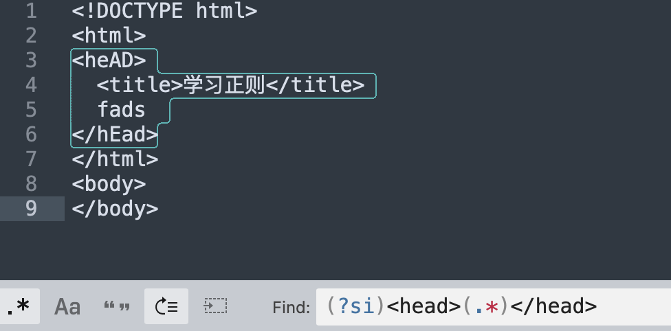

-------

## 二、应用

### 2.1 断言

断言：断言是指对匹配到的文本位置有要求。

比如：\d{11} 能匹配上 11 位数字，但这 11 位数字可能是 18 位身份证号中的一部分。再比如，去查找一个单词，我们要查找 tom，但其它的单词，比如 tomorrow 中也包含了 tom

换而言之就是对匹配的文本的位置有一定要求。

在正则中提供了一些结构，只用与匹配文本位置，而不是文本本身内容，这种结构就是**断言**

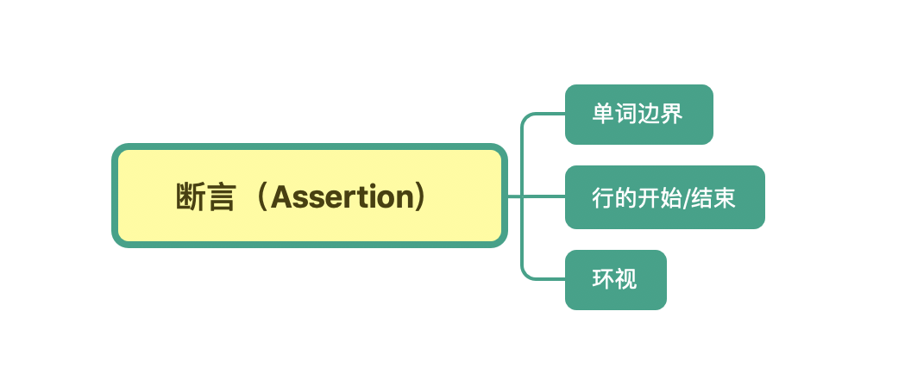

----

#### 单词边界（Word Boundary）

用目前所学知识来替换一下文本，得出来的答案中，**tomorrow也被替换了**

```python
替换前：tom asked me if I would go fishing with him tomorrow.
替换后：jerry asked me if I would go fishing with him jerryorrow.
```

单词的组成一般可以用元字符 \w+ 来表示，\w 包括了大小写字母、下划线和数字（即 [A-Za-z0-9_]）。那如果我们能找出单词的边界，也就是当出现了\w 表示的范围以外的字符，比如引号、空格、标点、换行等这些符号，我们就可以在正则中使用\b 来表示单词的边界。 \b 中的 b 可以理解为是边界（Boundary）这个单词的首字母

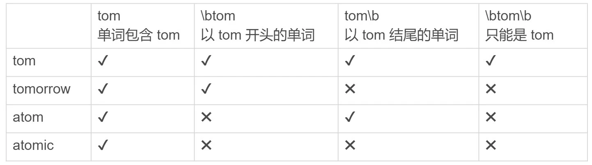

----

#### 行的开始或结束

和单词的边界类似，在正则中还有文本每行的开始和结束，如果我们要求匹配的内容要出现在一行文本开头或结尾，就可以使用 ^ 和 $ 来进行位置界定
在计算机中，回车（\r）和换行（\n）其实是两个概念，并且在不同的平台上，换行的表示也是不一样的


---

#### 日志起始行判断

最常见的例子就是日志收集，我们在收集日志的时候，通常可以指定日志行的开始规则，比如以时间开头，那些不是以时间开头的可能就是打印的堆栈信息。

```bash
[2020-05-24 12:13:10] "/home/tu/demo.py"
Traceback (most recent call last):
  File "demo.py", line 1, in <module>
    1/0
ZeroDivisionError: integer division or modulo by zero

```

---

#### 输入数据校验

在 Web 服务中，我们常常需要对输入的内容进行校验，比如要求输入 6 位数字，我们可以使用 \d{6} 来校验

但如果输入6位以上的数字，如果不去要求用户录入的 6 位数字必须是行的开头或结尾，就算验证通过了，结果也可能不对.

示例在可以regex101做验证

```python
>>> import re
>>> re.search('\d{6}', "1234567") is not None
True    <-- 能匹配上 (包含6位数字)
>>> re.search('^\d{6}', "1234567") is not None
True    <-- 能匹配上 (以6位数字开头)
>>> re.search('\d{6}$', "1234567") is not None
True    <-- 能匹配上 (以6位数字结尾)
>>> re.search('^\d{6}$', "1234567") is not None
False   <-- 不能匹配上 (只能是6位数字)
>>> re.search('^\d{6}$', "123456") is not None
True    <-- 能匹配上 (只能是6位数字)

```

在多行模式下，^ 和 $ 符号可以匹配每一行的开头或结尾。大部分实现默认不是多行匹配模式，但也有例外，比如 Ruby 中默认是多行模式。所以对于校验输入数据来说，一种更严谨的做法是，使用 \A 和 \z （Python 中使用 \Z） 来匹配整个文本的开头或结尾。

> 解决这个问题还有一种做法，我们可以在使用正则校验前，先判断一下字符串的长度，如果不满足长度要求，那就不需要再用正则去判断了。相当于你用正则解决主要的问题，而不是所有问题，这也是前面说的使用正则要克制。

---

#### 环视（Look Around）

> 《孟子·梁惠王下》中有一个成语“王顾左右而言他”。其中“王顾左右”可以理解成“环视”，看看左边，再看看右边。在正则中我**们**有时候也需要瞻前顾后，找准定位。

环视就是要求匹配部分的前面或后面要满足（或不满足）某种规则，有些地方也称环视为零宽断言。

**例子**

邮政编码的规则是由 6 位数字组成。现在要求你写出一个正则，提取文本中的邮政编码。根据规则，我们很容易就可以写出邮编的组成\d{6}

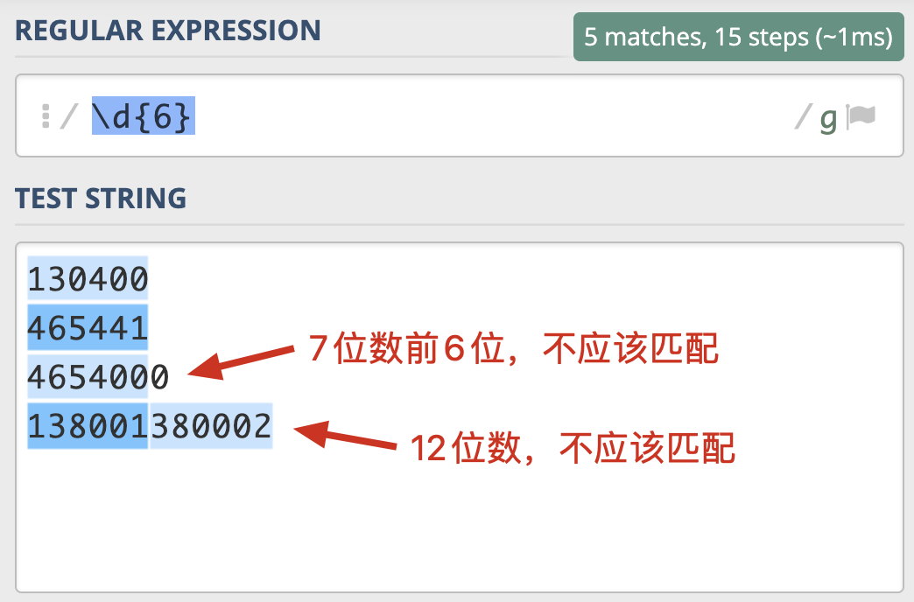

**分析：**除了文本本身组成符合这 6 位数的规则外，这 6 位数左边或右边都不能是数字

正则是通过环视来解决这个问题的。解决这个问题的正则有四种。口诀：==左尖括号代表看左边，没有尖括号是看右边，感叹号是非的意思==

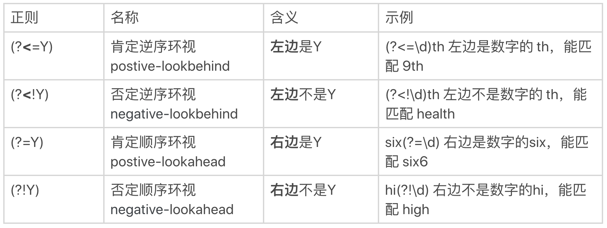

针对例子做出相应的解决

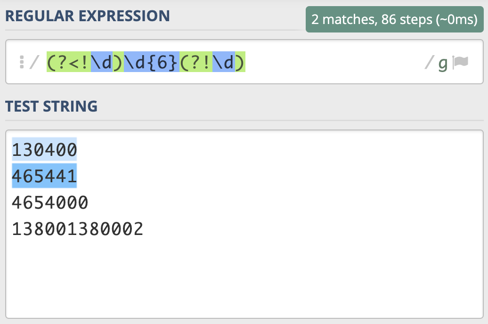

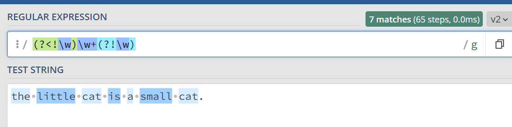

亦或把`!\w`写成`\W` => `(?\W)\w+(?\W)`。==ps==：这里值得注意的是：\W 不能匹配行开关和结尾，因此这种写法会有问题。

[\W解释](https://stackoverflow.com/a/11874614/2714931)

> ==环视中虽然也有括号，但不会保存成子组==。保存成子组的一般是匹配到的文本内容，后续用于替换等操作，而环视是表示对文本左右环境的要求，即环视只匹配位置，不匹配文本内容

-----

### 2.2 转义

转义字符（Escape Character）：在计算机科学与远程通信中，当转义字符放在字符序列中，它将对它后续的几个字符进行替代并解释。通常，判定某字符是否为转义字符由上下文确定。转义字符即标志着转义序列开始的那个字符

转义序列通常有两种功能。第一种功能是编码无法用字母表直接表示的特殊数据。第二种功能是用于表示无法直接键盘录入的字符（如回车符）

转义字符自身和后面的字符看成一个整体，用来表示某种含义。最常见的例子是，C 语言中用反斜线字符“\”作为转义字符，来表示那些不可打印的 ASCII 控制符。

比如：shell 中删除文件，如果文件名中有 * 号，我们就需要转义，此时我们能看出，使用了转义字符后，* 号就能放进文件名里了

```shell
rm access_log* # 删除当前目录下 access_log 开头的文件
rm access_log\* # 删除当前目录下名字叫 access_log* 的文件
```

双引号中又出现了双引号，这时候也需要转义了

```SHELL
print "tom said \"Hello World!\" to the crowd."
```

常见的转义字符

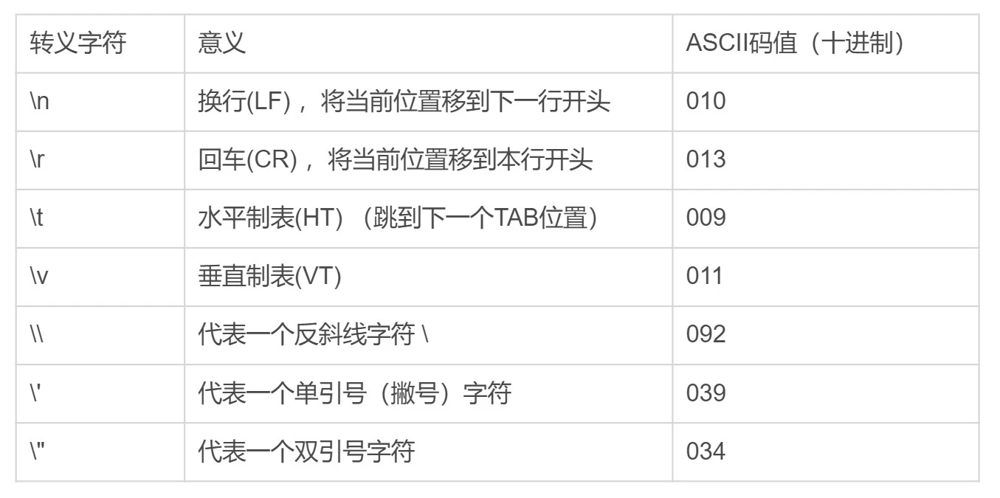

---

#### 字符串转义和正则转义

> 正则中也是使用反斜杠进行转义的

一般来说，正则中 \d 代表的是单个数字，但如果我们想表示成 反斜杠和字母 d，这时候就需要进行转义，写成 \\d，这个就表示反斜杠后面紧跟着一个字母 d

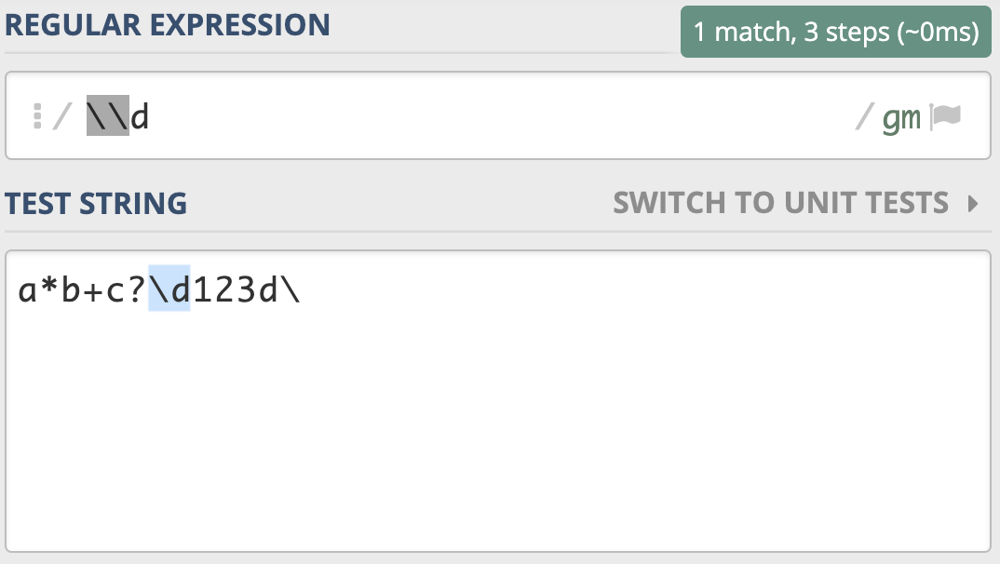

上述的反斜杠和 d 是连续出现的两个字符，如果你想表示成反斜杠或 d，可以用管道符号或中括号来实现，比如 \|d 或 [\d]。

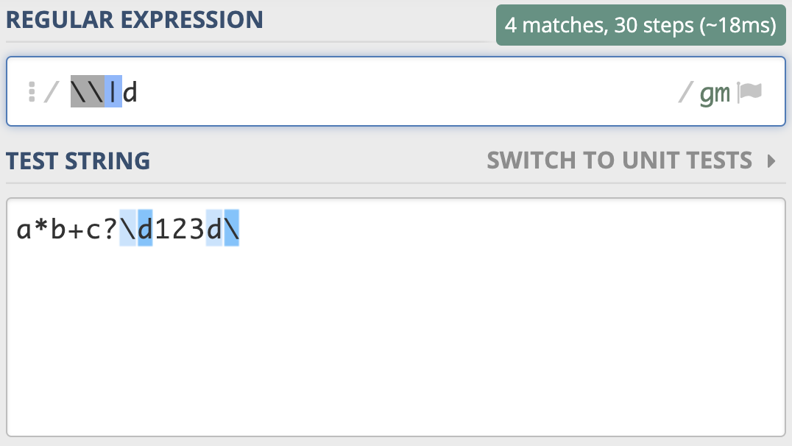

案例：python3

```python

>>> import re
>>> re.findall('\\|d', 'a*b+c?\d123d\')  # 字符串没转义"反斜杠"
  File "<input>", line 1
      re.findall('\\|d', 'a*b+c?\d123d\')
                                       ^
SyntaxError: EOL while scanning string literal

>>> re.findall('\\|d', 'a*b+c?\\d123d\\')
[]
```

在这里用正则写法在python3中会报错

```python
>>> import re
>>> re.findall('\\', 'a*b+c?\\d123d\\')
Traceback (most recent call last):
 省去部分信息
re.error: bad escape (end of pattern) at position 0
```

在python中，\会被认为是转义字符，因此`\\`表达的是单斜杠\

正确的写法是：`\\\\`

```python
>>> import re
>>> re.findall('\\\\', 'a*b+c?\\d123d\\')
['\\', '\\']
```

在python中，正则部分和文本部分都需要转义

```python
re.findall('\\\\', 'a*b+c?\\d123d\\') => '\\', 'a*b+c?\d123d\'
```

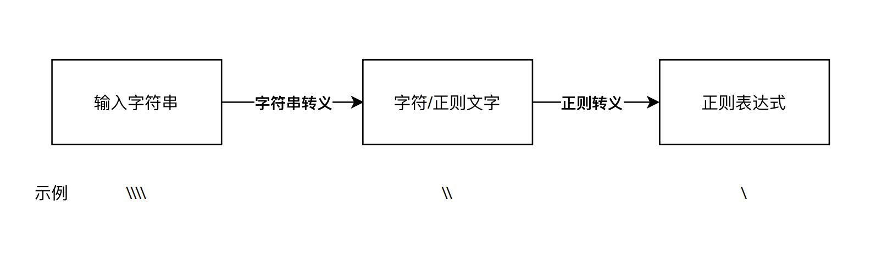

但是有更简单的方法：使用的python原生字符串小写r

```python
>>> import re
>>> re.findall(r'\\', 'a*b+c?\\d123d\\')
['\\', '\\']
```

----

#### 正则中元字符转义

如果现在我们要查找比如星号（*）、加号（+）、问号（?）本身，而不是元字符的功能，这时候就需要对其进行转义，直接在前面加上反斜杠就可以了

```python
>>> import re
>>> re.findall('\+', '+')
['+']
```

**括号中的转义**
在正则中方括号 [] 和 花括号 {} 只需转义开括号，但圆括号 () 两个都要转义

```python
>>> import re
>>> re.findall('\(\)\[]\{}', '()[]{}')
['()[]{}']
>>> re.findall('\(\)\[\]\{\}', '()[]{}')
# 方括号和花括号都转义也可以['()[]{}']
```

在正则中，圆括号通常用于分组，或者将某个部分看成一个整体，如果只转义开括号或闭括号，正则会认为少了另外一半，所以会报错

----

**使用函数消除元字符特殊含义**

编程语言自带的转义函数来实现转义

```python
>>> import re
>>> re.escape('\d') # 反斜杠和字母d转义'
相当于\\\\d'
>>> re.findall(re.escape('\d'), '\d')
['\\d']
>>> re.escape('[+]') # 中括号和加号'
相当于\\[\\+\\]'
>>> re.findall(re.escape('[+]'), '[+]')
['[+]']
```

转义函数可以将整个文本转义，一般用于转义用户输入的内容，即把这些内容看成普通字符串去匹配，但你还是得好好注意一下，如果使用普通字符串查找能满足要求，就不要使用正则，因为它简单不容易出问题。

---

**元字符的转义**
书写正则的时候，在字符组中，如果有过多的转义会导致代码可读性差。在字符组里只有三种情况需要转义

1. 脱字符在中括号中，且在第一个位置需要转义

   ```python
   >>> import re
   >>> re.findall(r'[^ab]', '^ab')  # 转义前代表"非"
   ['^']
   >>> re.findall(r'[\^ab]', '^ab')  # 转义后代表普通字符
   ['^', 'a', 'b']
   ```

2. 中划线在中括号中，且不在首尾位置

   ```python
   >>> import re
   >>> re.findall(r'[a-c]', 'abc-')  # 中划线在中间，代表"范围"
   ['a', 'b', 'c']
   >>> re.findall(r'[a\-c]', 'abc-')  # 中划线在中间，转义后的
   ['a', 'c', '-']
   >>> re.findall(r'[-ac]', 'abc-')  # 在开头，不需要转义
   ['a', 'c', '-']
   >>> re.findall(r'[ac-]', 'abc-')  # 在结尾，不需要转义
   ['a', 'c', '-']
   
   ```

3. 右括号在中括号中，且不在首位

   ```python
   >>> import re
   >>> re.findall(r'[]ab]', ']ab')  # 右括号不转义，在首位
   [']', 'a', 'b']
   >>> re.findall(r'[a]b]', ']ab')  # 右括号不转义，不在首位
   []  # 匹配不上，因为含义是 a后面跟上b]
   >>> re.findall(r'[a\]b]', ']ab')  # 转义后代表普通字符
   [']', 'a', 'b']
   ```

-----

**字符组中其它的元字符**

一般来说如果我们要想将元字符（.\*+?() 之类）表示成它字面上本来的意思，是需要对其进行转义的，但如果==它们出现在字符组中括号里，可以不转义==。这种情况，一般都是单个长度的元字符，比如点号（.）、星号（*）、加号（+）、问号（?）、左右圆括号等。它们都不再具有特殊含义，而是代表字符本身。但如果在==中括号中出现 \d 或 \w 等符号时，他们还是元字符本身的含义==。

----

### 2.3 正则中常见的流派及特性

---

### 2.4 正则如何处理Unicode编码文本

#### Unicode基础知识

> Unicode（中文：万国码、国际码、统一码、单一码）是计算机科学领域里的一项业界标准。它对世界上大部分的文字进行了整理、编码。Unicode 使计算机呈现和处理文字变得简单。

Unicode 标准也在不断发展和完善。目前，使用 4 个字节的编码表示一个字符，就可以表示出全世界所有的字符

Unicode 相当于规定了字符对应的码值，这个码值得编码成字节的形式去传输和存储

UTF-8 之所以能够流行起来，是因为其编码比较巧妙，采用的是变长的方法。也就是一个 Unicode 字符，在使用 UTF-8 编码表示时占用 1 到 4 个字节不等。最重要的是 Unicode 兼容 ASCII 编码，在表示纯英文时，并不会占用更多存储空间。而汉字呢，在 UTF-8 中，通常是用三个字节来表示。

---

#### Unicode中的正则

**编码问题的坑**

如果你需要在 Python 语言中使用正则，我建议你使用 Python3。如果你不得不使用 Python2，一定要记得使用 Unicode 编码。在 Python2 中，一般是以 u 开头来表示 Unicode。如果不加 u，会导致匹配出现问题。例子如下

```python
# 测试环境 macOS/Linux/Windows， Python2.7
>>> import re
>>> re.search(r'[时间]', '极客') is not None
True
>>> re.findall(r'[时间]', '极客')
['\xe6']
# Windows下输出是 ['\xbc']
```

不使用 Unicode 编码时，正则会被编译成其它编码表示形式。比如，在 `macOS` 或 Linux 下，一般会编码成 `UTF-8`，而在 `Windows` 下一般会编码成 `GBK`

以下是在`macOS` 上做的测试，“时间”这两个汉字表示成了 `UTF-8` 编码，正则不知道要每三个字节看成一组，而是把它们当成了 6 个单字符

```python
# 测试环境 macOS/Linux，Python 2.7
>>> import re
>>> re.compile(r'[时间]', re.DEBUG)
in
  literal 230
  literal 151
  literal 182
  literal 233
  literal 151
  literal 180
<_sre.SRE_Pattern object at 0x1053e09f0>
>>> re.compile(ur'[时间]', re.DEBUG)
in
  literal 26102
  literal 38388
<_sre.SRE_Pattern object at 0x1053f8710>
```

“极客” 和 “时间” 这两个词语对应的 UTF-8 编码。你可以发现，这两个词语都含有 16 进制表示的 e6，而 GBK 编码时都含有 16 进制的 bc，所以才会出现前面的表现。

```python
# UTF-8
>>> u'极客'.encode('utf-8')
'\xe6\x9e\x81\xe5\xae\xa2'  # 含有 e6
>>> u'时间'.encode('utf-8')
'\xe6\x97\xb6\xe9\x97\xb4'  # 含有 e6

# GBK
>>> u'极客'.encode('gbk')
'\xbc\xab\xbf\xcd'  # 含有 bc
>>> u'时间'.encode('gbk')
'\xca\xb1\xbc\xe4'  # 含有 bc
```

因此在使用时，一定要指定 Unicode 编码，这样就可以正常工作了。

```python
# Python2 或 Python3 都可以
>>> import re
>>> re.search(ur'[时间]', u'极客') is not None
False
>>> re.findall(ur'[时间]', u'极客')
[]
```

----

#### 点号匹配

---

#### 字符组匹配

很多字符组，比如\d 表示数字，\w 表示大小写字母、下划线、数字，\s 表示空白符号等，那 Unicode 下的数字，比如全角的 1、2、３等，算不算数字呢？全角的空格算不算空白呢？

---

#### Unicode属性

在正则中使用 Unicode，还可能会用到 Unicode 的一些属性。这些属性把 Unicode 字符集划分成不同的字符小集合。

在正则中常用的有三种，分别是按功能划分的 Unicode Categories（有的也叫 Unicode Property），比如标点符号，数字符号；按连续区间划分的 Unicode Blocks，比如只是中日韩字符；按书写系统划分的 Unicode Scripts，比如汉语中文字符。

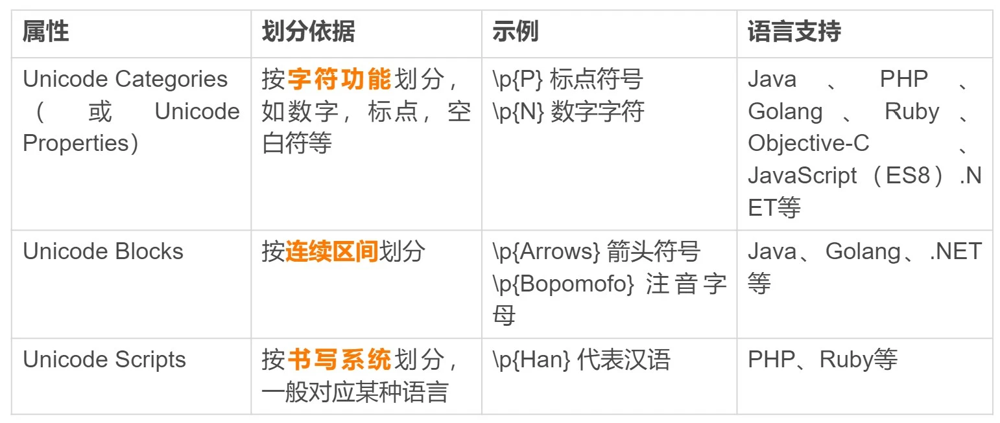

这三种属性在正则中的表示方式都是 ==\p{属性}==

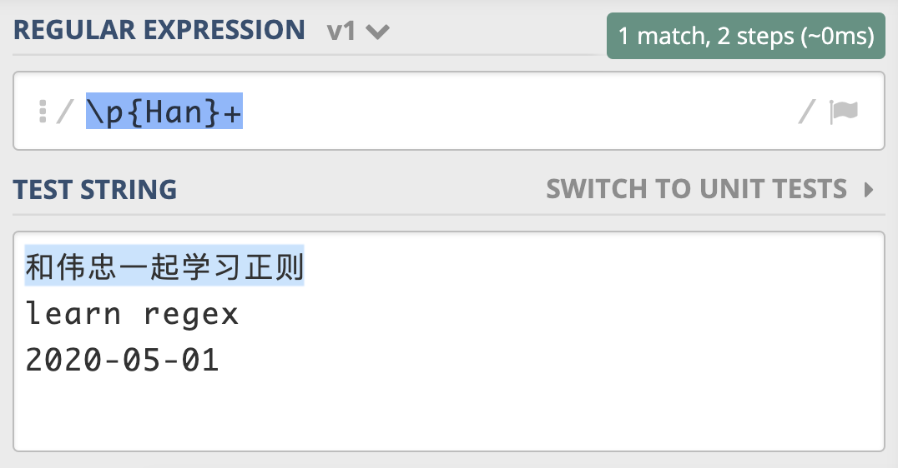

其中，Unicode Blocks 在不同的语言中记法有差异，比如 Java 需要加上 In 前缀，类似于 `\p{InBopomofo}` 表示注音字符。

----

#### 表情符号

表情符号其实是“图片字符”。在 2020 年 3 月 10 日公布的 Unicode 标准 13.0.0 中，新增了 55 个新的 emoji 表情，完整的表情列表可以在这里查看[UnicodeEmoji](http://www.unicode.org/emoji/charts/full-emoji-list.html)

这些表情的特点有：

1. 许多表情不在 `BMP` 内，码值超过了 `FFFF`。使用 `UTF-8` 编码时，普通的 `ASCII` 是 1 个字节，中文是 3 个字节，而有一些表情需要 4 个字节来编码。

2. 这些表情分散在 BMP 和各个补充平面中，要想用一个正则来表示所有的表情符号非常麻烦，即便使用编程语言处理也同样很麻烦。
3. 一些表情现在支持使用颜色修饰（Fitzpatrick modifiers），可以在 5 种色调之间进行选择。这样一个表情其实就是 8 个字节了。

面是使用 IPython 测试颜色最深的点赞表情，在 macOS 上的测试结果。你可以发现，它是由 8 个字节组成，这样用正则处理起来就很不方便了。因此，在处理表情符号时，我不建议你使用正则来处理。你可以使用专门的库，这样做一方面代码可读性更好，另一方面是表情在不断增加，使用正则的话不好维护，会给其它同学留坑。而使用专门的库可以通过升级版本来解决这个问题。

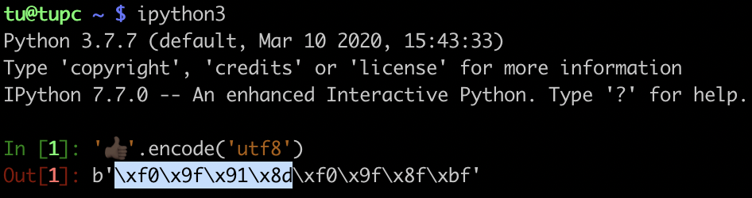

------

### 2.5 如何在编辑器中使用正则完成工作

#### 编辑器功能

以 Sublime Text 3 为例，这些功能在 Sublime Text、Atom、VS Code、JetBrains 系列（IntelliJ IDEA/PyCharm/Goland 等) 中都是支持的。

---

#### 光标移动和文本选择

在常见的编辑器、IDE、甚至 Chrome 等浏览器中，我们编辑文本时，使用键盘的左右箭头移动光标，可以按住 Shift 键来选中文本。在左右移动时，如果你按住 Alt（macOS 的 option），你会发现光标可以“按块移动”，快速移动到下一个单词。两种方式组合起来，你可以快速选择引号里面的内容。

---

#### 多焦点编辑

在 IDE 中，我们如果想对某个变量或函数重命名，通常可以使用重构（`refactor`）功能。但如果**处理的不是代码，而是普通文本，比如 JSON 字符串**的时候，就没法这么用了。不过现在很多编辑器都提供了多焦点编辑的功能

比如选择单词 route 之后，点击菜单 Find -> Quick Find All 就可以选中所有的 route 了。你可以进行多焦点编辑，非常方便

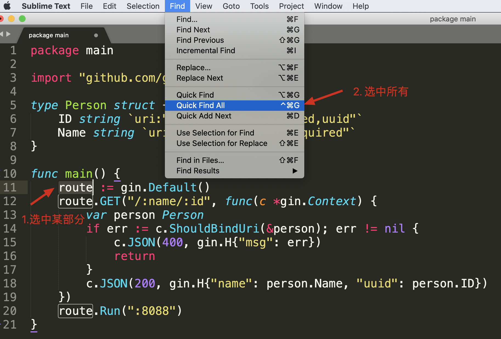

这个特性结合光标移动，可以快速提取某些内容，比如提取 JSON 中的姓名和手机号。选中所有的字段和值之间的字符（": "） 之后，按住 Shift+Alt（macOS 上是 Shift + Option），用箭头移动光标，可以快速选择到另外一个引号前，然后剪切，再找个空白地方粘贴就可以了。

```json
{
  "error_code": 0,
  "result": {
    "data": [
      {
        "name": "朱小明",
        "tel": "138xx138000"
      },
      {
        "name": "王五",
        "tel": "139xx139000"
      }
    ]
  }
}
```

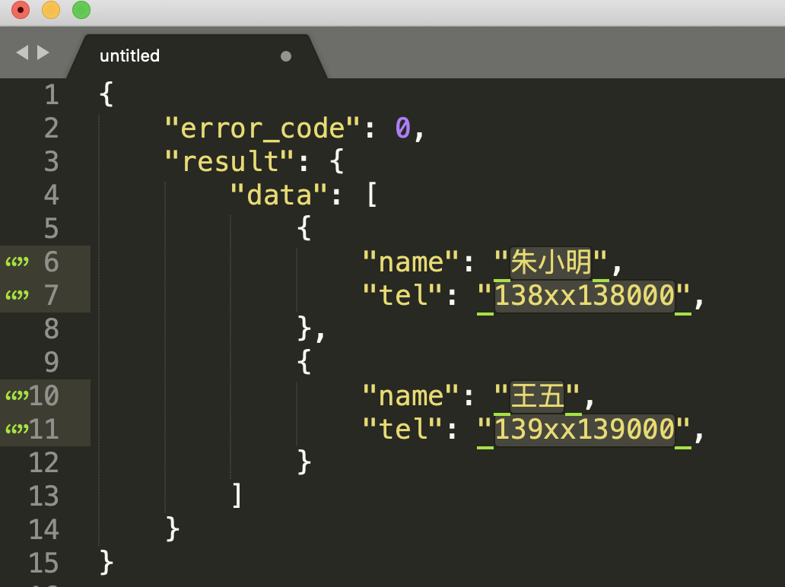

------

#### 竖向编辑

在编辑多行时，如果我们需要编辑的内容都是纵向上同一个位置，就可以使用 Alt (macOS 上是 Option）加上鼠标拖拽的方式来选择（或者尝试按下鼠标中键拖拽）。比如下图，当你选择了左侧的两个空格之后，可以批量编辑，比如修改成四个空格。将竖向编辑和刚刚上面说到的光标移动结合起来，会非常方便。

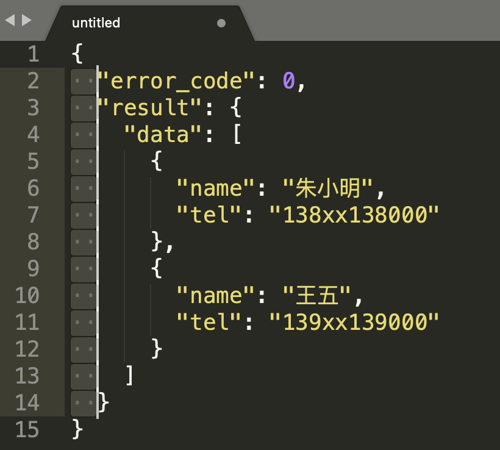
