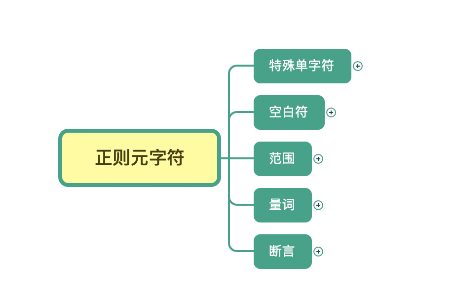
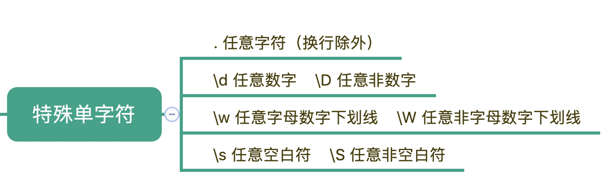
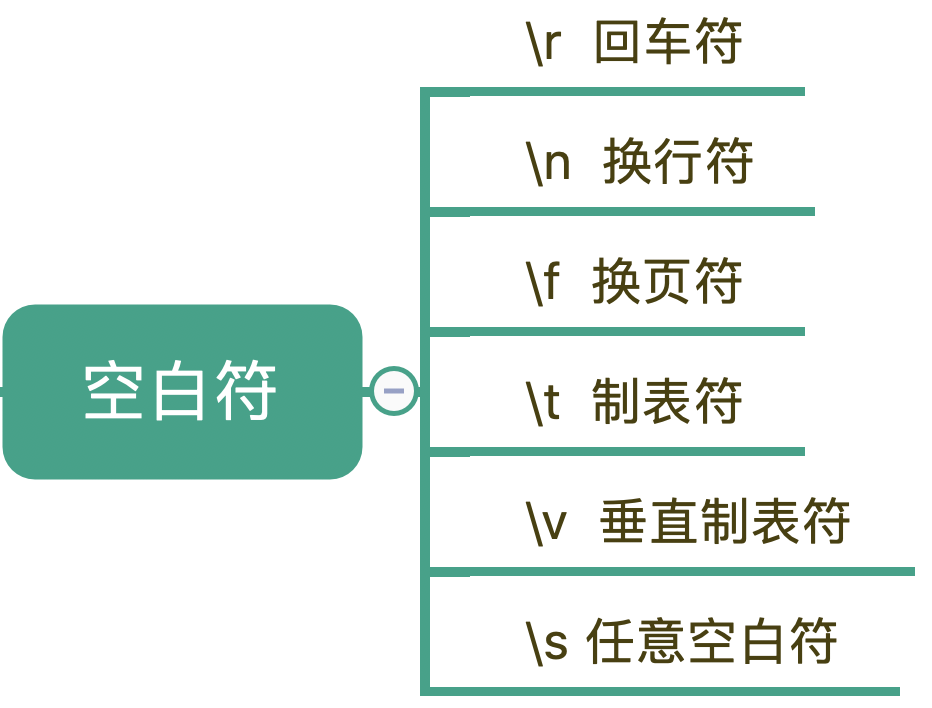
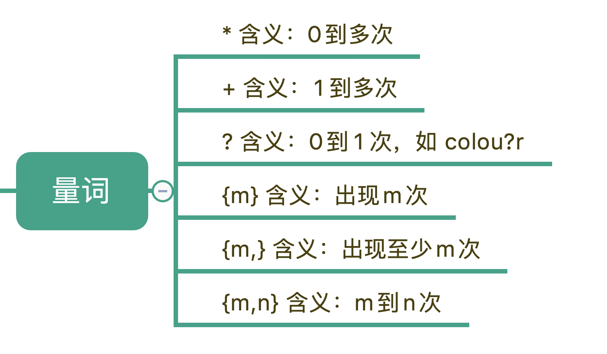
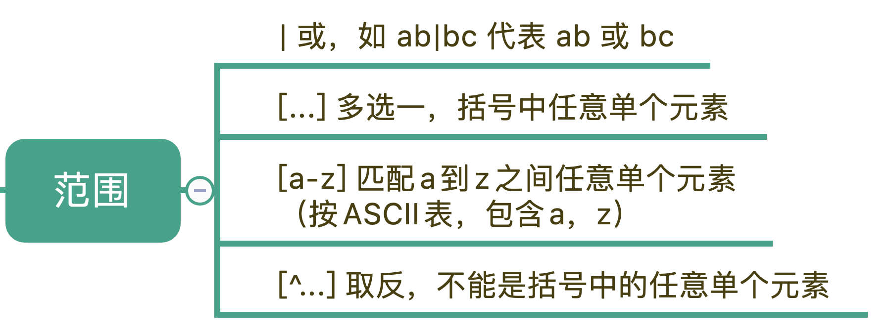
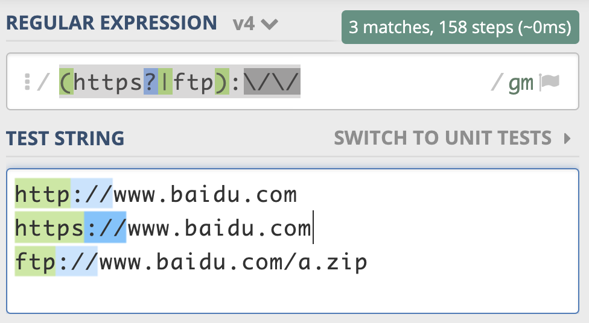
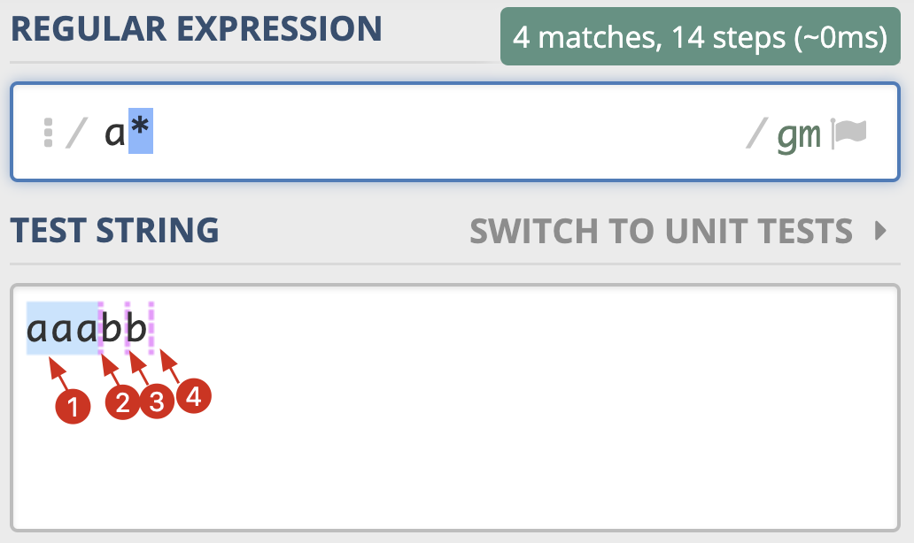
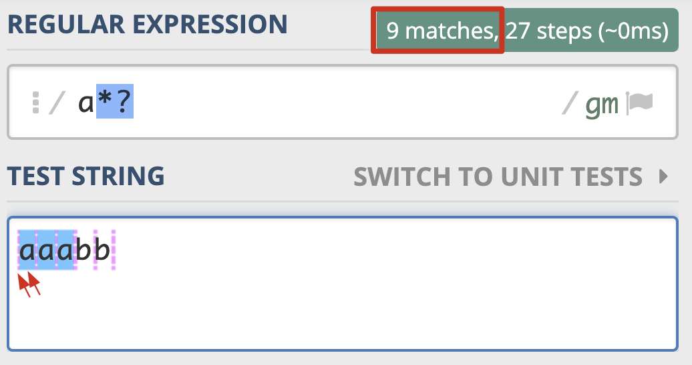
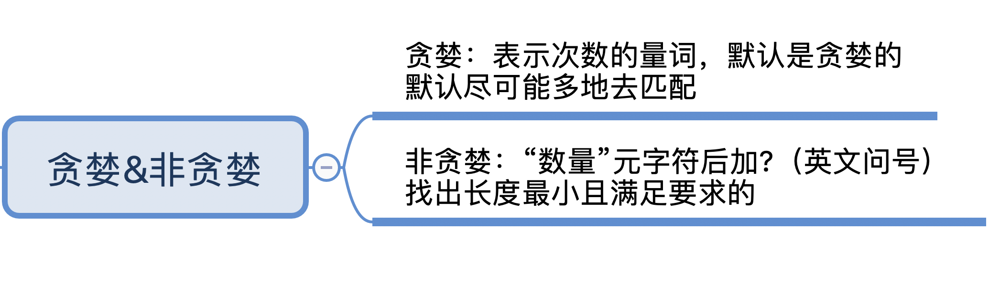

## 一、基础

### 1.1 元字符

> 正则功能：**校验**数据的有效性、**查找符合要求的文本**以及对文本进行**切割和替换**等操作。

#### 元字符的定义

所谓元字符就是指那些在正则表达式中具有特殊意义的专用字符，正则表达式就是由一系列的元字符组成

> 比如`\d`（表示 0-9 这 10 个数字中的任意一个）、`\d{11}`（表示单个数字出现 11 次），其中`\d`和`{11}`就表示元字符。`.`表示匹配除换行符\n以外的任意字符

------

#### 元字符分类



1. **特殊单字符**



2. **空白符**

不同的系统在每行文本结束位置默认的“换行”会有区别。比如在 Windows 里是 \r\n，在 Linux 和 MacOS 中是 \n。


在正则中，也是类似于 \n 或 \r 等方式来表示空白符号，只要记住它们就行了。平时使用正则，大部分场景使用 \s 就可以满足需求，\s 代表任意单个空白符号。



3. **量词**

   比如，在文本中“颜色”这个单词，可能是带有 u 的 colour，也可能是不带 u 的 color，我们使用 colou?r 就可以表示两种情况了

   

4. **范围**

   

   匹配http https ftp

   

5. **练习手机号的匹配规则**

   1. 第 1 位固定为数字 1

   2. 第 2 位可能是 3，4，5，6，7，8，9

   3. 第 3 位到第 11 位我们认为可能是 0-9 任意数字。

      通过规则可以得出正则表达式是：`1[3-9 ]\d{9}`

----

### 1.2 量词与贪婪 

#### 贪婪匹配（Greedy）

定义：尽可能最大长度去匹配



使用 Python 示例如下，我们可以看到输出结果，也是得到了 4 个匹配结果：a* 在匹配开头的 a 时，会尝试尽量匹配更多的 a，直到第一个字母 b 不满足要求为止，匹配上三个 a，后面每次匹配时都得到了空字符串。

```python
>>> import re
>>> re.findall(r'a*', 'aaabb')
['aaa', '', '', '']
```

----

#### 非贪婪匹配（lazy）

定义：非贪婪模式会尽可能短地去匹配



这次匹配到的结果都是单个的 a，非贪婪模式会尽可能短地去匹配。其中*?表示满足条件的情况只匹配一次

```python
>>> import re
>>> re.findall(r'a*', 'aaabb') 
# 贪婪模式
['aaa', '', '', '']
>>> re.findall(r'a*?', 'aaabb')
# 非贪婪模式
['', 'a', '', 'a', '', 'a', '', '', '']
```



----

#### 独占模式（Possessive）

> 不管是贪婪模式，还是非贪婪模式，都需要发生回溯才能完成相应的功能。但是在一些场景下，我们不需要回溯，匹配不上返回失败就好了，因此正则中还有另外一种模式，独占模式，它类似贪婪匹配，但匹配过程不会发生回溯，因此在一些场合下性能会更好

**回溯例子：**

​	有一正则表达式：`regex = “xy{1,3}z”`

​	匹配的文本：`text = “xyyz”`

​	在匹配时，y{1,3}会尽可能长地去匹配，当匹配完 xyy 后，由于 y 要尽可能匹配最长，即三个，但字符串中后面是个 z 就会导致匹配不上，这时候正则就会==向前回溯==，吐出当前字符 z，接着用正则中的 z 去匹配。


如果把`regex = “xy{1,3}z”`改成`regex = “xy{1,3}?z”`

​	由于 y{1,3}? 代表匹配 1 到 3 个 y，尽可能少地匹配。匹配上一个 y 之后，也就是在匹配上 text 中的 xy 后，正则会使用 z 和 text 中的 xy 后面的 y 比较，发现正则 z 和 y 不匹配，这时正则就会==向前回溯==，重新查看 y 匹配两个的情况，匹配上正则中的 xyy，然后再用 z 去匹配 text 中的 z，匹配成功。


如何变成独占模式：独占模式会尽可能多地去匹配，如果匹配失败就结束，不会进行回溯，这样的话就比较节省时间。==具体的方法就是在量词后面加上加号（+）==

​	`regex = “xy{1,3}+yz”`，此时并不会去匹配z，
